# QA Evidence — NEARS-1663

**PASS — NEARS-1663 delivery-man card typography on DLS tokens, light mode, emulator-5556, APK md5 152572571c75f44e3025c6d1f3156a8e**

**12 screenshot(s).** Click any thumbnail for full resolution.

<table>
<tr>
<td align="center" width="33%"><a href="00-launch.png">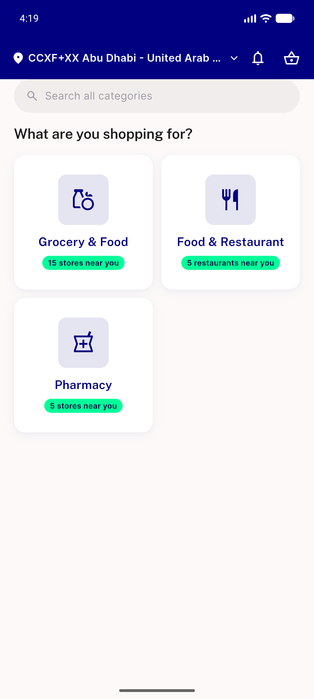</a> launch</td>
<td align="center" width="33%"><a href="01-after-module.png">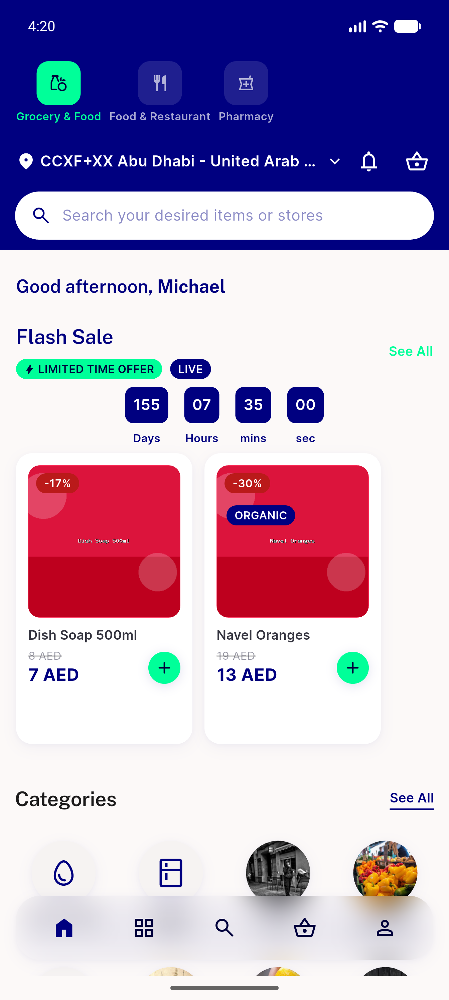</a> after module</td>
<td align="center" width="33%"><a href="02-profile.png">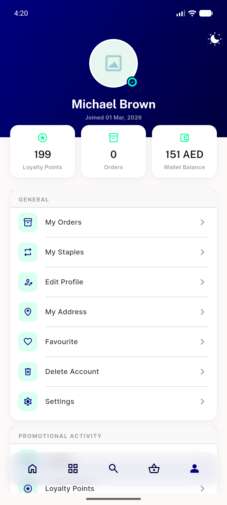</a> profile</td>
</tr>
<tr>
<td align="center" width="33%"><a href="06-after-logout.png">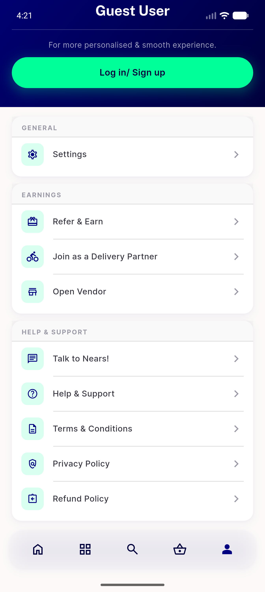</a> after logout</td>
<td align="center" width="33%"><a href="07-login-screen.png">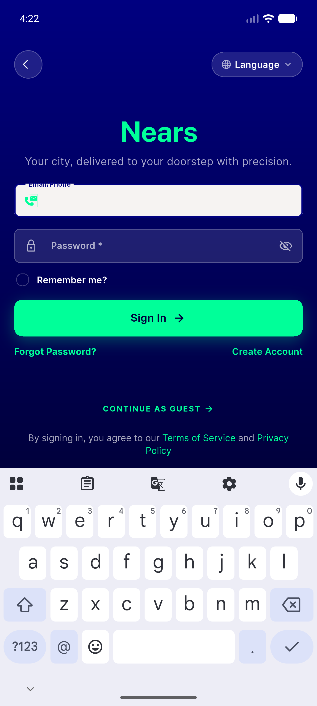</a> login screen</td>
<td align="center" width="33%"><a href="09-after-signin.png">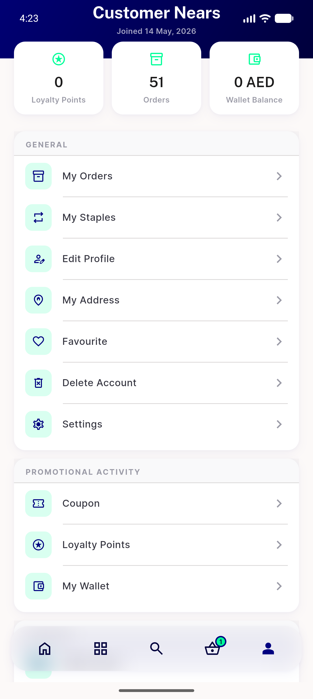</a> after signin</td>
</tr>
<tr>
<td align="center" width="33%"><a href="10-orders.png">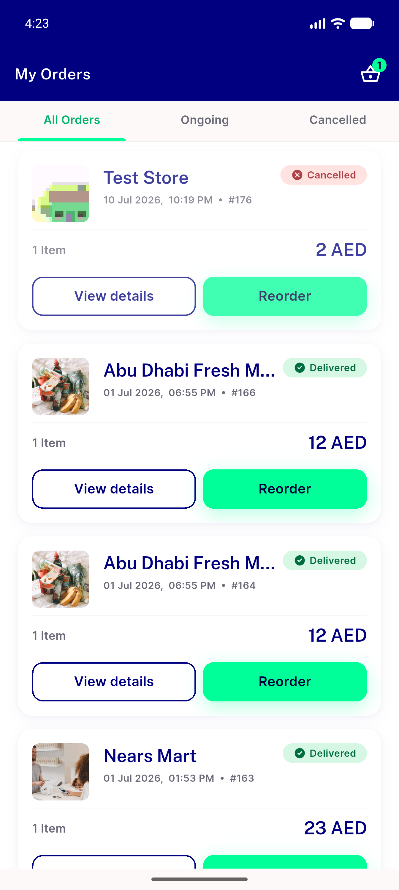</a> orders</td>
<td align="center" width="33%"><a href="11-order-details.png">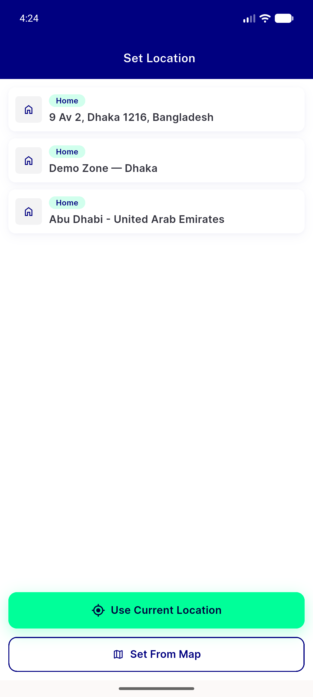</a> order details</td>
<td align="center" width="33%"><a href="12-after-location.png">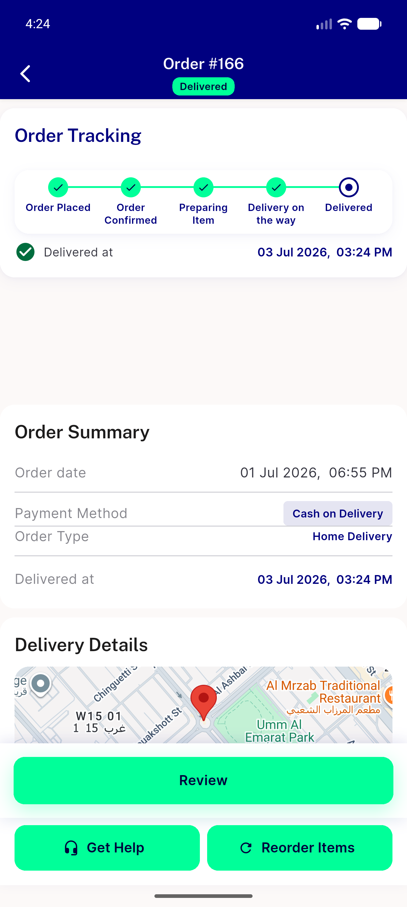</a> after location</td>
</tr>
<tr>
<td align="center" width="33%"><a href="13-rate-review.png">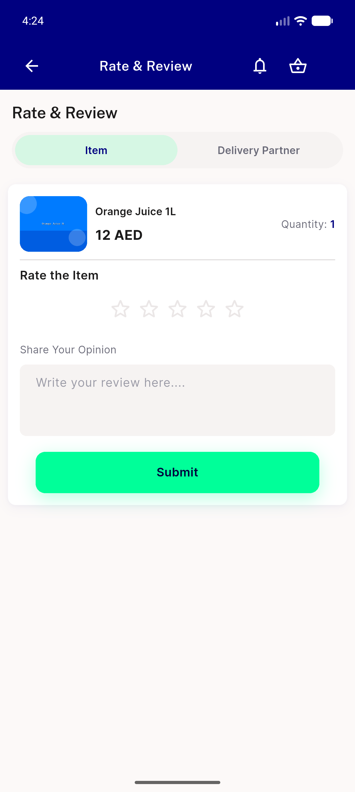</a> rate review</td>
<td align="center" width="33%"><a href="AC3-dm-card-light-ar-rtl.png">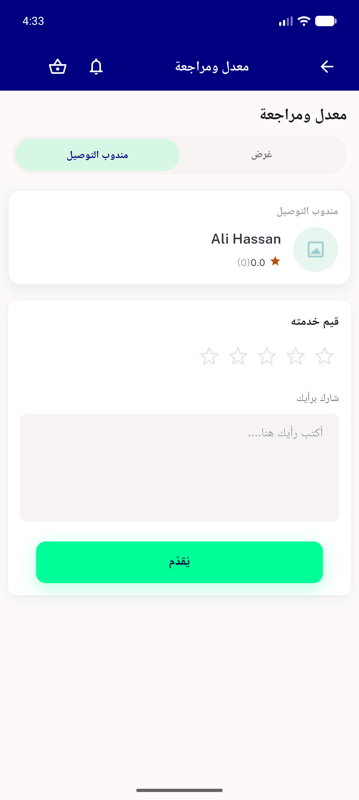</a> AC3 dm card light ar rtl</td>
<td align="center" width="33%"><a href="AC3-dm-card-light-en.png">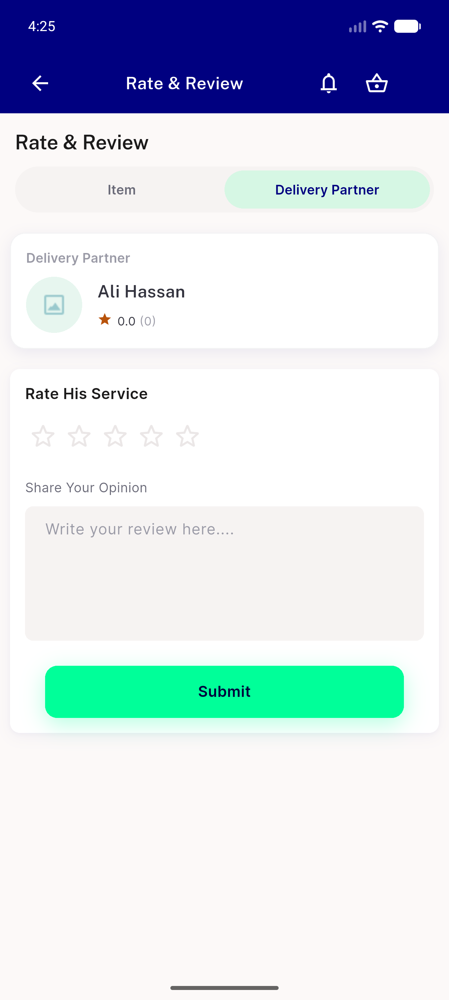</a> AC3 dm card light en</td>
</tr>
</table>

---
*From `nears/docs/qa-evidence/NEARS-1663/` · public-repo scrub policy (no live secrets; verified clean).*
