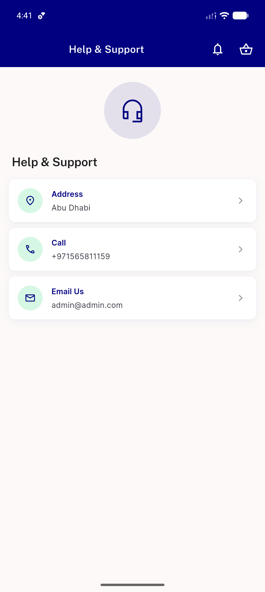
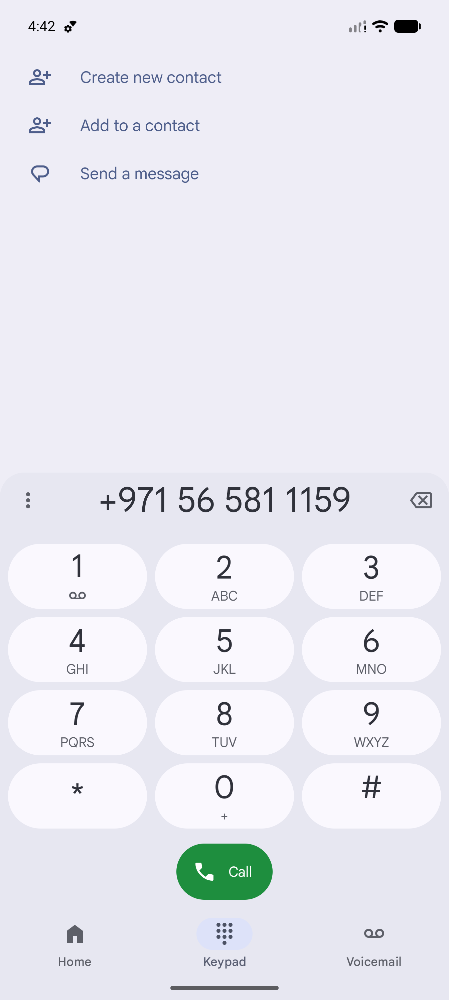
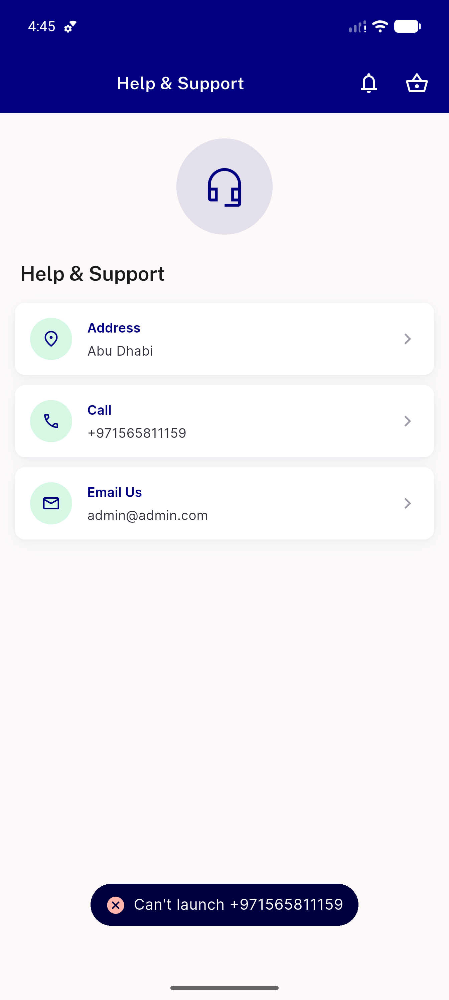
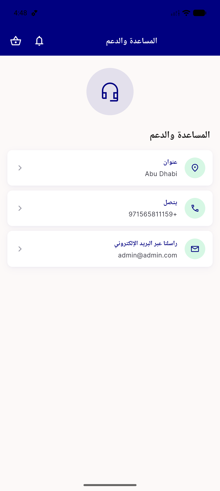

# QA Evidence — NEARS-1664

**PASS — AC3/AC4/AC5 demonstrated live on emulator-5558 (light mode); AC1/AC2 widget-test-only**

**5 screenshot(s).** Click any thumbnail for full resolution.

<table>
<tr>
<td align="center" width="33%"> ac3 support ltr three rows</td>
<td align="center" width="33%"> ac4 call dialer</td>
<td align="center" width="33%"> ac4 cannot launch snackbar</td>
</tr>
<tr>
<td align="center" width="33%"> ac5 chevron ltr vs rtl zoom</td>
<td align="center" width="33%"> ac5 support rtl arabic</td>
</tr>
</table>

### Other artifacts
- [`ac4-launch-intents.log`](ac4-launch-intents.log)
- [`progress.md`](progress.md)

---
*From `nears/docs/qa-evidence/NEARS-1664/` · public-repo scrub policy (no live secrets; verified clean).*
