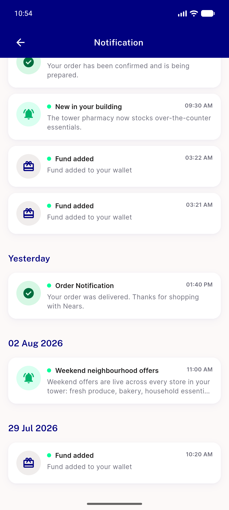
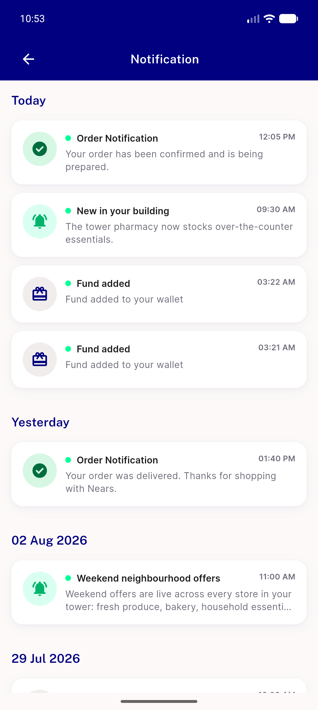
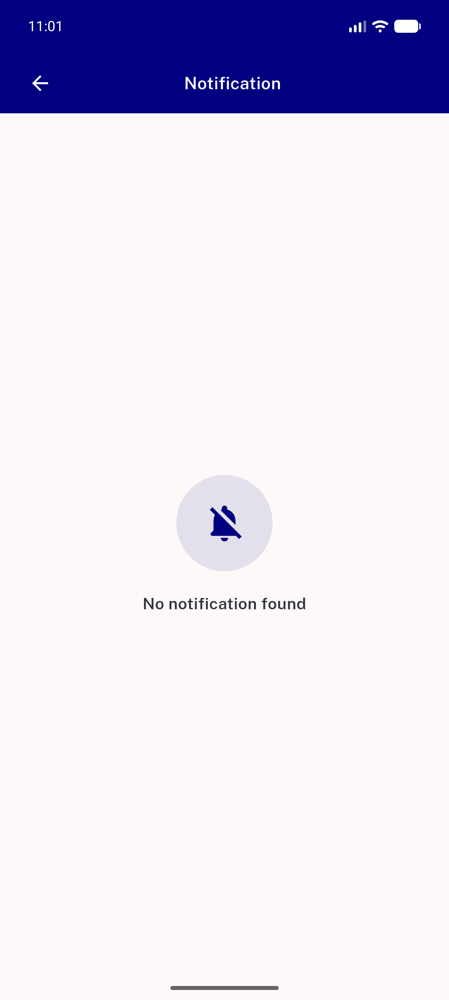

# QA Evidence — NEARS-1665

**PASS — AC6 demonstrated live on emulator-5558: 7 cards, 4 date headers, correct per-type glyphs, newest-first**

**3 screenshot(s).** Click any thumbnail for full resolution.

<table>
<tr>
<td align="center" width="33%"> ac6 notification list bottom</td>
<td align="center" width="33%"> ac6 notification list user3</td>
<td align="center" width="33%"> regression user6 empty state</td>
</tr>
</table>

### Other artifacts
- [`progress.md`](progress.md)

---
*From `nears/docs/qa-evidence/NEARS-1665/` · public-repo scrub policy (no live secrets; verified clean).*
