# QA Evidence — NEARS-1671

**PASS — NErrorRetry in-flight latch verified live on 4 converted + 2 inherited sites; AC1 exact request counts, AC2 holds to slowest, dead-CTA clean**

**14 screenshot(s).** Click any thumbnail for full resolution.

<table>
<tr>
<td align="center" width="33%"><a href="ac-voidsite-categorygrid-nospinner.png">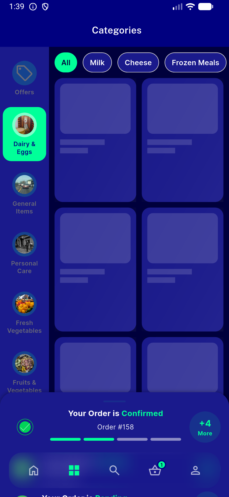</a> ac voidsite categorygrid nospinner</td>
<td align="center" width="33%"><a href="ac-wallet-recovered.png">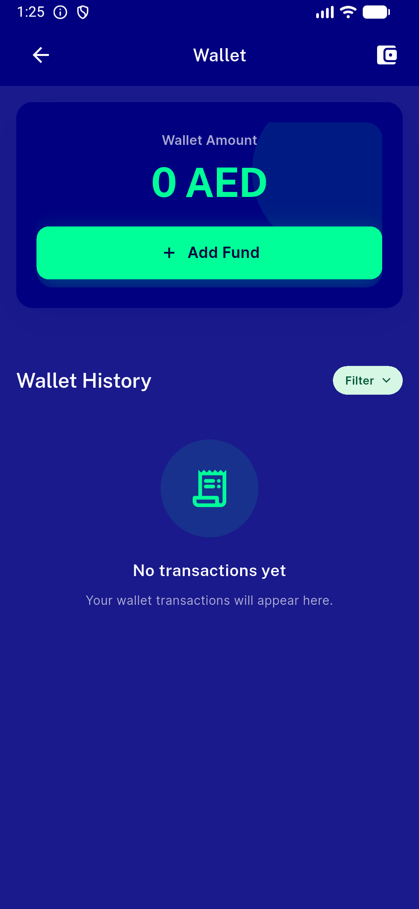</a> ac wallet recovered</td>
<td align="center" width="33%"><a href="ac2-busy-light-ltr-english.png">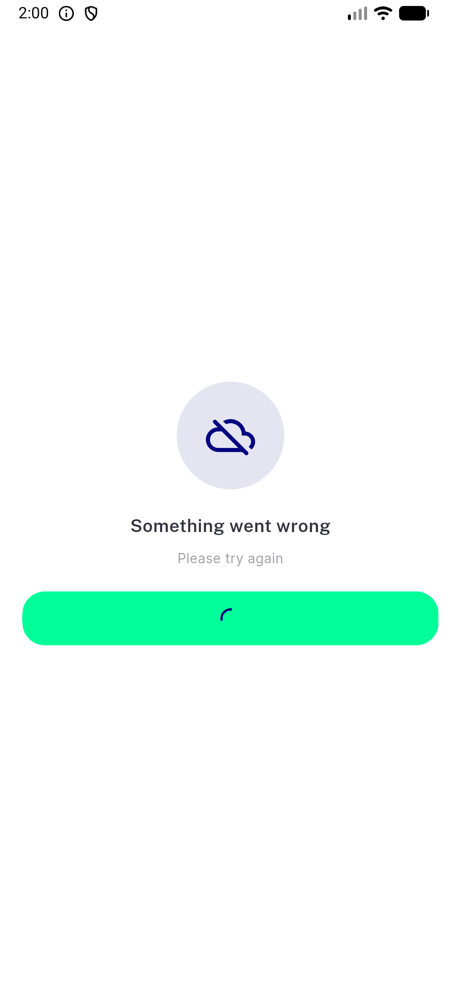</a> ac2 busy light ltr english</td>
</tr>
<tr>
<td align="center" width="33%"><a href="ac2-busy-light-rtl-arabic.png">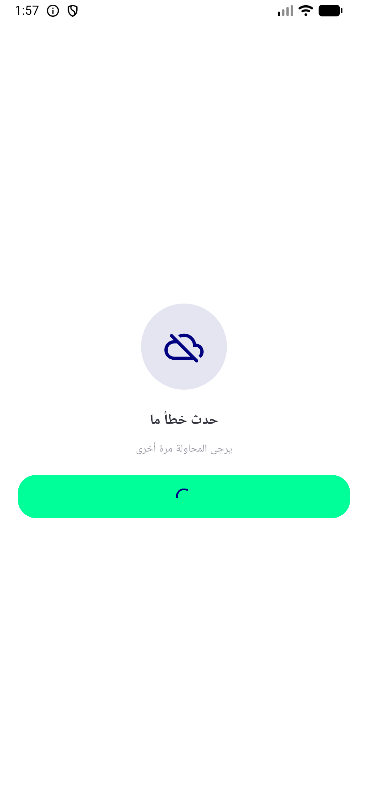</a> ac2 busy light rtl arabic</td>
<td align="center" width="33%"><a href="ac2-idle-light-ltr-english.png">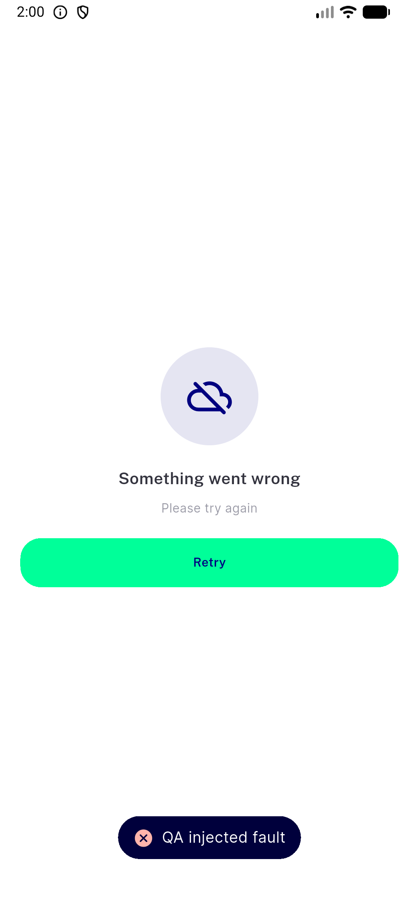</a> ac2 idle light ltr english</td>
<td align="center" width="33%"><a href="ac2-idle-light-rtl-arabic.png">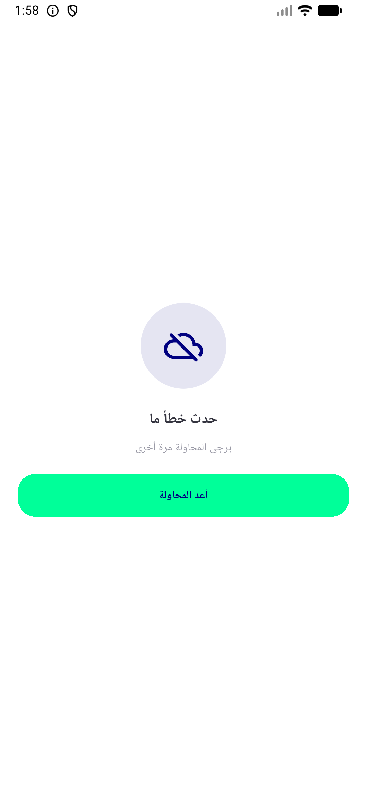</a> ac2 idle light rtl arabic</td>
</tr>
<tr>
<td align="center" width="33%"><a href="ac2-itemsheet-busy.png">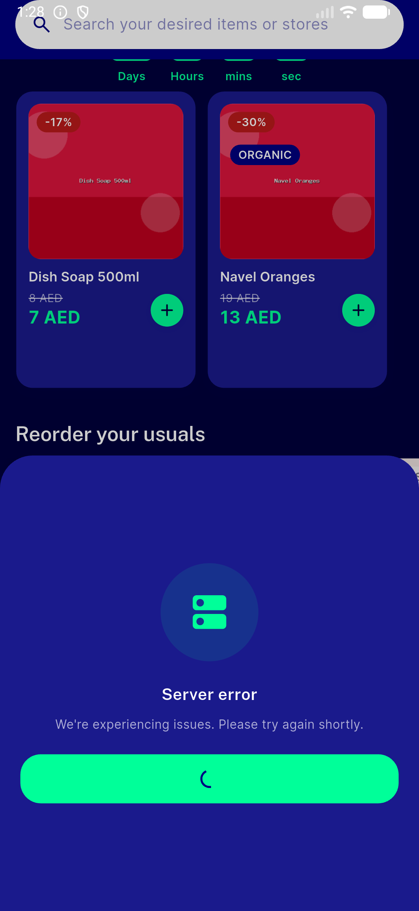</a> ac2 itemsheet busy</td>
<td align="center" width="33%"><a href="ac2-loyalty-busy.png">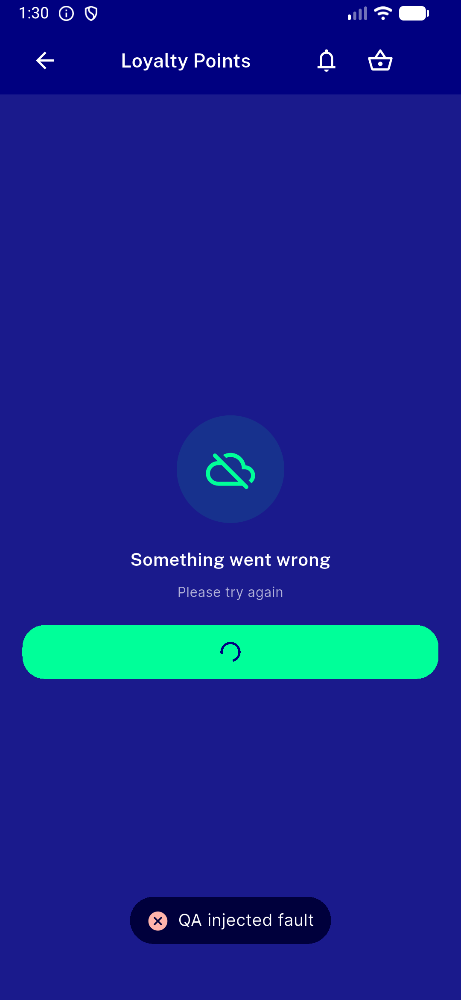</a> ac2 loyalty busy</td>
<td align="center" width="33%"><a href="ac2-rtl-arabic-busy.png">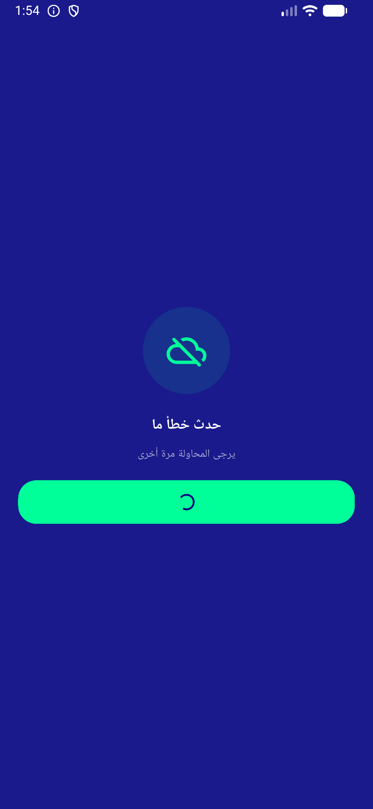</a> ac2 rtl arabic busy</td>
</tr>
<tr>
<td align="center" width="33%"><a href="ac2-updateprofile-busy.png">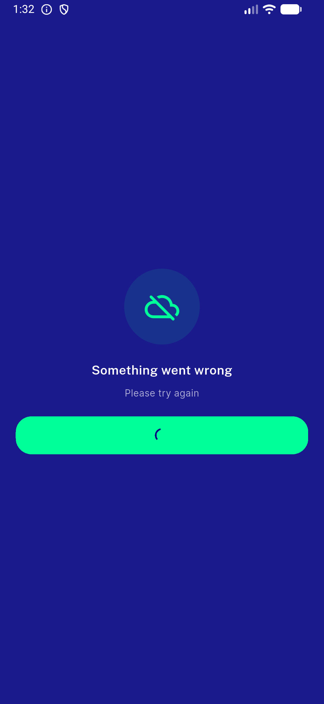</a> ac2 updateprofile busy</td>
<td align="center" width="33%"><a href="ac2-wallet-busy-spinner.png">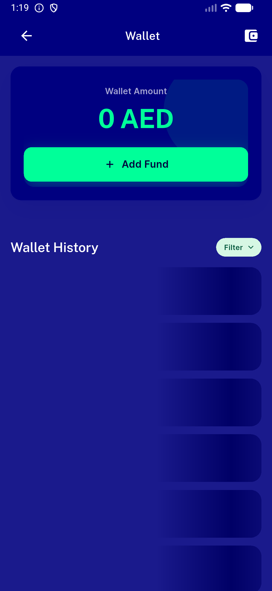</a> ac2 wallet busy spinner</td>
<td align="center" width="33%"><a href="ac2-wallet-mainretry-busy.png">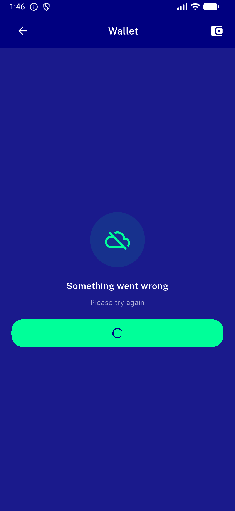</a> ac2 wallet mainretry busy</td>
</tr>
<tr>
<td align="center" width="33%"><a href="regression-nemptystate-no-results.png">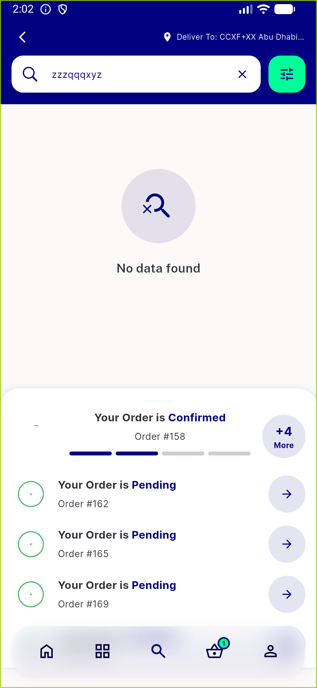</a> regression nemptystate no results</td>
<td align="center" width="33%"><a href="rtl-arabic-error-idle.png">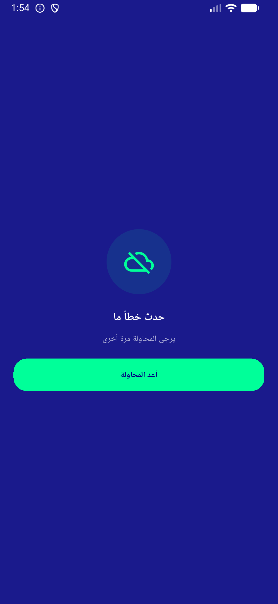</a> rtl arabic error idle</td>
</tr>
</table>

### Other artifacts
- [`bug-storedetails-403.log`](bug-storedetails-403.log)
- [`progress.md`](progress.md)

---
*From `nears/docs/qa-evidence/NEARS-1671/` · public-repo scrub policy (no live secrets; verified clean).*
