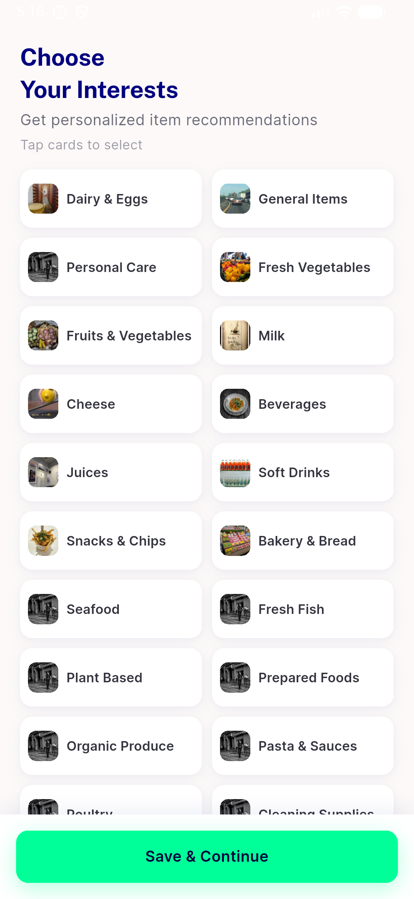

# QA Evidence — NEARS-1673

**PASS — NEARS-1673 cold-cache interest gate, emulator-5560, build ef1885ca**

**1 screenshot(s).** Click any thumbnail for full resolution.

<table>
<tr>
<td align="center" width="33%"> ac1 cold cache first tap interests</td>
</tr>
</table>

### Other artifacts
- [`bug-preexisting-userapp-suite-failures.log`](bug-preexisting-userapp-suite-failures.log)
- [`bug-recommended-items-typeerror-offline.log`](bug-recommended-items-typeerror-offline.log)
- [`progress.md`](progress.md)

---
*From `nears/docs/qa-evidence/NEARS-1673/` · public-repo scrub policy (no live secrets; verified clean).*
