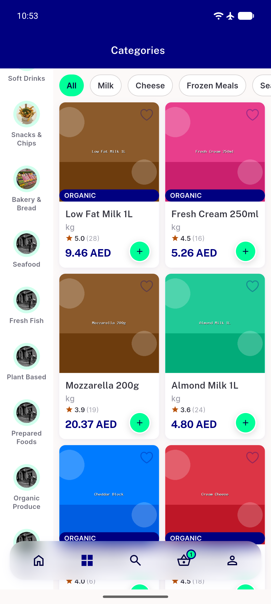
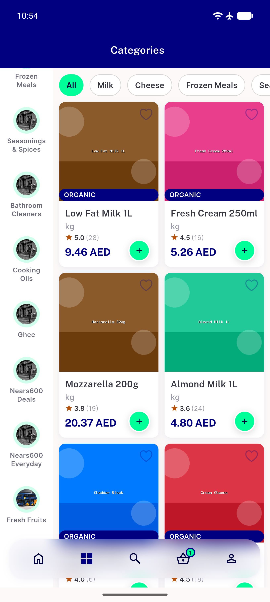
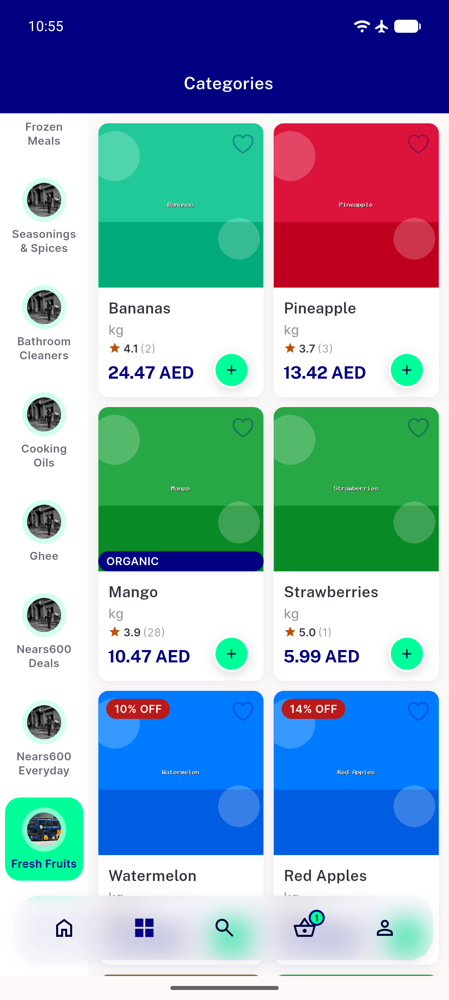

# QA Evidence — NEARS-1674

**PASS - module1 category dedup verified live (34 rows/0 dupes, Fresh Fruits & Fresh Vegetables each shown once, merged item sets resolve correctly)**

**3 screenshot(s).** Click any thumbnail for full resolution.

<table>
<tr>
<td align="center" width="33%"> categories top fresh vegetables once</td>
<td align="center" width="33%"> categories bottom fresh fruits once</td>
<td align="center" width="33%"> fresh fruits merged items</td>
</tr>
</table>

---
*From `nears/docs/qa-evidence/NEARS-1674/` · public-repo scrub policy (no live secrets; verified clean).*
