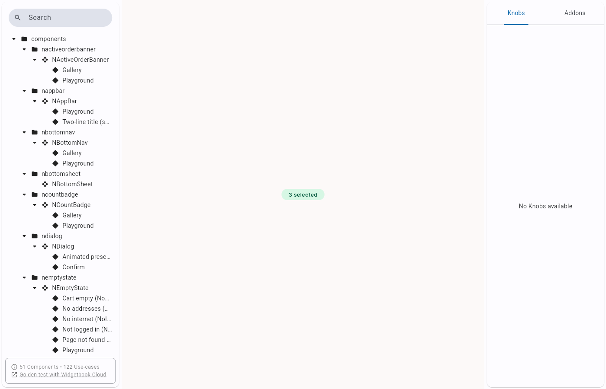
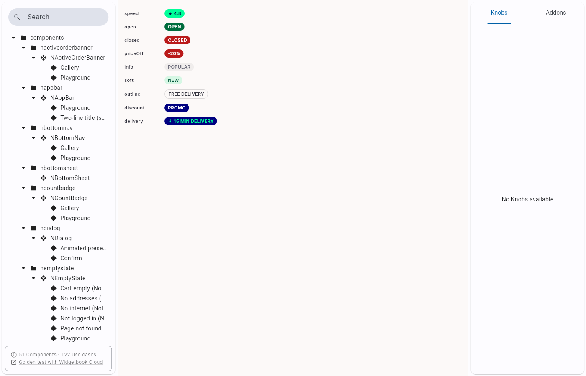

# QA Evidence — NEARS-1677

**PASS — NBadge sentenceSize prop, live Widgetbook (release web build) verification**

**2 screenshot(s).** Click any thumbnail for full resolution.

<table>
<tr>
<td align="center" width="33%"> ac1 counter sentence size</td>
<td align="center" width="33%"> ac2 gallery existing consumers unchanged</td>
</tr>
</table>

---
*From `nears/docs/qa-evidence/NEARS-1677/` · public-repo scrub policy (no live secrets; verified clean).*
