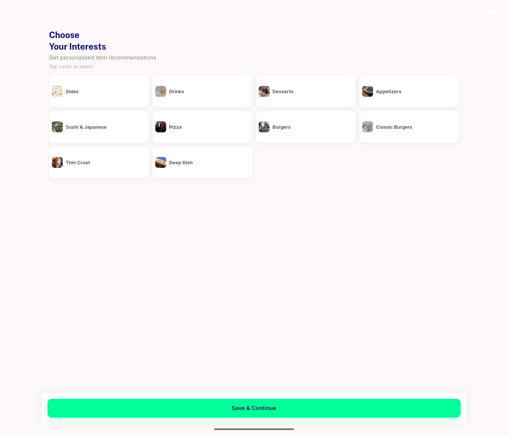
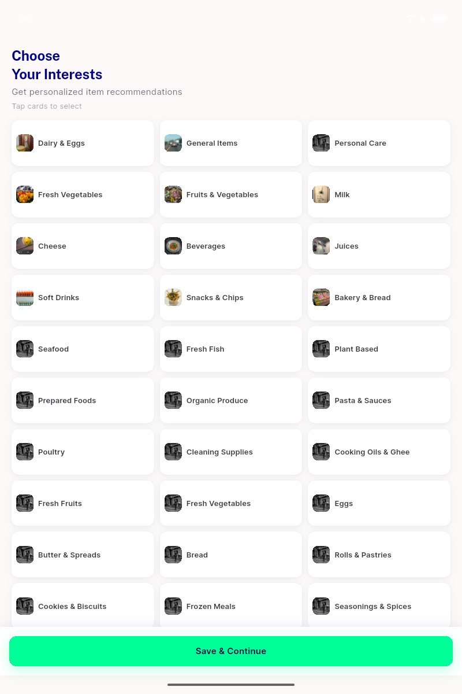

# QA Evidence — NEARS-1678

**PASS - interest grid tap target >=44dp at 320dp; tab/desktop unaffected**

**3 screenshot(s).** Click any thumbnail for full resolution.

<table>
<tr>
<td align="center" width="33%"> ac1 320dp interest grid</td>
<td align="center" width="33%"> ac2 desktop 1400dp interest grid</td>
<td align="center" width="33%"> ac2 tab 800dp interest grid</td>
</tr>
</table>

### Other artifacts
- [`progress.md`](progress.md)

---
*From `nears/docs/qa-evidence/NEARS-1678/` · public-repo scrub policy (no live secrets; verified clean).*
