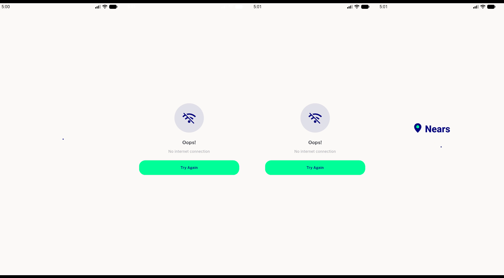
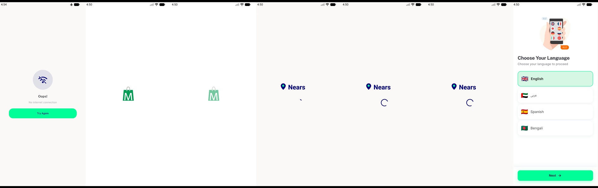
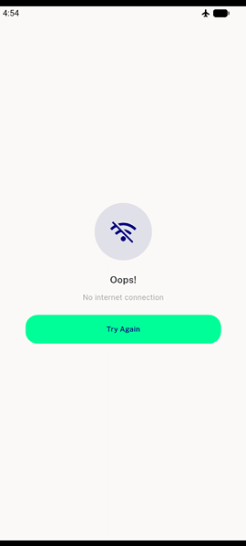
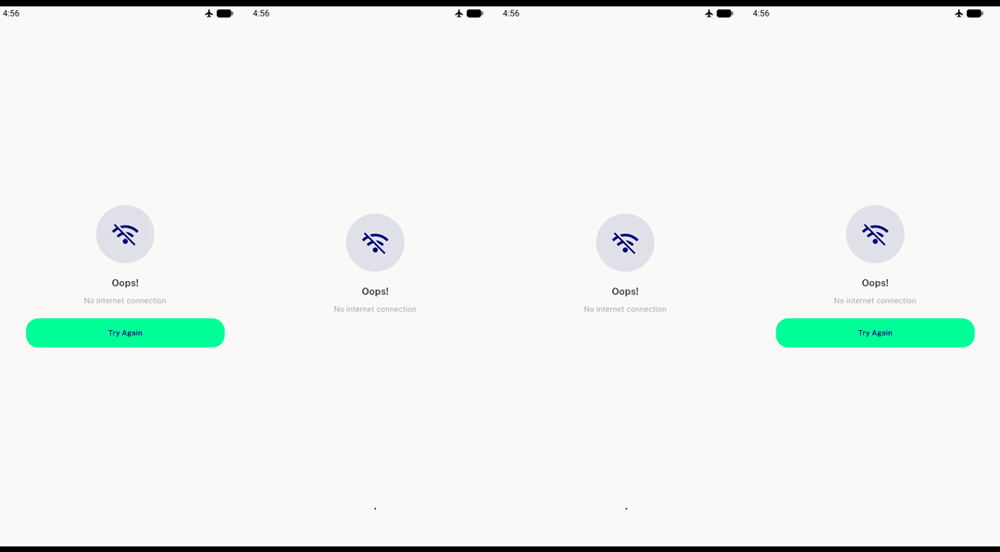
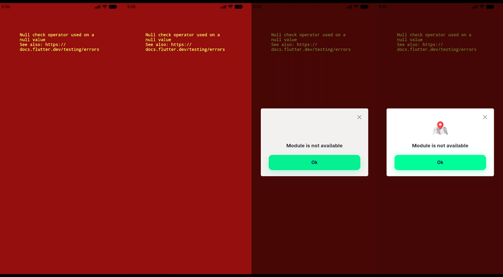

# QA Evidence — NEARS-1681

**PASS - splash no longer paints a false no-internet error on a local-cache miss (AC1 proven with a pre-fix control)**

**5 screenshot(s).** Click any thumbnail for full resolution.

<table>
<tr>
<td align="center" width="33%"> ac1 BASE control false error repro</td>
<td align="center" width="33%"> ac1 HEAD launch sequence no error</td>
<td align="center" width="33%"> ac2 offline error screen</td>
</tr>
<tr>
<td align="center" width="33%"> ac5 retrying spinner</td>
<td align="center" width="33%"> bug deeplink module redscreen</td>
</tr>
</table>

### Other artifacts
- [`bug-deeplink-module-redscreen.log`](bug-deeplink-module-redscreen.log)
- [`summary.txt`](summary.txt)

---
*From `nears/docs/qa-evidence/NEARS-1681/` · public-repo scrub policy (no live secrets; verified clean).*
