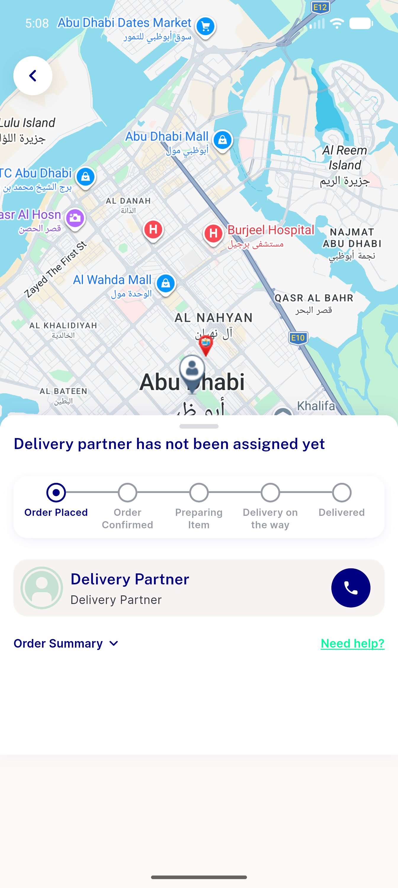
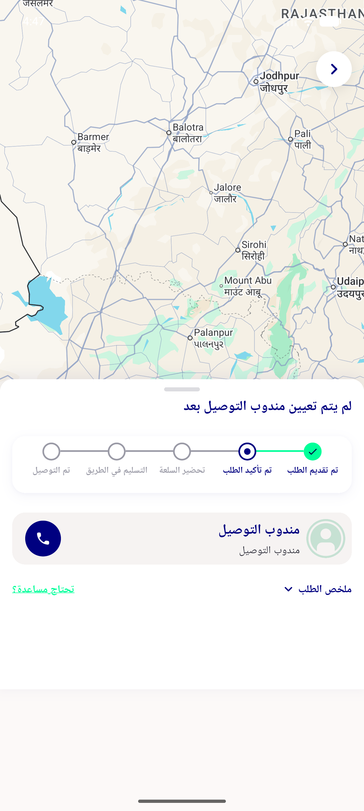
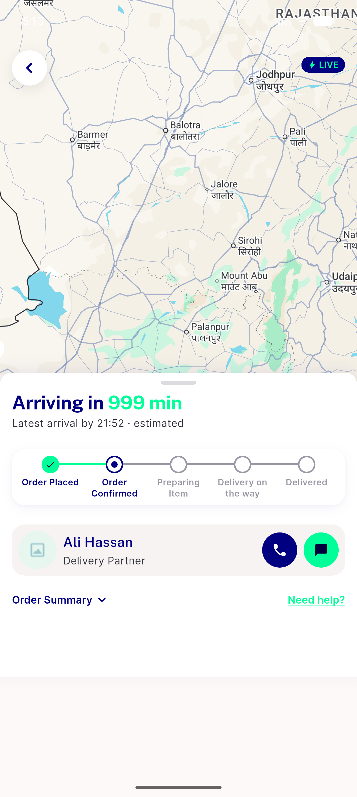
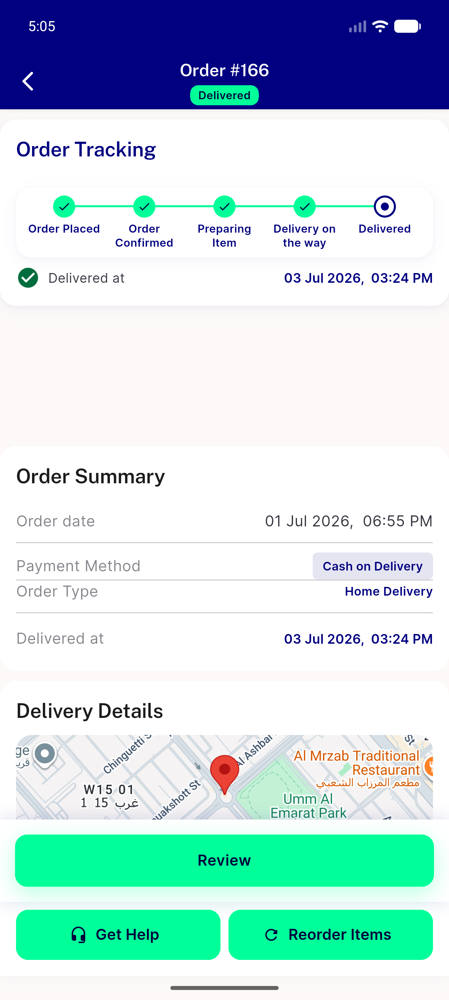
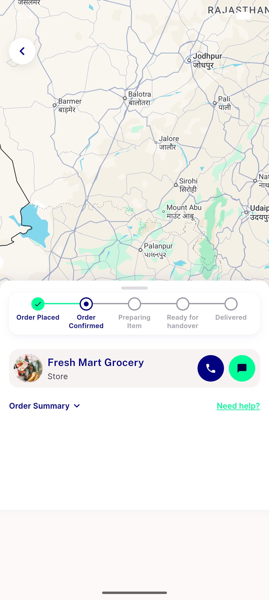

# QA Evidence — NEARS-1686

**PASS — chat action hidden when no delivery partner; no crash path; take-away + assigned-partner chat unchanged**

**6 screenshot(s).** Click any thumbnail for full resolution.

<table>
<tr>
<td align="center" width="33%"> ac1 ac2 en tracking chat hidden</td>
<td align="center" width="33%"> ac2 ar rtl tracking chat hidden</td>
<td align="center" width="33%"> ac4 delivered order no track entry</td>
</tr>
<tr>
<td align="center" width="33%"> ac4 partner assigned chat visible</td>
<td align="center" width="33%"> bug track fab unlabeled</td>
<td align="center" width="33%"> q3 takeaway chat visible</td>
</tr>
</table>

### Other artifacts
- [`bug-track-fab-unlabeled.log`](bug-track-fab-unlabeled.log)

---
*From `nears/docs/qa-evidence/NEARS-1686/` · public-repo scrub policy (no live secrets; verified clean).*
