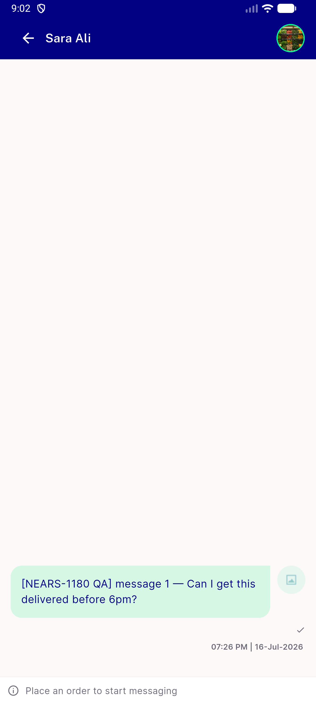
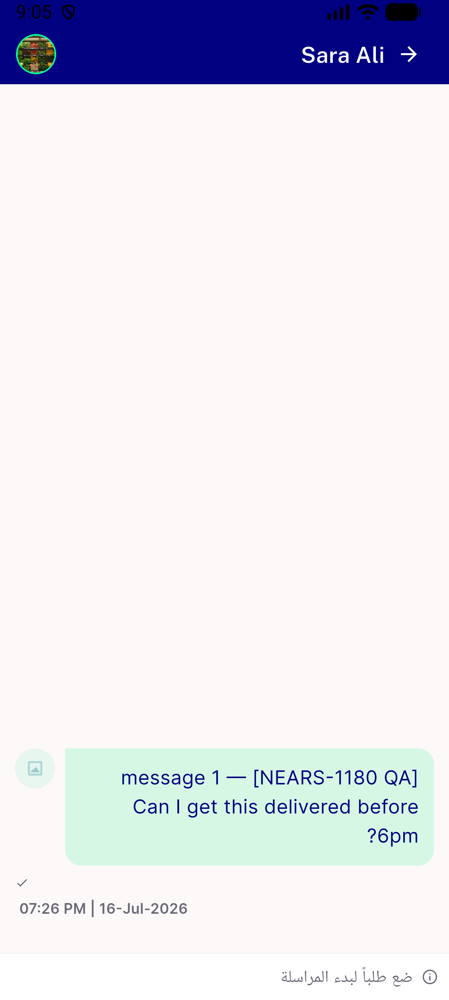
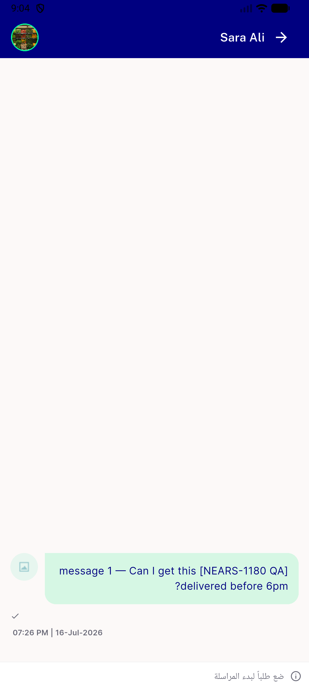
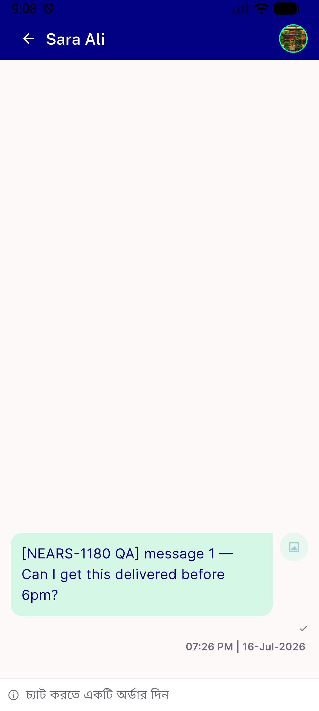
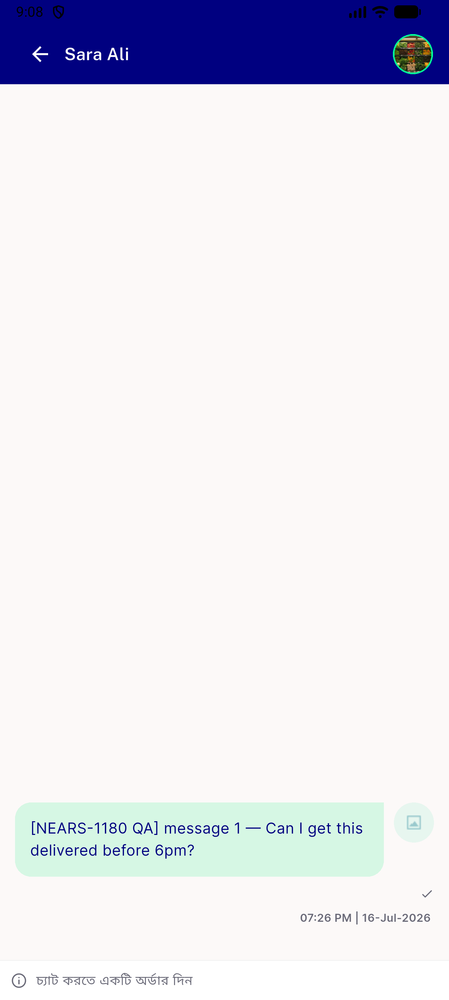
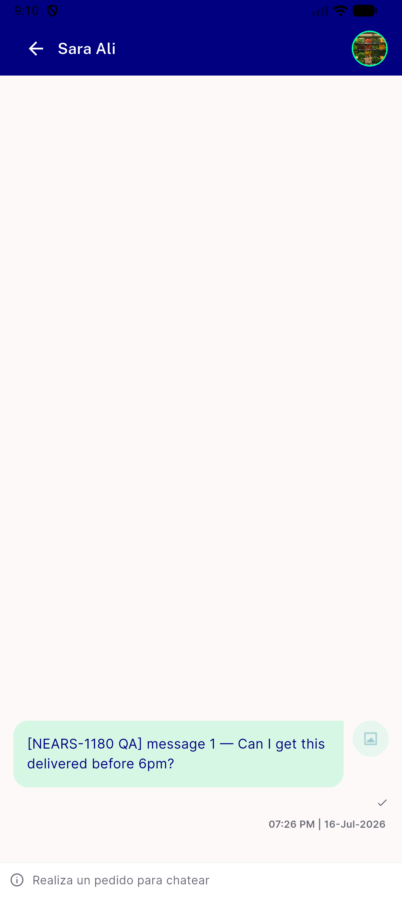
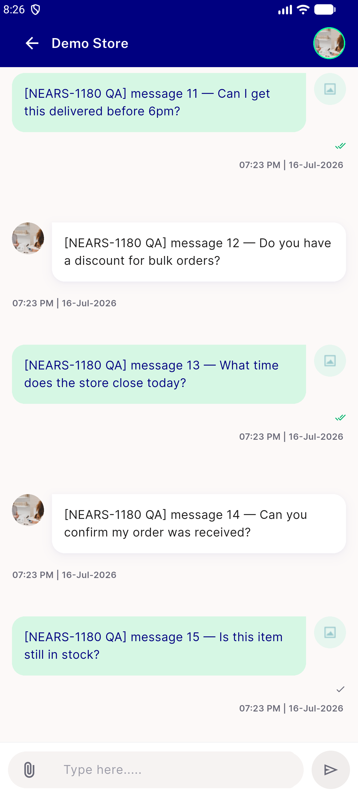
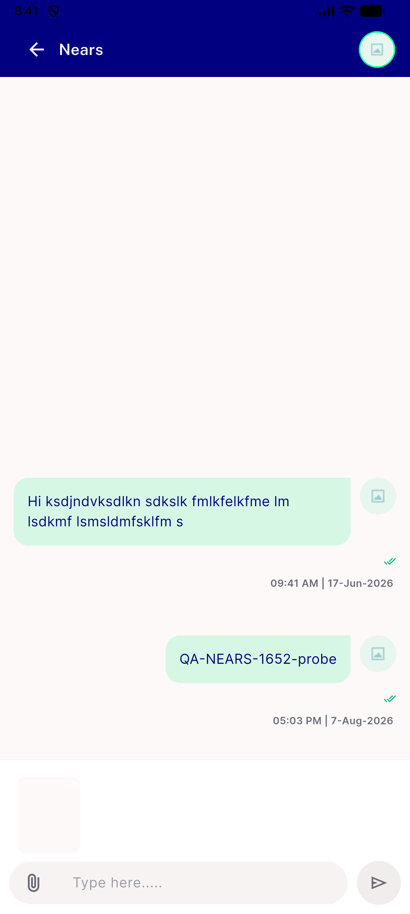
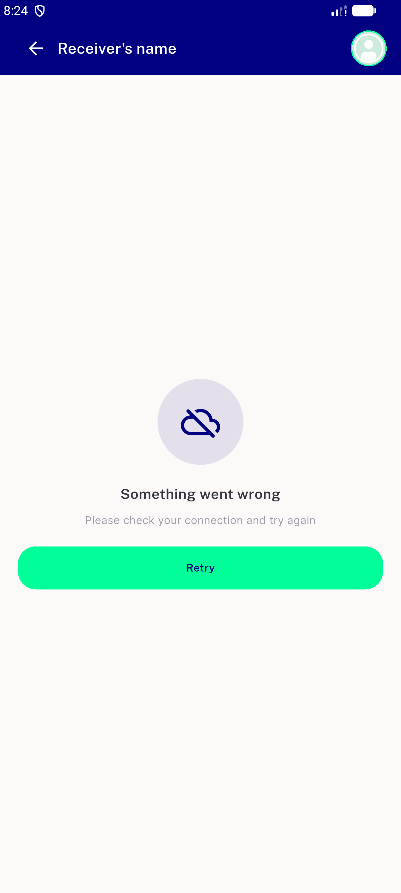
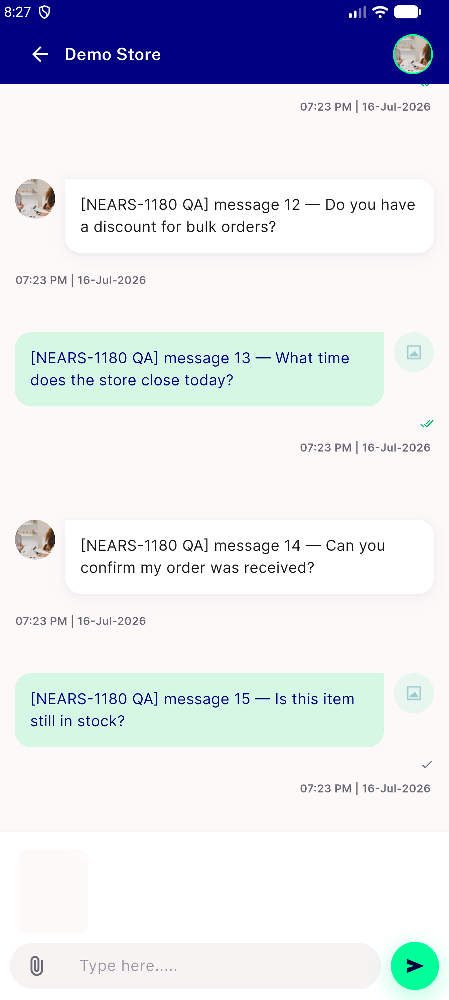

# QA Evidence — NEARS-1688

**DELTA re-QA PASS (fix cycle 1, HEAD 501a57f5) — glyph is now info (U+E88E), padlock absent from the render tree; all 6 notice shots re-taken**

**11 screenshot(s).** Click any thumbnail for full resolution.

<table>
<tr>
<td align="center" width="33%"> ac1 en gated notice conv48</td>
<td align="center" width="33%"> ac2 ar rtl notice textscale 1.3</td>
<td align="center" width="33%"> ac2 ar rtl notice</td>
</tr>
<tr>
<td align="center" width="33%"> ac2 bn notice textscale 1.3</td>
<td align="center" width="33%"> ac2 bn notice</td>
<td align="center" width="33%"> ac2 es notice</td>
</tr>
<tr>
<td align="center" width="33%"> ac3 en admin conv45 composer</td>
<td align="center" width="33%"> ac3 en open composer vendor conv46</td>
<td align="center" width="33%"> bug attachment persists across threads</td>
</tr>
<tr>
<td align="center" width="33%"> loading arm null model slot empty</td>
<td align="center" width="33%"> regression attach preview strip intact</td>
</tr>
</table>

### Other artifacts
- [`bug-icon-lock-vs-reviewed-info.log`](bug-icon-lock-vs-reviewed-info.log)
- [`progress.md`](progress.md)

---
*From `nears/docs/qa-evidence/NEARS-1688/` · public-repo scrub policy (no live secrets; verified clean).*
