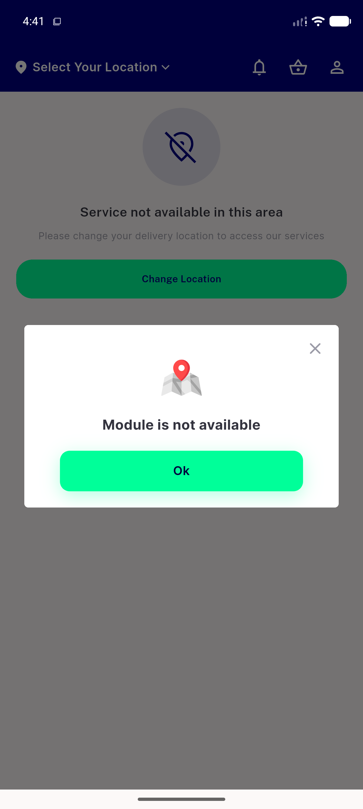

# QA Evidence — NEARS-1691

**PASS — deep-link module-not-found paired [FAIL] log confirmed live, both branches, no crash, valid module unaffected**

**3 screenshot(s).** Click any thumbnail for full resolution.

<table>
<tr>
<td align="center" width="33%"> ac1 ac2 has address home after bogus module</td>
<td align="center" width="33%"> ac1 ac2 no address zonewarning module not available</td>
<td align="center" width="33%"> ac4 valid module unaffected</td>
</tr>
</table>

---
*From `nears/docs/qa-evidence/NEARS-1691/` · public-repo scrub policy (no live secrets; verified clean).*
