# QA Evidence — NEARS-1695

**QA PASS -- chat refresh-failed affordance, emulator-5558**

**12 screenshot(s).** Click any thumbnail for full resolution.

<table>
<tr>
<td align="center" width="33%"><a href="ac1-conversation-list-refresh-failed.png">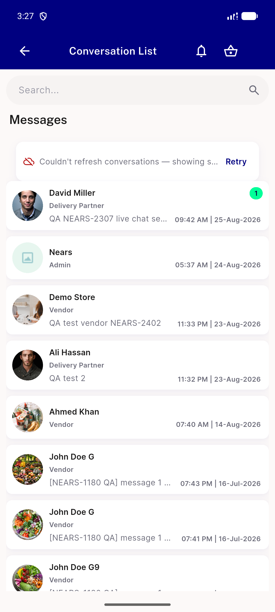</a> ac1 conversation list refresh failed</td>
<td align="center" width="33%"><a href="ac2-thread-refresh-failed-pinned.png">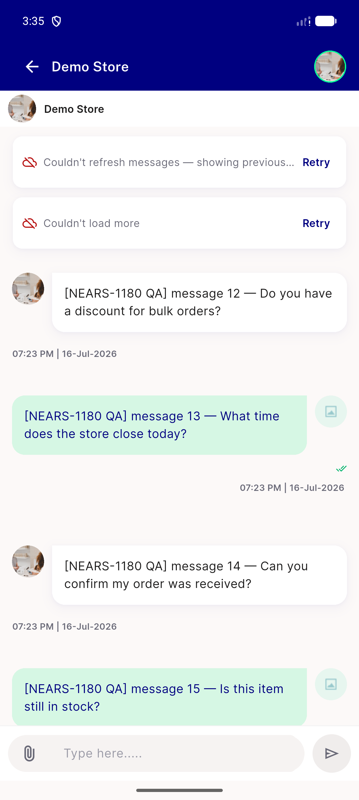</a> ac2 thread refresh failed pinned</td>
<td align="center" width="33%"><a href="ac3-thread-retry-persists-on-failure.png">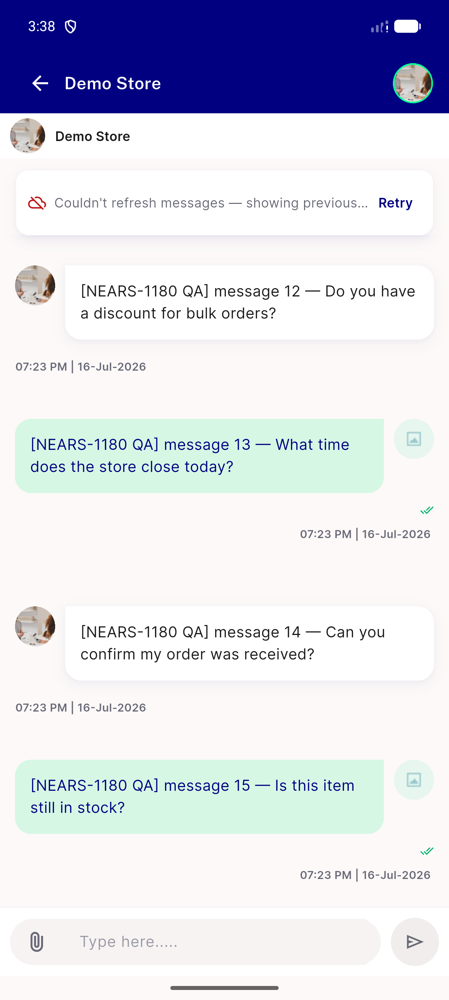</a> ac3 thread retry persists on failure</td>
</tr>
<tr>
<td align="center" width="33%"><a href="scope10-rtl-conversation-list.png">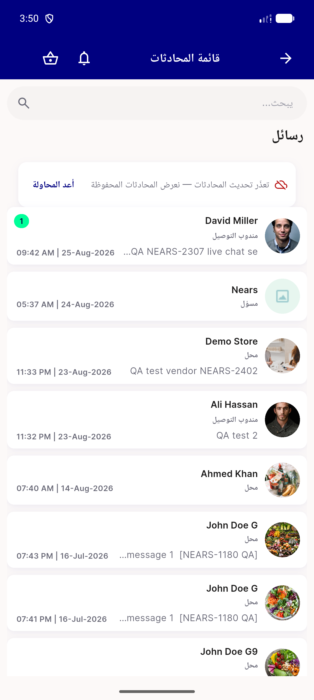</a> scope10 rtl conversation list</td>
<td align="center" width="33%"><a href="scope10-rtl-thread.png">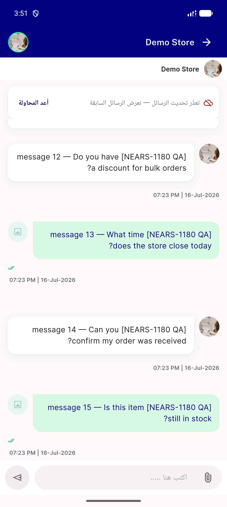</a> scope10 rtl thread</td>
<td align="center" width="33%"><a href="scope2-empty-list-refresh-failed.png">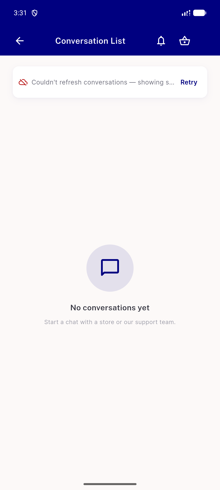</a> scope2 empty list refresh failed</td>
</tr>
<tr>
<td align="center" width="33%"><a href="scope3-search-mode-no-banner.png">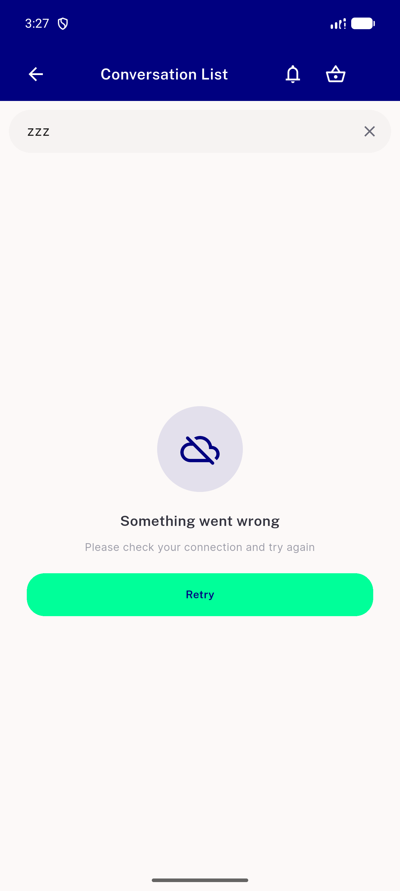</a> scope3 search mode no banner</td>
<td align="center" width="33%"><a href="scope6-empty-thread-baseline.png">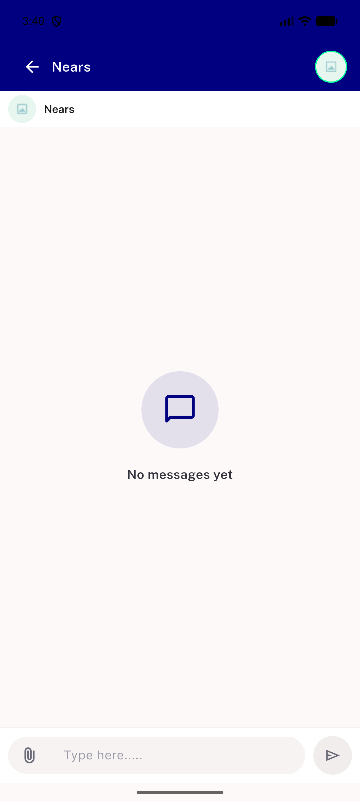</a> scope6 empty thread baseline</td>
<td align="center" width="33%"><a href="scope6-empty-thread-refresh-failed.png">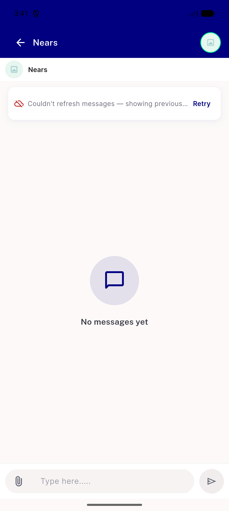</a> scope6 empty thread refresh failed</td>
</tr>
<tr>
<td align="center" width="33%"><a href="scope8-coldpath-conversationlist.png">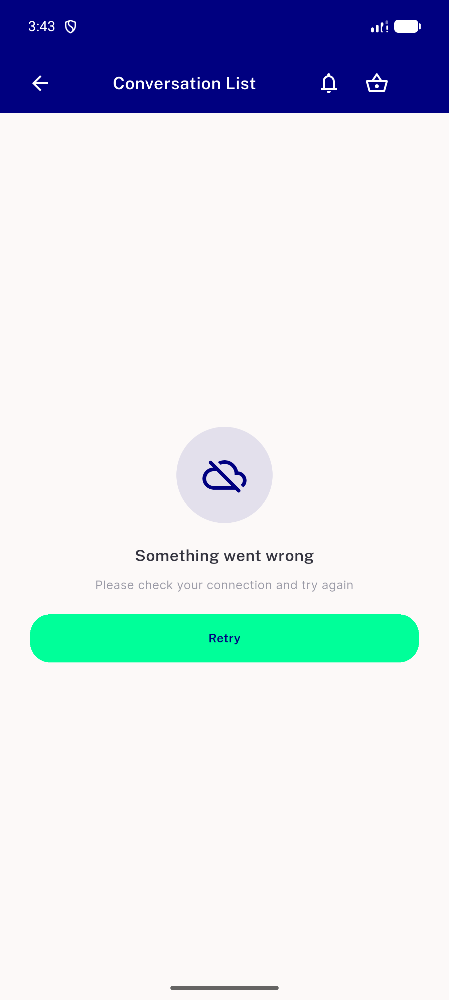</a> scope8 coldpath conversationlist</td>
<td align="center" width="33%"><a href="scope8-coldpath-thread.png">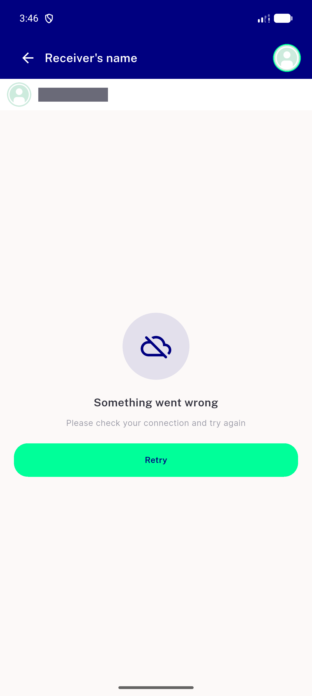</a> scope8 coldpath thread</td>
<td align="center" width="33%"><a href="scope9-coupon-regression-unaffected.png">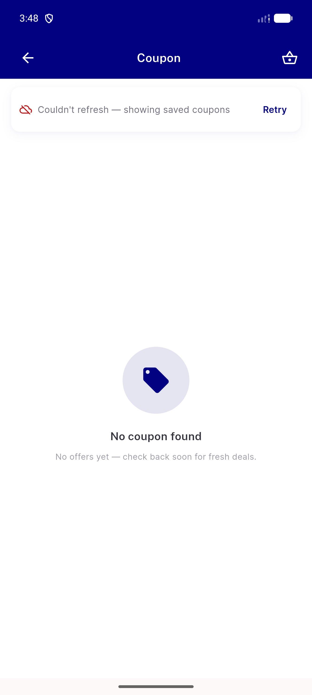</a> scope9 coupon regression unaffected</td>
</tr>
</table>

---
*From `nears/docs/qa-evidence/NEARS-1695/` · public-repo scrub policy (no live secrets; verified clean).*
