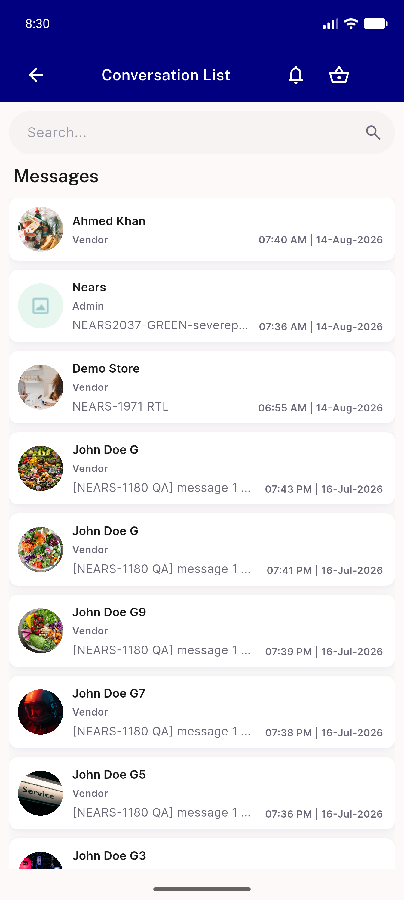
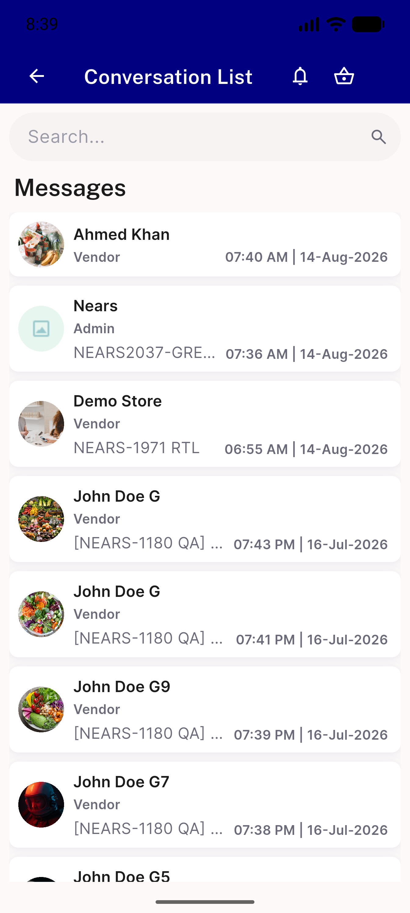
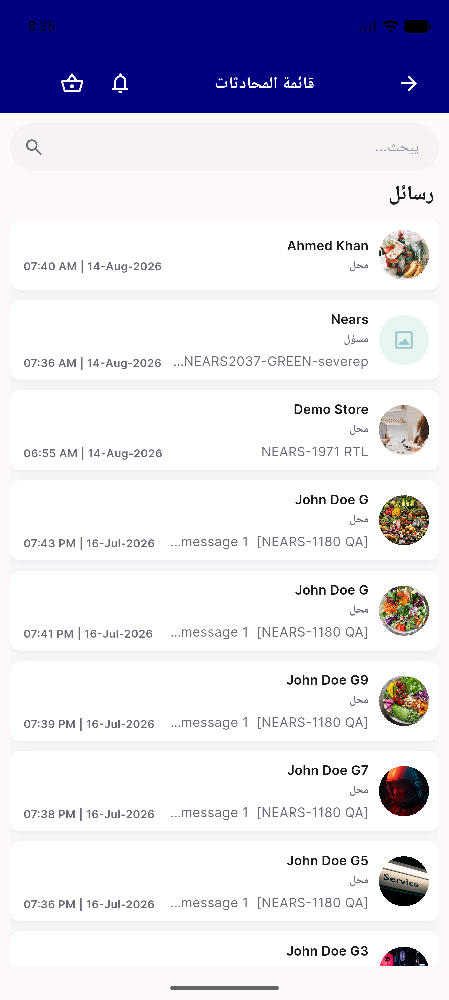
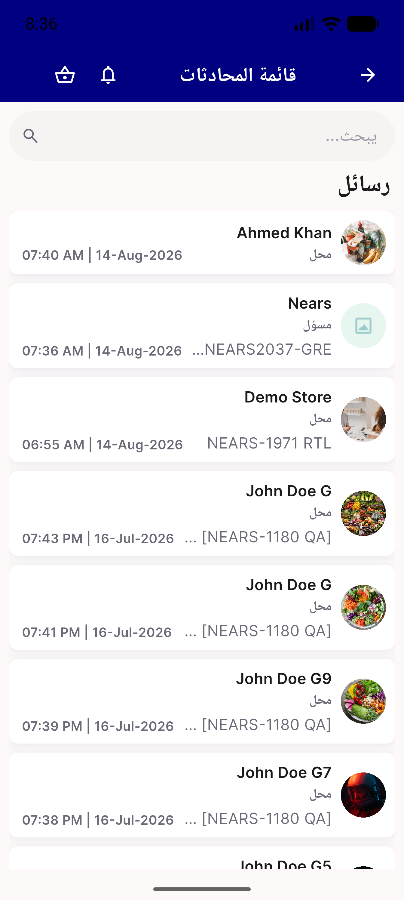

# QA Evidence — NEARS-1696

**PASS — AC1+AC2 demonstrated live on emulator-5556 (448x997dp), LTR+RTL, scale 1.0 and 1.3; zero overlap, zero RenderFlex overflow**

**4 screenshot(s).** Click any thumbnail for full resolution.

<table>
<tr>
<td align="center" width="33%"> ac1 ltr scale1.0</td>
<td align="center" width="33%"> ac1 ltr textscale1.3</td>
<td align="center" width="33%"> ac2 rtl scale1.0</td>
</tr>
<tr>
<td align="center" width="33%"> ac2 rtl textscale1.3</td>
</tr>
</table>

---
*From `nears/docs/qa-evidence/NEARS-1696/` · public-repo scrub policy (no live secrets; verified clean).*
