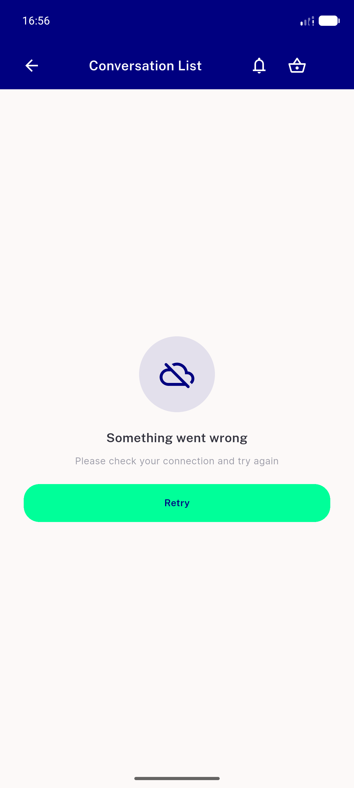
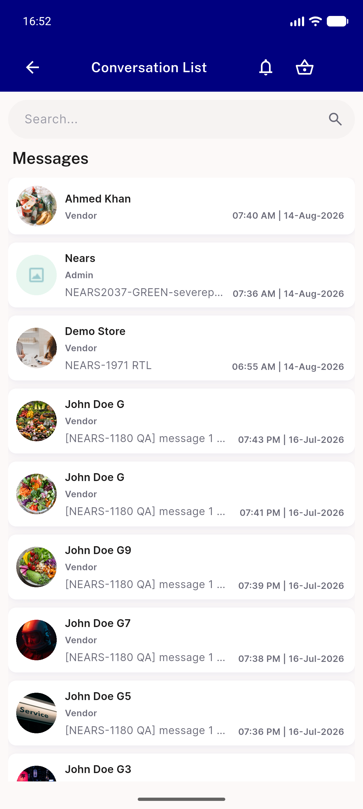
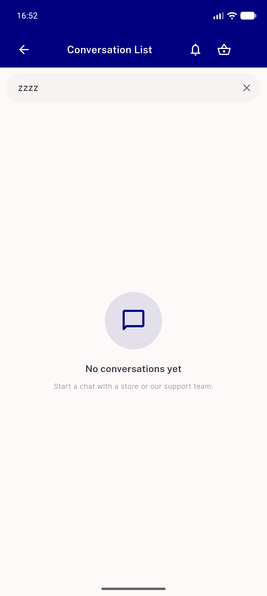
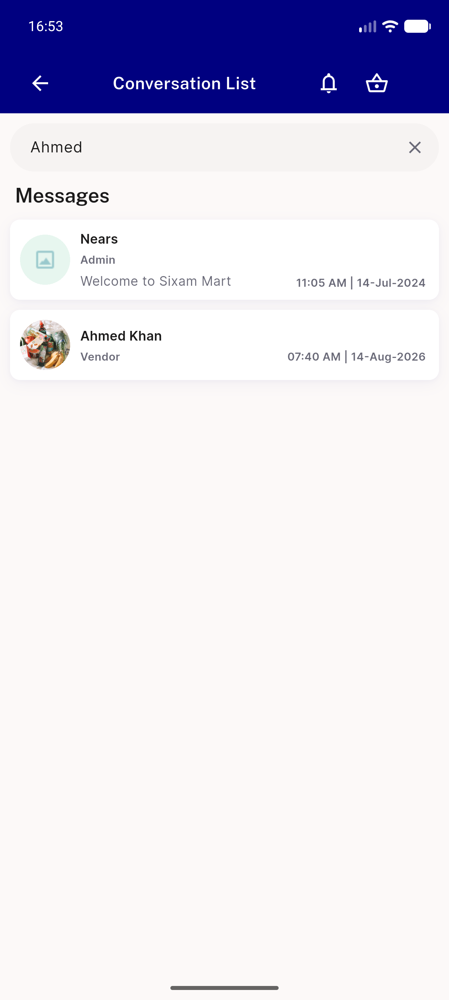
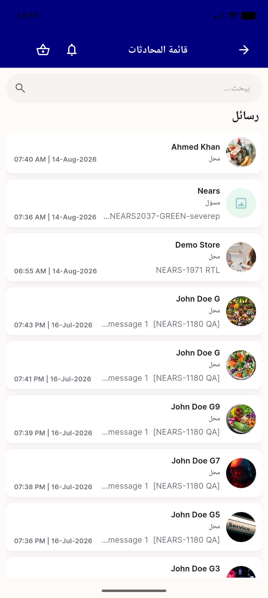

# QA Evidence — NEARS-1697

**PASS — AC1 unit-pinned (not live-reachable), AC2 demonstrated live incl. zero-result search keeping the field + Clear exit; LTR + RTL**

**5 screenshot(s).** Click any thumbnail for full resolution.

<table>
<tr>
<td align="center" width="33%"> ac1 04 failed load no search field</td>
<td align="center" width="33%"> ac2 01 loaded list baseline</td>
<td align="center" width="33%"> ac2 02 zero result search field stays</td>
</tr>
<tr>
<td align="center" width="33%"> ac2 03 search with hits</td>
<td align="center" width="33%"> ac2 05 rtl arabic layout</td>
</tr>
</table>

---
*From `nears/docs/qa-evidence/NEARS-1697/` · public-repo scrub policy (no live secrets; verified clean).*
