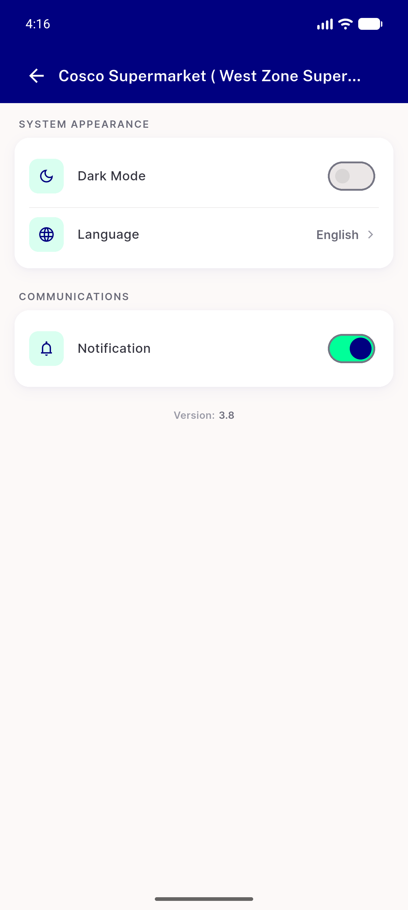
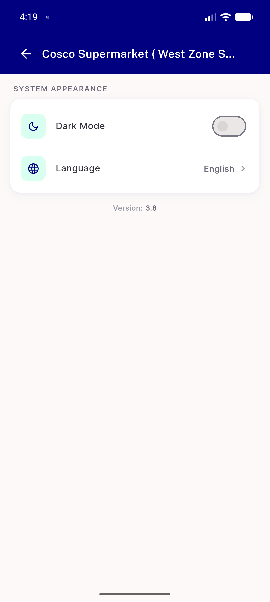

# QA Evidence — NEARS-1699

**PASS — AC5 long title ellipsizes on one line inside the 60dp bar (448dp + 411dp)**

**4 screenshot(s).** Click any thumbnail for full resolution.

<table>
<tr>
<td align="center" width="33%"> ac5 5558 appbar crop</td>
<td align="center" width="33%"> ac5 5558 long title ellipsized 448dp</td>
<td align="center" width="33%"> ac5 5562 appbar crop</td>
</tr>
<tr>
<td align="center" width="33%"> ac5 5562 long title ellipsized 411dp</td>
</tr>
</table>

### Other artifacts
- [`measurements.md`](measurements.md)

---
*From `nears/docs/qa-evidence/NEARS-1699/` · public-repo scrub policy (no live secrets; verified clean).*
