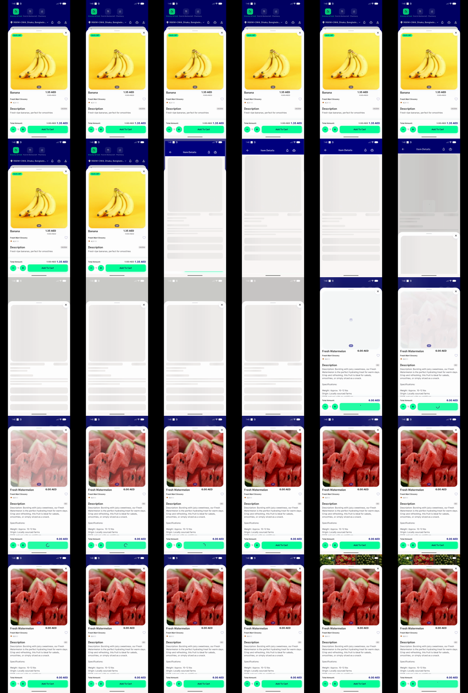
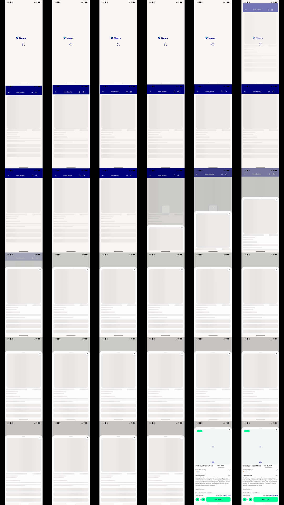
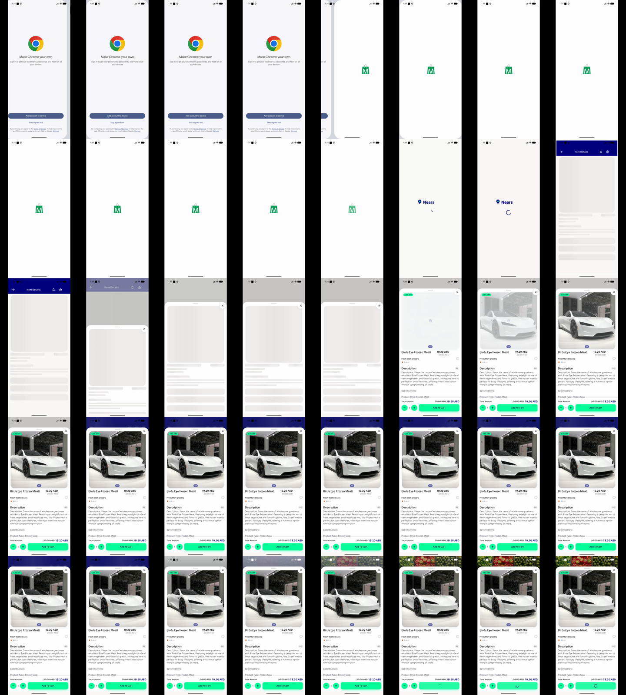
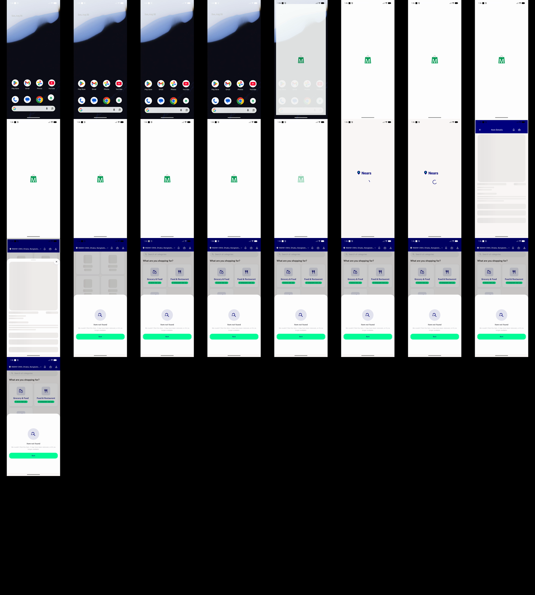
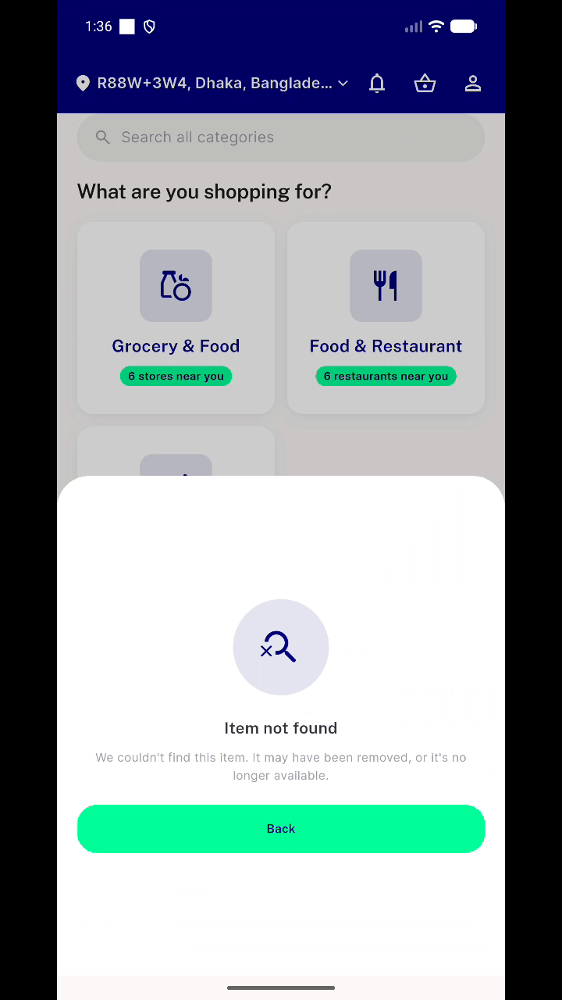

# QA Evidence — NEARS-1705

**PASS — item-details loader reachability confirmed cold+warm start; regression sweep clean; 2 pre-existing (non-blocking) findings logged**

**6 screenshot(s).** Click any thumbnail for full resolution.

<table>
<tr>
<td align="center" width="33%"> ac1 warmstart contactsheet</td>
<td align="center" width="33%"> ac2 cold start loader chrome</td>
<td align="center" width="33%"> ac2 coldstart contactsheet zoom</td>
</tr>
<tr>
<td align="center" width="33%"> ac2 coldstart contactsheet</td>
<td align="center" width="33%"> bug modmismatch contactsheet</td>
<td align="center" width="33%"> bug modselect flash</td>
</tr>
</table>

### Other artifacts
- [`ac1-ac2-coldstart-recording.mp4`](ac1-ac2-coldstart-recording.mp4)
- [`ac1-warmstart-recording.mp4`](ac1-warmstart-recording.mp4)
- [`ac3-grep-itemdetails.log`](ac3-grep-itemdetails.log)
- [`bug-modmismatch-flash-recording.mp4`](bug-modmismatch-flash-recording.mp4)
- [`bug-shareitem-orphaned-widget.log`](bug-shareitem-orphaned-widget.log)
- [`regression-acs-live-dumps.log`](regression-acs-live-dumps.log)

---
*From `nears/docs/qa-evidence/NEARS-1705/` · public-repo scrub policy (no live secrets; verified clean).*
