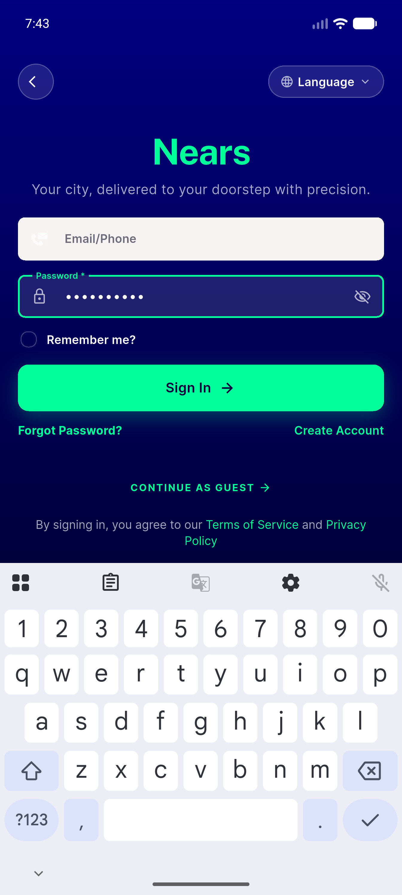
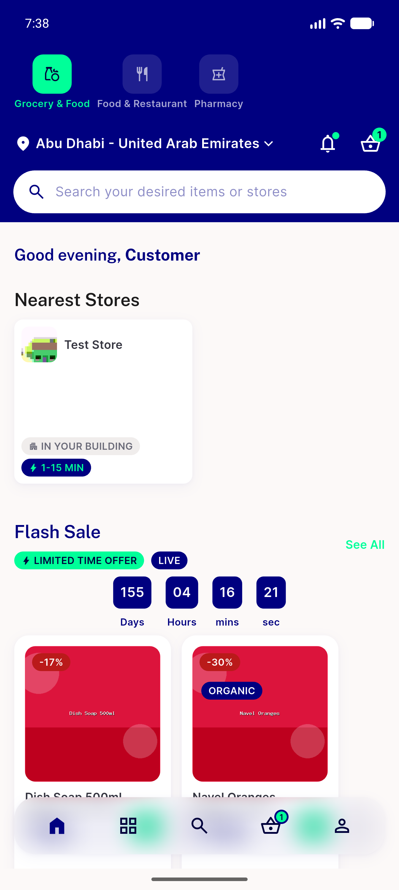

# QA Evidence — NEARS-1707

**PASS — 8/8 ACs demonstrated live on emulator-5556; ui_find exact-tier-first + loud ambiguity verified, incl. the AC5(b) ambiguous-anchor case**

**4 screenshot(s).** Click any thumbnail for full resolution.

<table>
<tr>
<td align="center" width="33%"> ac1 password tap lands on field</td>
<td align="center" width="33%"> ac5b after ui home</td>
<td align="center" width="33%"> ac6 before tap attempt</td>
</tr>
<tr>
<td align="center" width="33%"> final healthy state</td>
</tr>
</table>

### Other artifacts
- [`ac1-ac4-prefix-postfix-ab.log`](ac1-ac4-prefix-postfix-ab.log)
- [`ac2-exit-code-matrix.log`](ac2-exit-code-matrix.log)
- [`ac5-ui-home-three-directions.log`](ac5-ui-home-three-directions.log)
- [`regression-sweep.log`](regression-sweep.log)

---
*From `nears/docs/qa-evidence/NEARS-1707/` · public-repo scrub policy (no live secrets; verified clean).*
