# QA Evidence — NEARS-1708

**PASS (AC1/AC2/AC3) — AC4 not demonstrable; wire claim + chat round-trip both VERIFIED on device**

**23 screenshot(s).** Click any thumbnail for full resolution.

<table>
<tr>
<td align="center" width="33%"><a href="before-ar-order-details.png">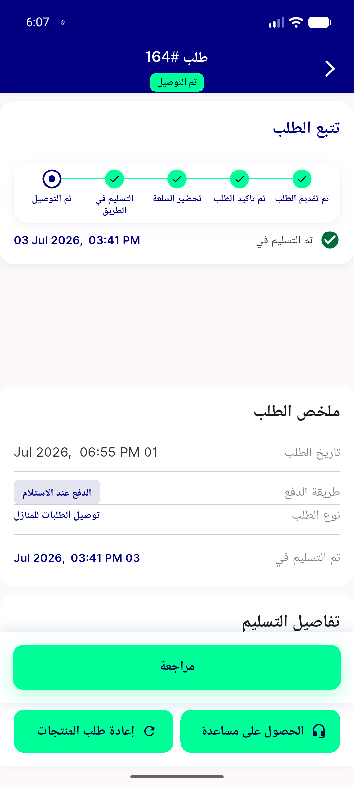</a> before ar order details</td>
<td align="center" width="33%"><a href="before-ar-order-list.png">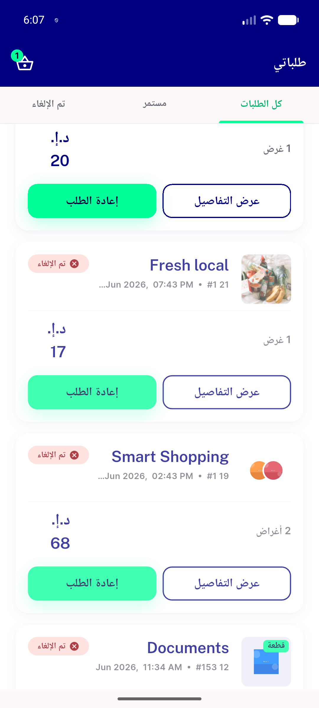</a> before ar order list</td>
<td align="center" width="33%"><a href="before-ar-profile-joined.png">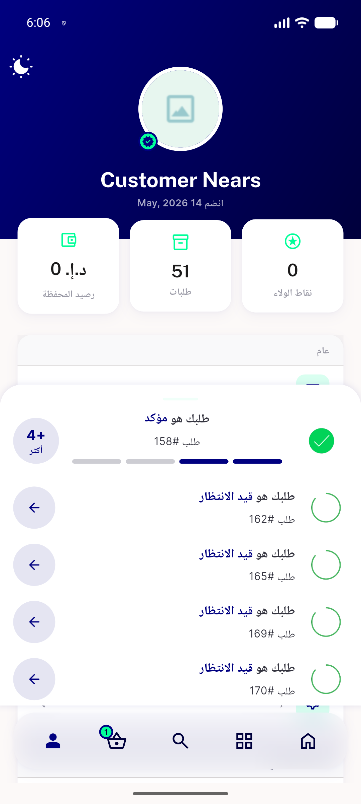</a> before ar profile joined</td>
</tr>
<tr>
<td align="center" width="33%"> bug min order gate stale</td>
<td align="center" width="33%"><a href="bug-unsubstituted-amount-placeholder.png">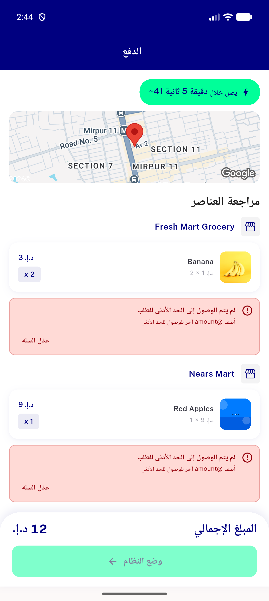</a> bug unsubstituted amount placeholder</td>
<td align="center" width="33%"><a href="chat-thread-composer-state.png">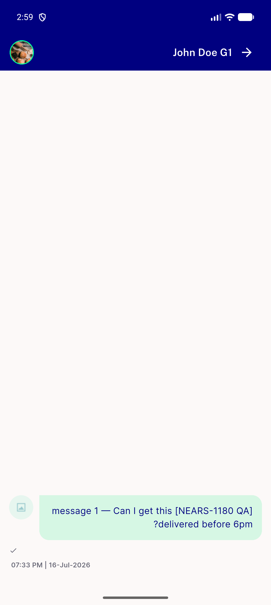</a> chat thread composer state</td>
</tr>
<tr>
<td align="center" width="33%"> post chat thread ar</td>
<td align="center" width="33%"><a href="post-chat-thread-en.png">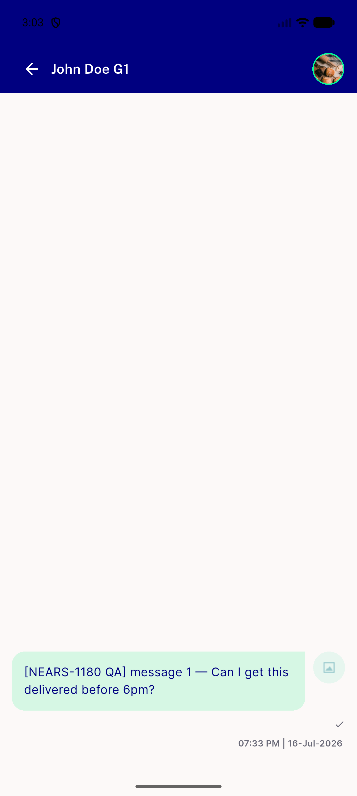</a> post chat thread en</td>
<td align="center" width="33%"><a href="post-conversation-list-ar.png">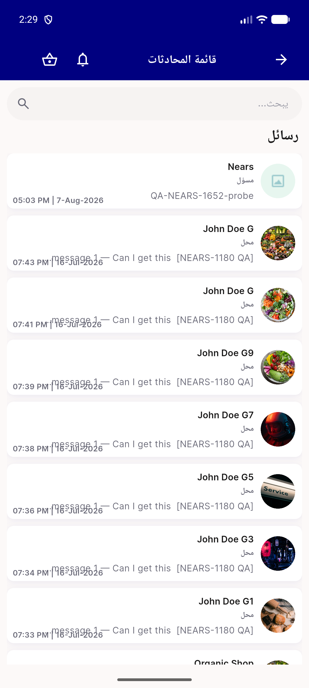</a> post conversation list ar</td>
</tr>
<tr>
<td align="center" width="33%"><a href="post-conversation-list-en.png">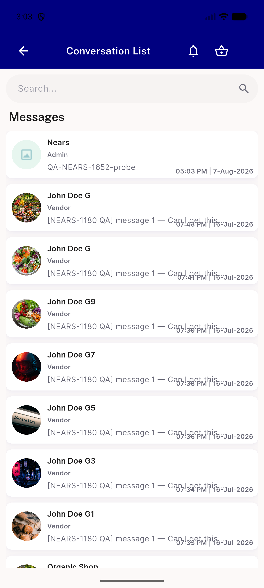</a> post conversation list en</td>
<td align="center" width="33%"><a href="post-notifications-en.png">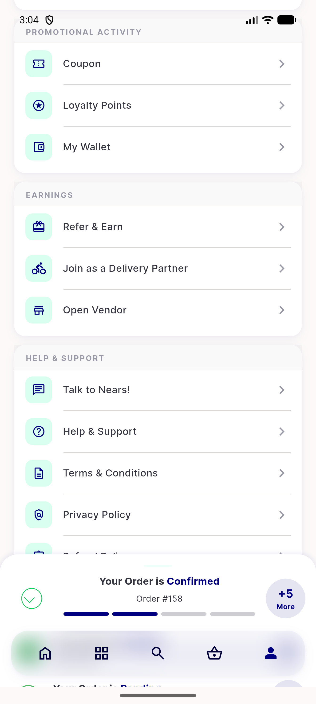</a> post notifications en</td>
<td align="center" width="33%"><a href="post-order-tracking-ar.png">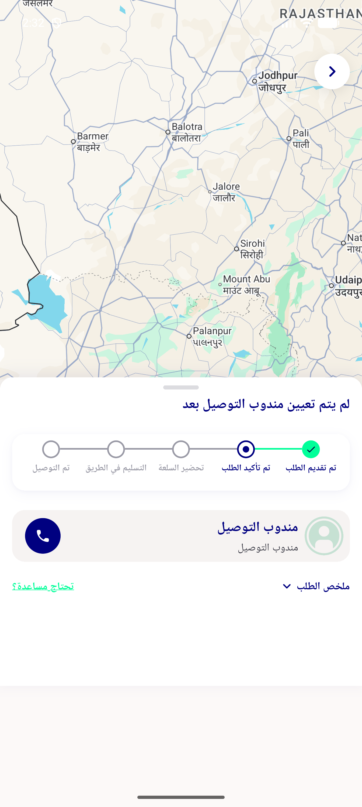</a> post order tracking ar</td>
</tr>
<tr>
<td align="center" width="33%"><a href="post-orders-ar.png">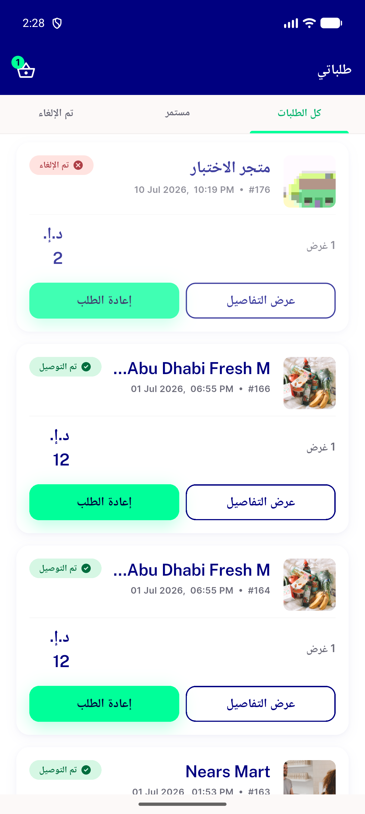</a> post orders ar</td>
<td align="center" width="33%"><a href="post-orders-en.png">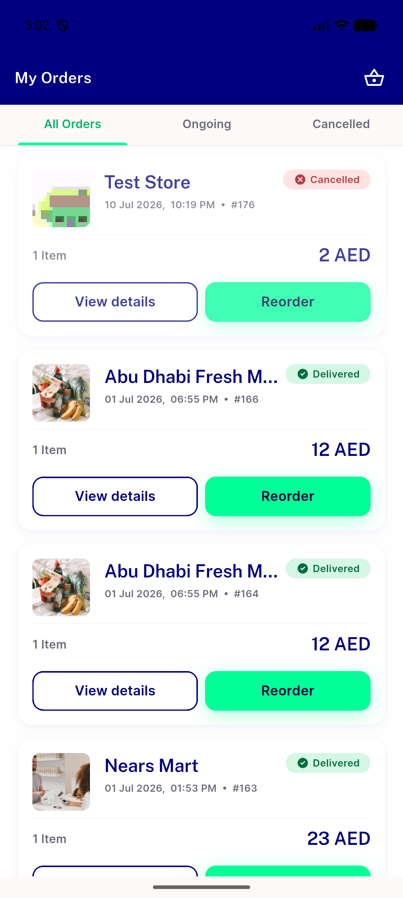</a> post orders en</td>
<td align="center" width="33%"><a href="post-profile-joined-ar.png">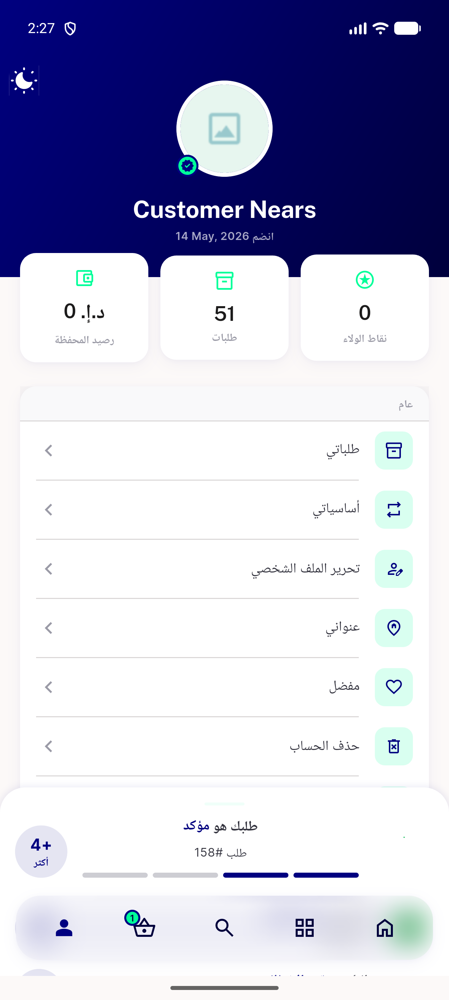</a> post profile joined ar</td>
</tr>
<tr>
<td align="center" width="33%"><a href="post-review-row-ar.png">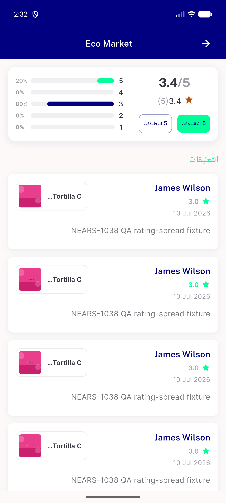</a> post review row ar</td>
<td align="center" width="33%"><a href="post-timeslot-range-ar.png">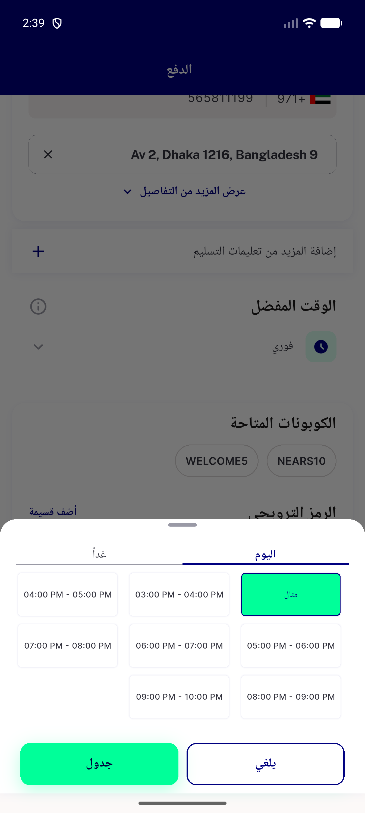</a> post timeslot range ar</td>
<td align="center" width="33%"><a href="pre-chat-thread-ar.png">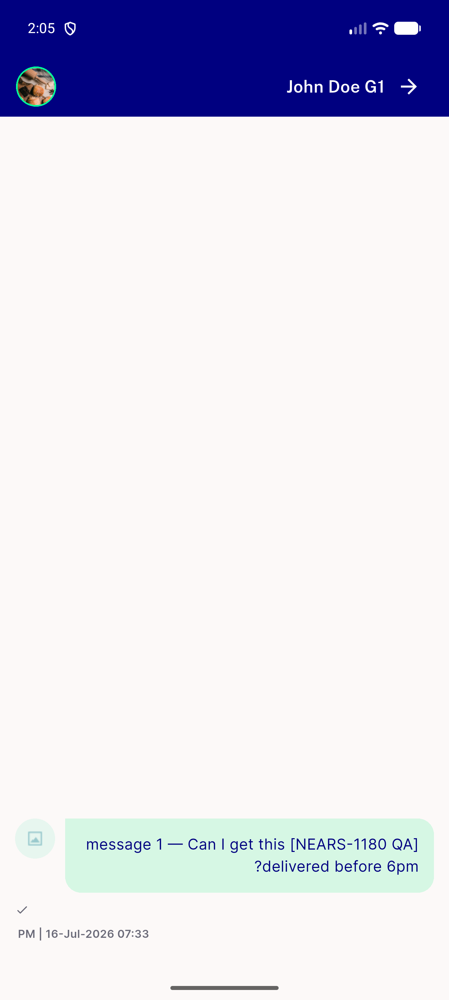</a> pre chat thread ar</td>
</tr>
<tr>
<td align="center" width="33%"> pre conversation list ar</td>
<td align="center" width="33%"><a href="pre-order-details-ar.png">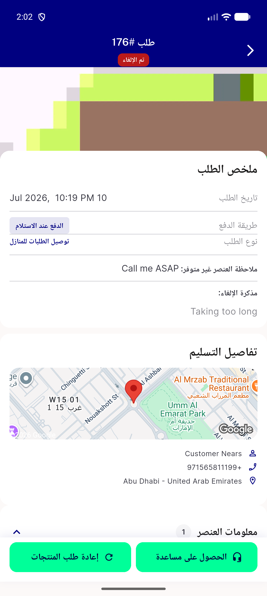</a> pre order details ar</td>
<td align="center" width="33%"> pre orders ar</td>
</tr>
<tr>
<td align="center" width="33%"><a href="pre-profile-joined-ar.png">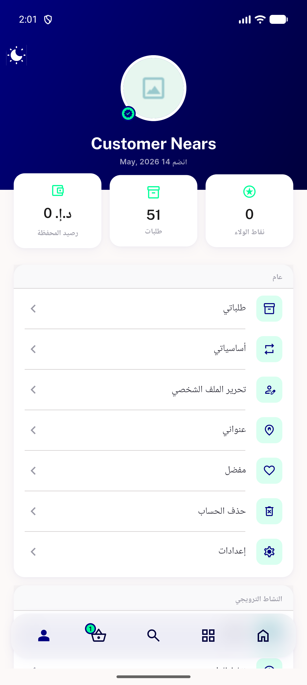</a> pre profile joined ar</td>
<td align="center" width="33%"><a href="pre-review-row-ar.png">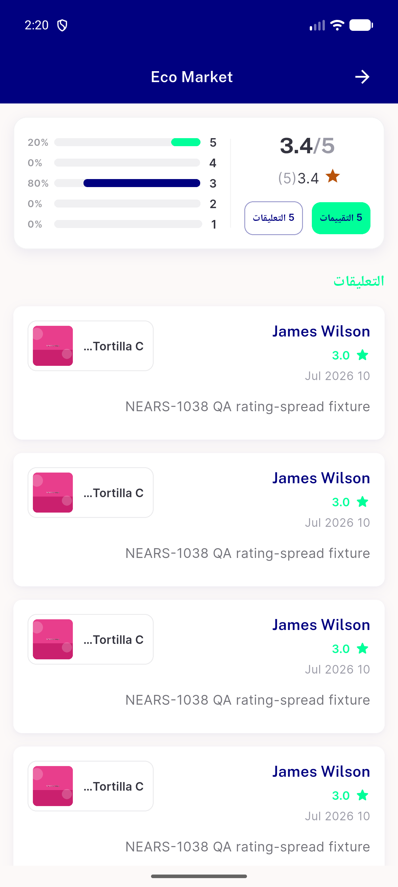</a> pre review row ar</td>
</tr>
</table>

### Other artifacts
- [`progress.md`](progress.md)

---
*From `nears/docs/qa-evidence/NEARS-1708/` · public-repo scrub policy (no live secrets; verified clean).*
