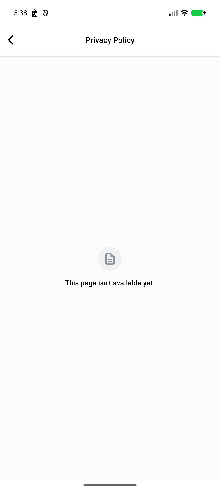
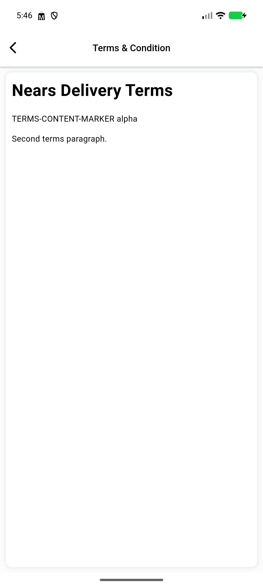
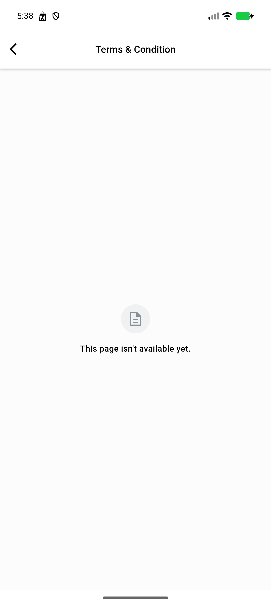
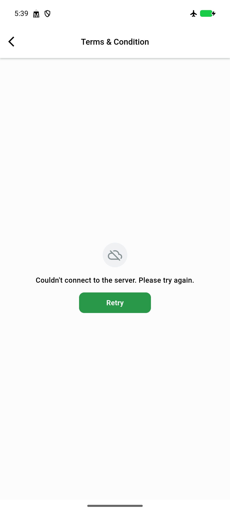
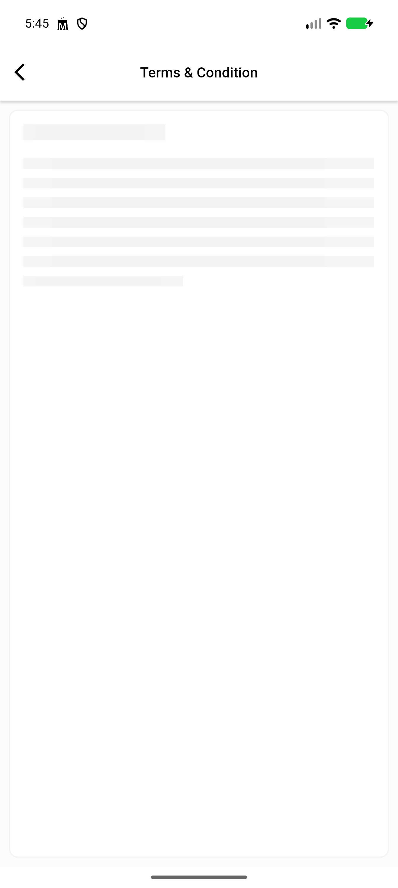
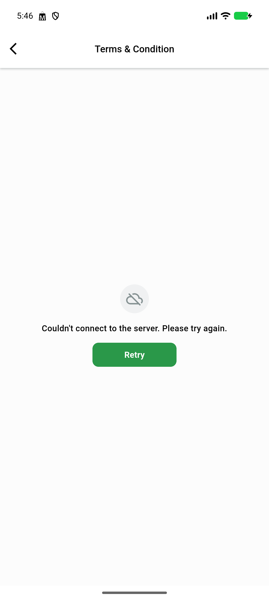
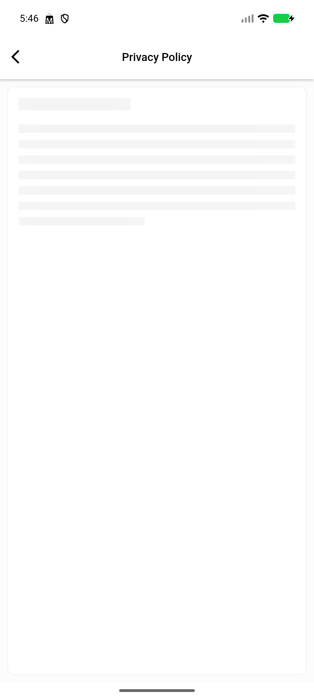
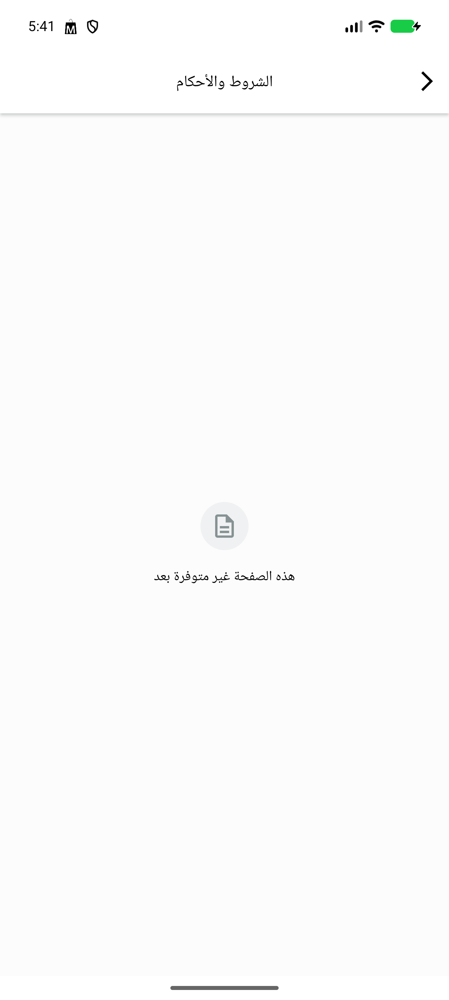
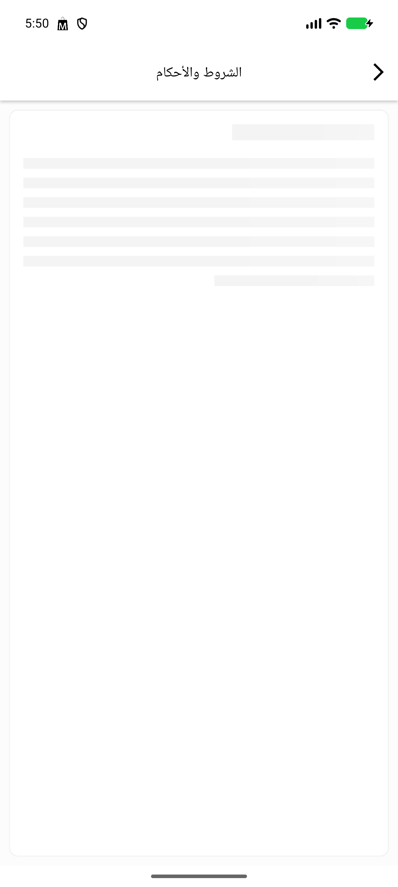

# QA Evidence — NEARS-1710

**PASS — DeliveryApp policy/HTML viewer 4-state gate verified live on emulator-5560 (Android, light mode)**

**9 screenshot(s).** Click any thumbnail for full resolution.

<table>
<tr>
<td align="center" width="33%"> ac1 privacy empty state</td>
<td align="center" width="33%"> ac1 terms content state</td>
<td align="center" width="33%"> ac1 terms empty state</td>
</tr>
<tr>
<td align="center" width="33%"> ac1 terms error retry state</td>
<td align="center" width="33%"> ac1 terms skeleton loading</td>
<td align="center" width="33%"> ac2 terms http500 error retry</td>
</tr>
<tr>
<td align="center" width="33%"> ac4 switch no stale flash</td>
<td align="center" width="33%"> ac7 ac9 terms empty arabic rtl</td>
<td align="center" width="33%"> ac9 terms skeleton arabic rtl</td>
</tr>
</table>

### Other artifacts
- [`bug-retry-no-inflight-state.log`](bug-retry-no-inflight-state.log)
- [`progress.md`](progress.md)

---
*From `nears/docs/qa-evidence/NEARS-1710/` · public-repo scrub policy (no live secrets; verified clean).*
