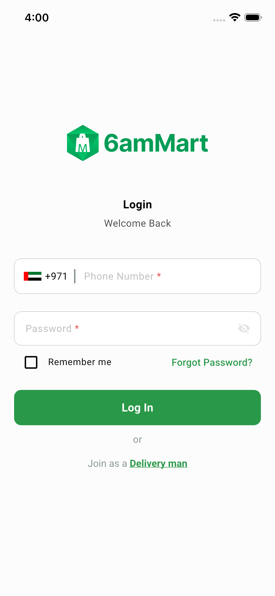

# QA Evidence — NEARS-1710

**NEEDS_DECISION — iOS tap mechanism inert on this host session; build/backend/boot confirmed healthy, live interactive QA blocked**

**4 screenshot(s).** Click any thumbnail for full resolution.

<table>
<tr>
<td align="center" width="33%"> tap noop after forgotpw</td>
<td align="center" width="33%"> tap noop after phonefield</td>
<td align="center" width="33%"> tap noop before forgotpw</td>
</tr>
<tr>
<td align="center" width="33%"> tap noop before phonefield</td>
</tr>
</table>

### Other artifacts
- [`ios-tap-blocker.log`](ios-tap-blocker.log)

---
*From `nears/docs/qa-evidence/NEARS-1710/` · public-repo scrub policy (no live secrets; verified clean).*
