# QA Evidence — NEARS-1718

**PASS — post-fix: order-id row no overflow in en/ar/bn/es at scale 1.0 and 1.3 (max reachable); id #158 whole in every case**

**29 screenshot(s).** Click any thumbnail for full resolution.

<table>
<tr>
<td align="center" width="33%"> initial</td>
<td align="center" width="33%"><a href="02-conversations.png">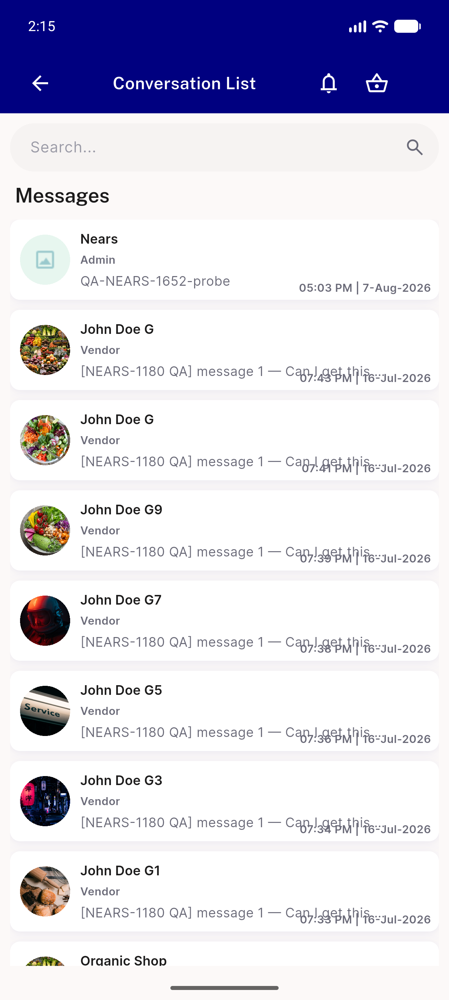</a> conversations</td>
<td align="center" width="33%"><a href="03-chat-en.png">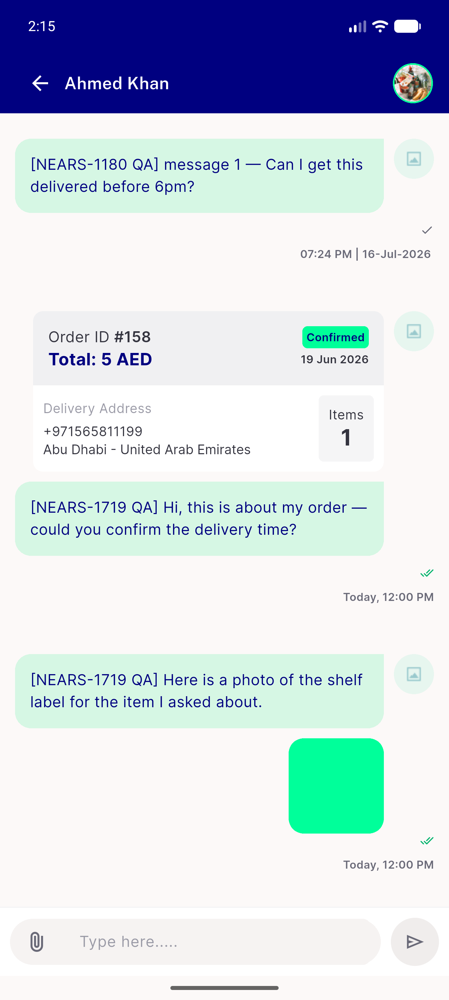</a> chat en</td>
</tr>
<tr>
<td align="center" width="33%"> settings</td>
<td align="center" width="33%"><a href="05-ar-settings.png">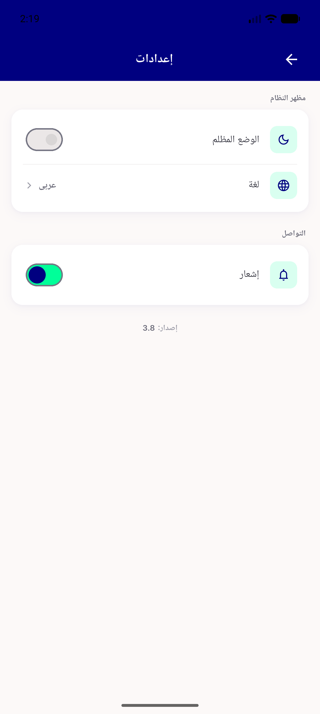</a> ar settings</td>
<td align="center" width="33%"> chat ar</td>
</tr>
<tr>
<td align="center" width="33%"> chat bn</td>
<td align="center" width="33%"><a href="08-positive-control-es-240dp.png">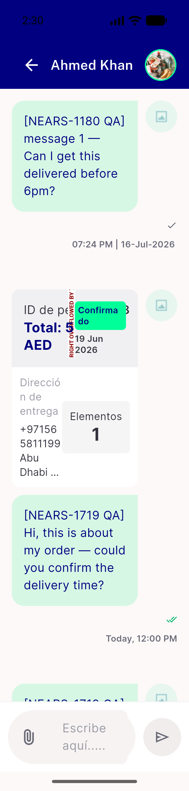</a> positive control es 240dp</td>
<td align="center" width="33%"> chat es scale1.0</td>
</tr>
<tr>
<td align="center" width="33%"><a href="10-chat-es-scale1.3.png">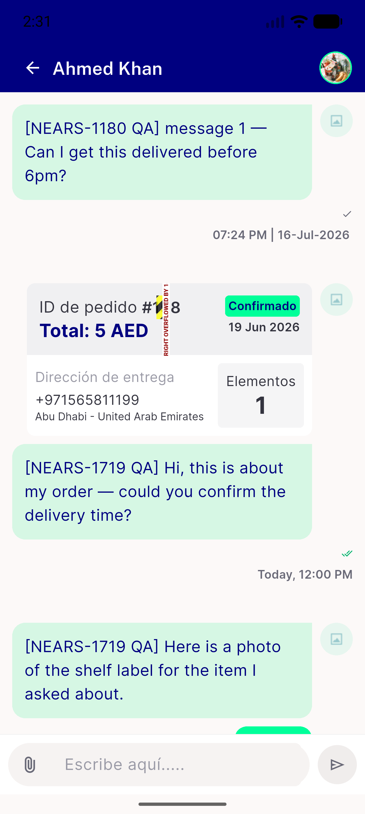</a> chat es scale1.3</td>
<td align="center" width="33%"><a href="11-chat-bn-scale1.3.png">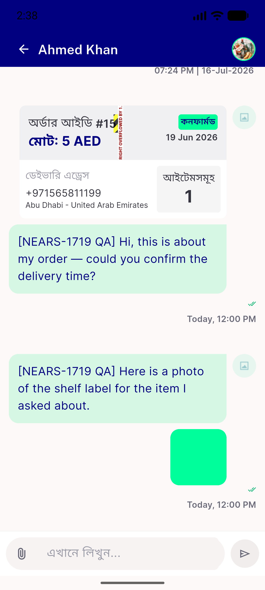</a> chat bn scale1.3</td>
<td align="center" width="33%"><a href="12-chat-ar-scale1.3.png">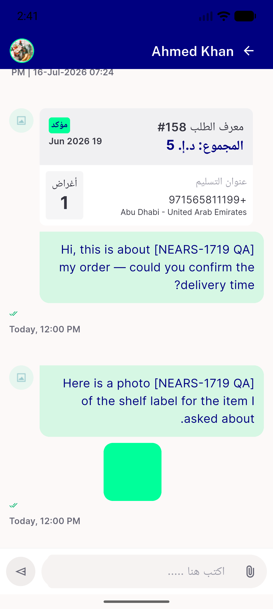</a> chat ar scale1.3</td>
</tr>
<tr>
<td align="center" width="33%"><a href="evidence-glyph-coverage-ar-bn-en.png">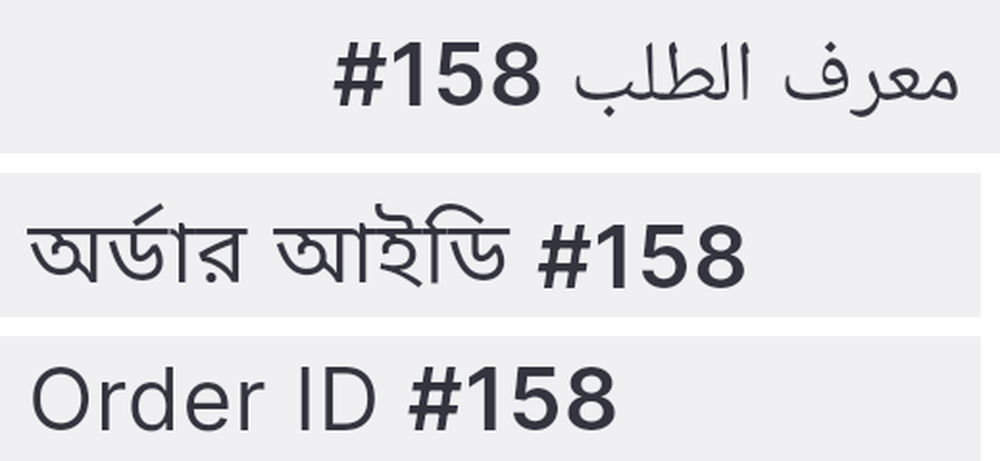</a> evidence glyph coverage ar bn en</td>
<td align="center" width="33%"><a href="post-01-ar-scale1.0.png">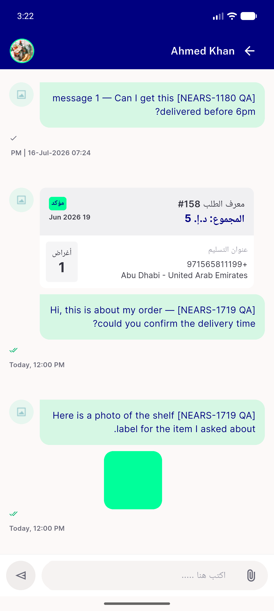</a> post 01 ar scale1.0</td>
<td align="center" width="33%"><a href="post-02-ar-scale1.3.png">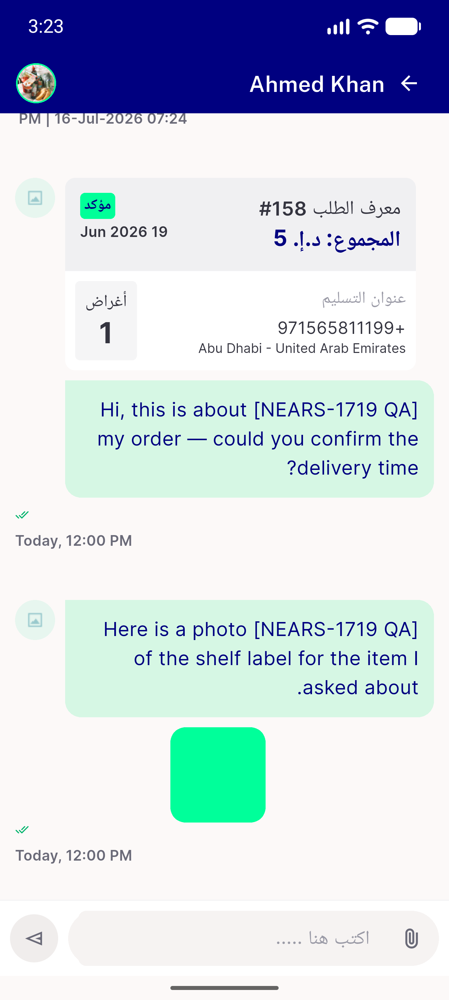</a> post 02 ar scale1.3</td>
</tr>
<tr>
<td align="center" width="33%"> post 03 bn scale1.0</td>
<td align="center" width="33%"> post 04 bn scale1.3</td>
<td align="center" width="33%"><a href="post-05-es-scale1.0.png">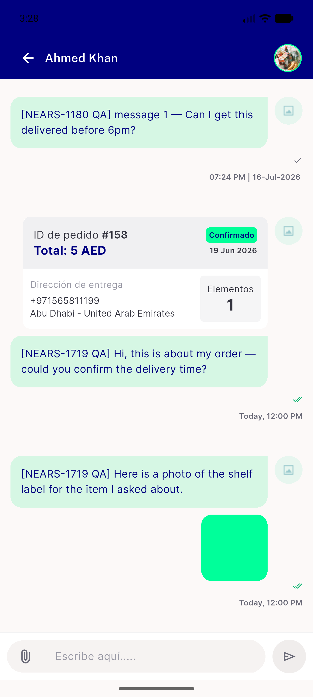</a> post 05 es scale1.0</td>
</tr>
<tr>
<td align="center" width="33%"><a href="post-06-es-scale1.3.png">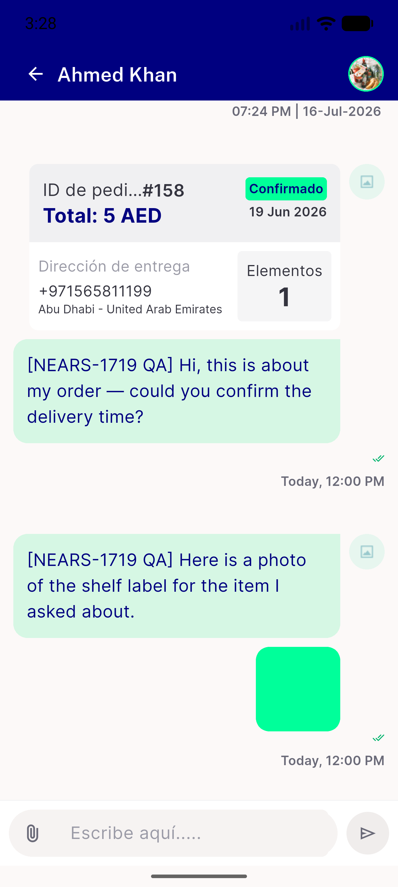</a> post 06 es scale1.3</td>
<td align="center" width="33%"><a href="v2-POSCTRL-en-80dp.png">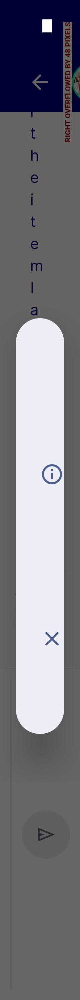</a> v2 POSCTRL en 80dp</td>
<td align="center" width="33%"><a href="v2-ZOOM-bn-ar-1.3.png">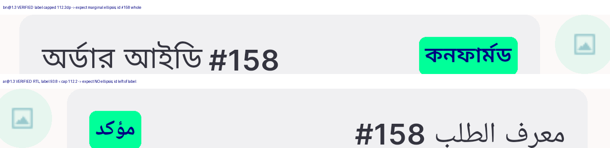</a> v2 ZOOM bn ar 1.3</td>
</tr>
<tr>
<td align="center" width="33%"><a href="v2-ZOOM-ellipsis-check.png">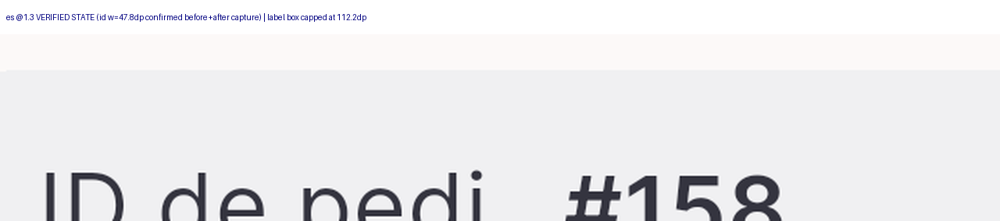</a> v2 ZOOM ellipsis check</td>
<td align="center" width="33%"><a href="v2-ZOOM-es-1.3-ellipsis.png">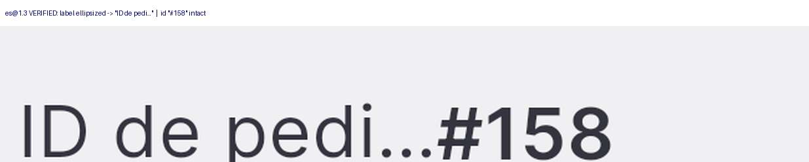</a> v2 ZOOM es 1.3 ellipsis</td>
<td align="center" width="33%"><a href="v2-ar-1.0.png">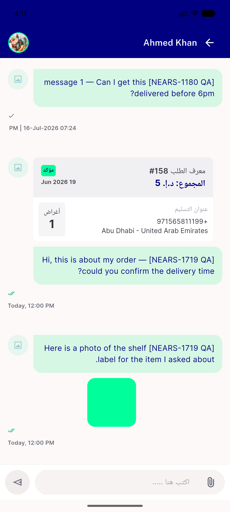</a> v2 ar 1.0</td>
</tr>
<tr>
<td align="center" width="33%"> v2 ar 1.3</td>
<td align="center" width="33%"><a href="v2-bn-1.0.png">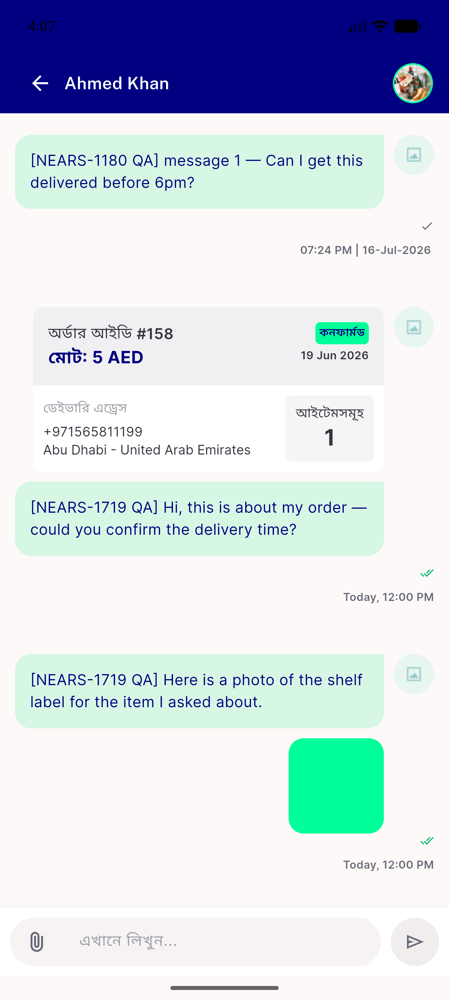</a> v2 bn 1.0</td>
<td align="center" width="33%"><a href="v2-bn-1.3.png">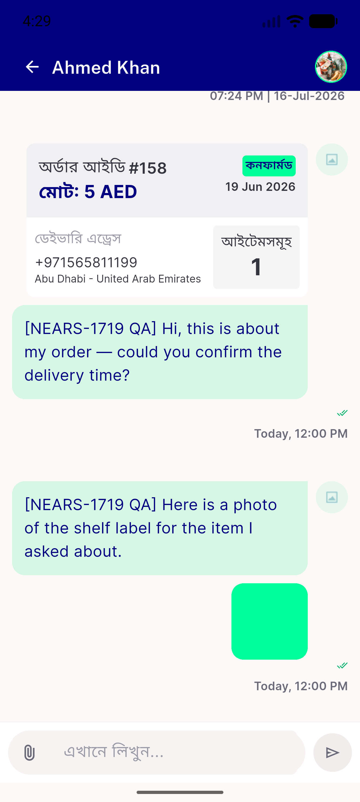</a> v2 bn 1.3</td>
</tr>
<tr>
<td align="center" width="33%"><a href="v2-en-1.0.png">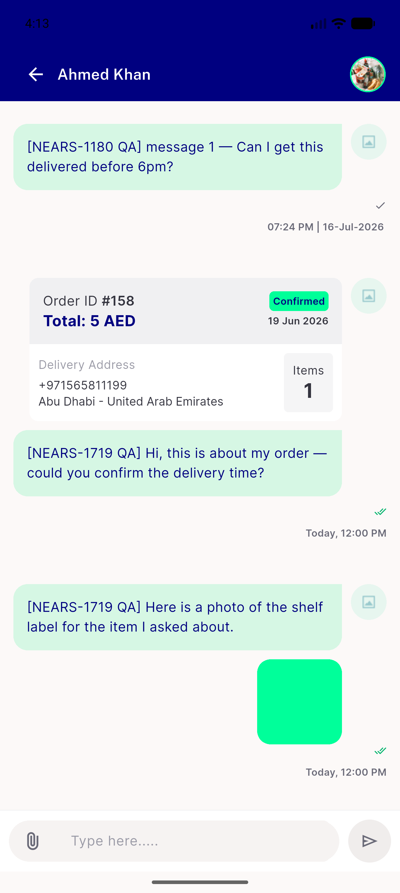</a> v2 en 1.0</td>
<td align="center" width="33%"> v2 es 1.3</td>
</tr>
</table>

### Other artifacts
- [`bug-flutererror-onerror-swallows-framework-errors.log`](bug-flutererror-onerror-swallows-framework-errors.log)
- [`v2-measurements.txt`](v2-measurements.txt)

---
*From `nears/docs/qa-evidence/NEARS-1718/` · public-repo scrub policy (no live secrets; verified clean).*
