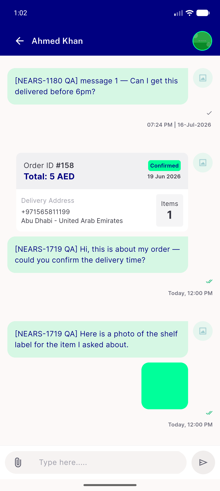

# QA Evidence — NEARS-1719

**PASS — AC1/AC2/AC3 demonstrated live on emulator-5556 against worktree backend :8003; 1 pre-existing regression (ImagePreviewWidget overflow, NEARS-1661)**

**2 screenshot(s).** Click any thumbnail for full resolution.

<table>
<tr>
<td align="center" width="33%"> ac1 order card and composer</td>
<td align="center" width="33%"> ac2 image preview opened</td>
</tr>
</table>

### Other artifacts
- [`bug-image-preview-overflow.log`](bug-image-preview-overflow.log)

---
*From `nears/docs/qa-evidence/NEARS-1719/` · public-repo scrub policy (no live secrets; verified clean).*
