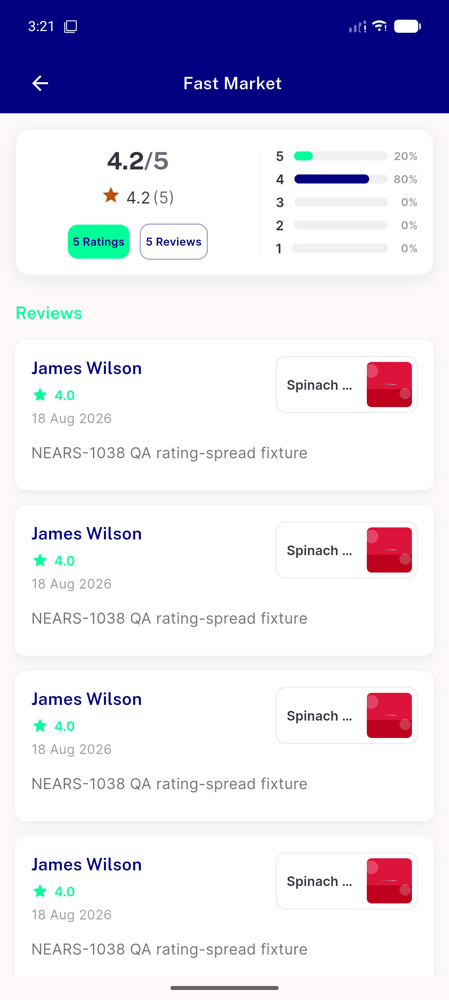
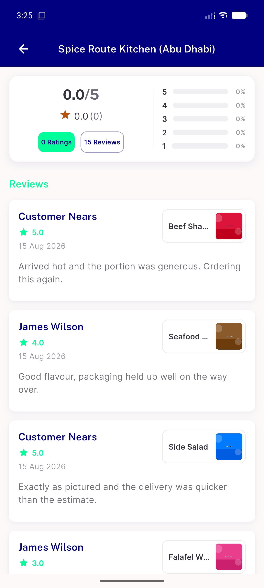

# QA Evidence — NEARS-1725

**fix-cycle 1 delta re-QA: AC1 re-verified PASS (mobile pills/progress flex reweight resolves the 2-line wrap)**

**2 screenshot(s).** Click any thumbnail for full resolution.

<table>
<tr>
<td align="center" width="33%"> fix1 ac1 fastmarket 5ratings 5reviews</td>
<td align="center" width="33%"> fix1 ac1 spiceroutekitchen 0ratings 15reviews</td>
</tr>
</table>

---
*From `nears/docs/qa-evidence/NEARS-1725/` · public-repo scrub policy (no live secrets; verified clean).*
