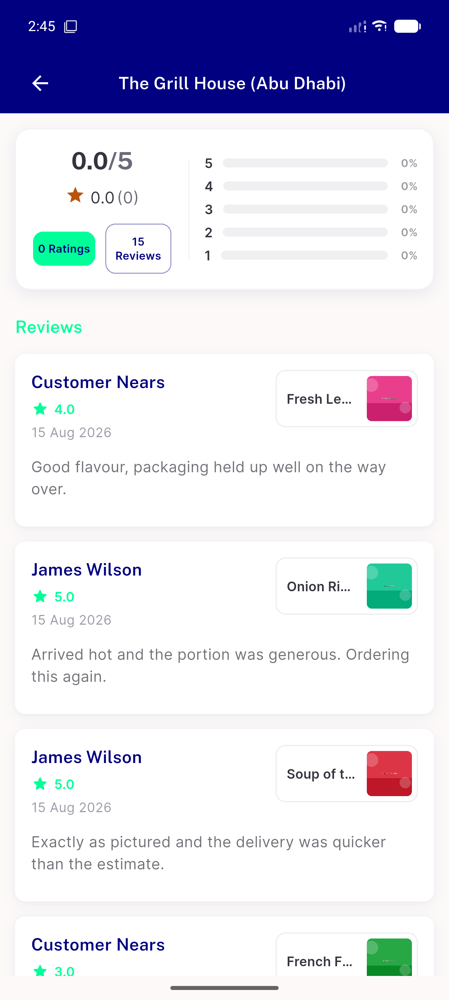
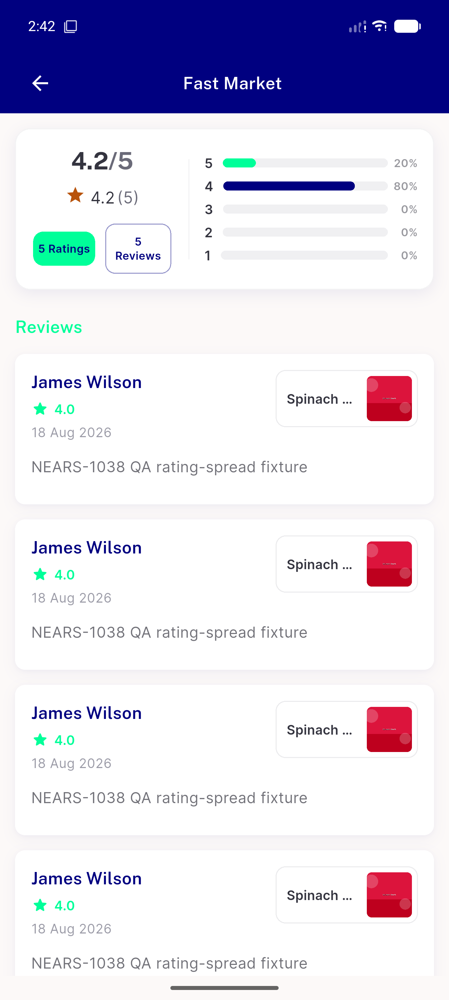
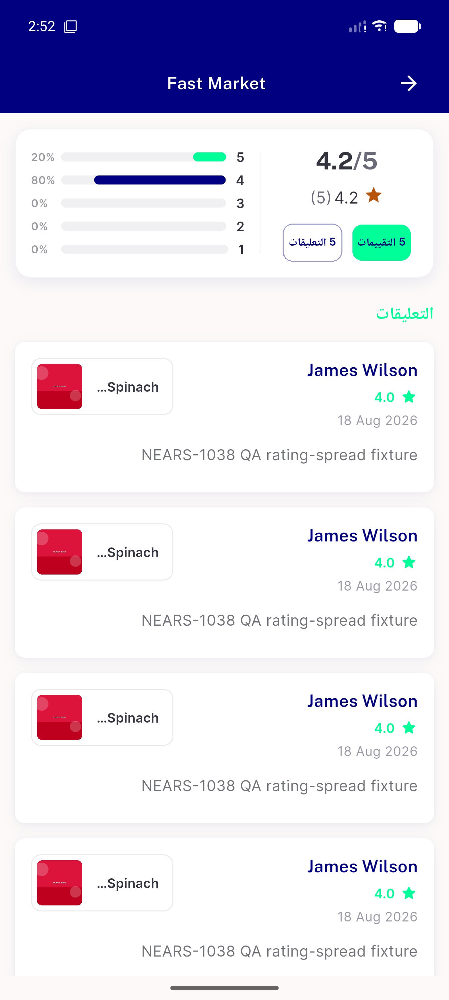
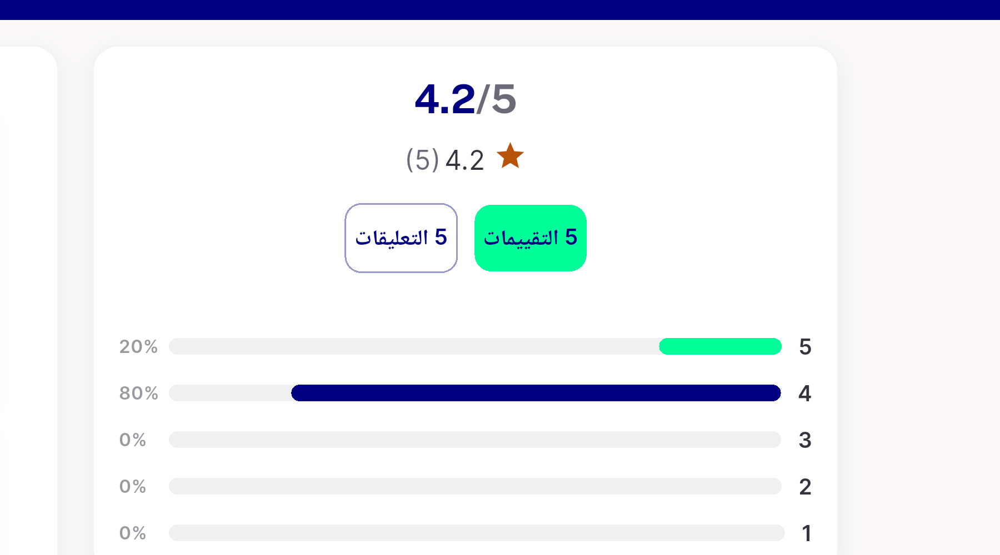
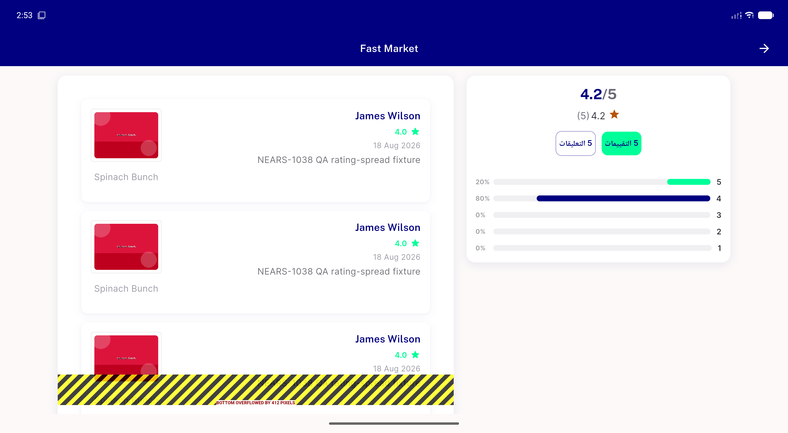
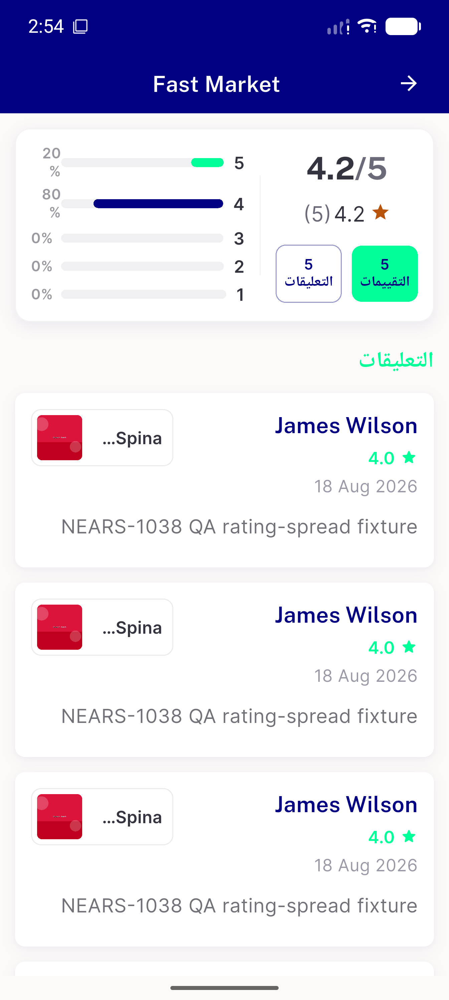

# QA Evidence — NEARS-1725

**FAIL — AC1 live violation (Reviews pill still wraps to 2 lines at common phone width, 448dp) — see bug-ac1-reviews-pill-wraps-two-lines.png/.log**

**10 screenshot(s).** Click any thumbnail for full resolution.

<table>
<tr>
<td align="center" width="33%"> ac1 evidence 5ratings 5reviews</td>
<td align="center" width="33%"> ac1 mobile pills 15reviews</td>
<td align="center" width="33%"> ac1 mobile pills</td>
</tr>
<tr>
<td align="center" width="33%"> ac4 rtl crop</td>
<td align="center" width="33%"> ac4 rtl pills</td>
<td align="center" width="33%"> ac5 desktop crop</td>
</tr>
<tr>
<td align="center" width="33%"> ac5 desktop</td>
<td align="center" width="33%"> ac6 crop</td>
<td align="center" width="33%"> ac6 textscale13</td>
</tr>
<tr>
<td align="center" width="33%"> bug ac1 reviews pill wraps two lines</td>
</tr>
</table>

### Other artifacts
- [`bug-ac1-reviews-pill-wraps-two-lines.log`](bug-ac1-reviews-pill-wraps-two-lines.log)
- [`bug-regression-review-list-column-overflow-desktop.log`](bug-regression-review-list-column-overflow-desktop.log)

---
*From `nears/docs/qa-evidence/NEARS-1725/` · public-repo scrub policy (no live secrets; verified clean).*
