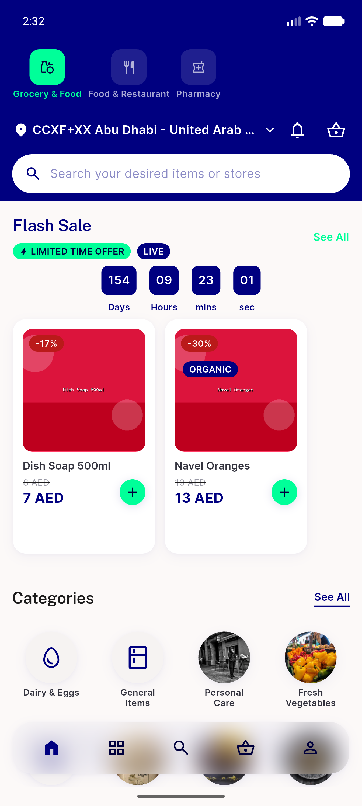
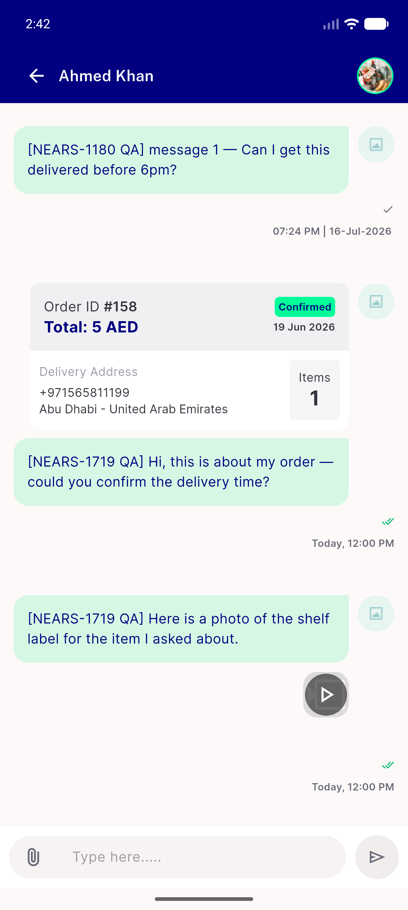
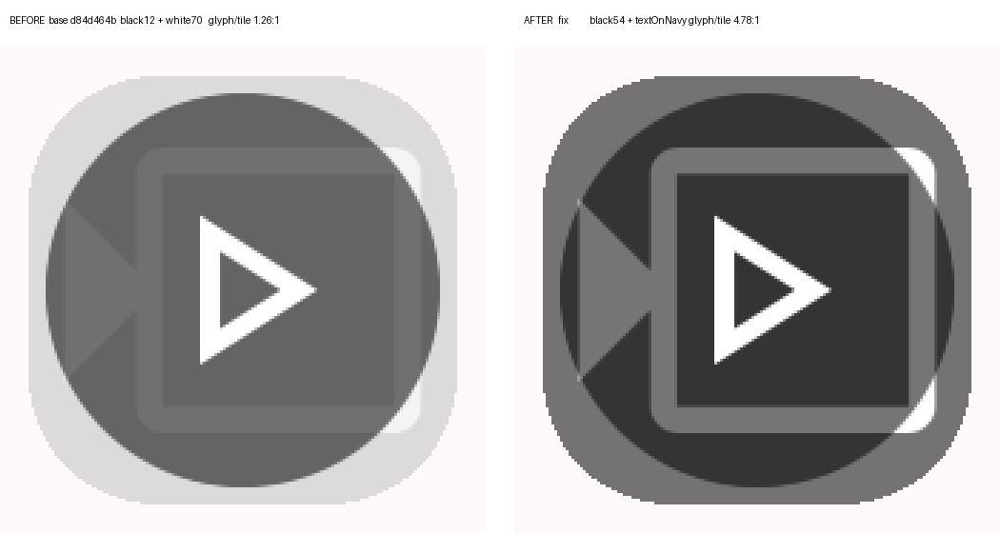
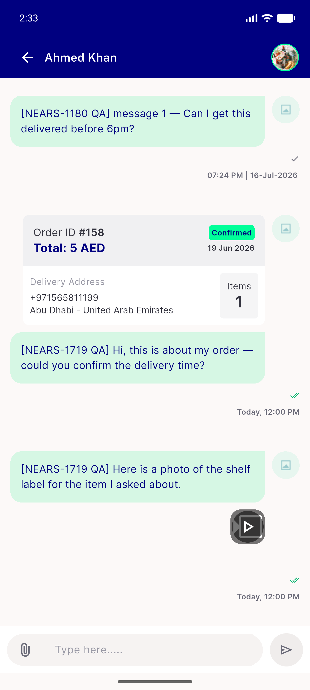
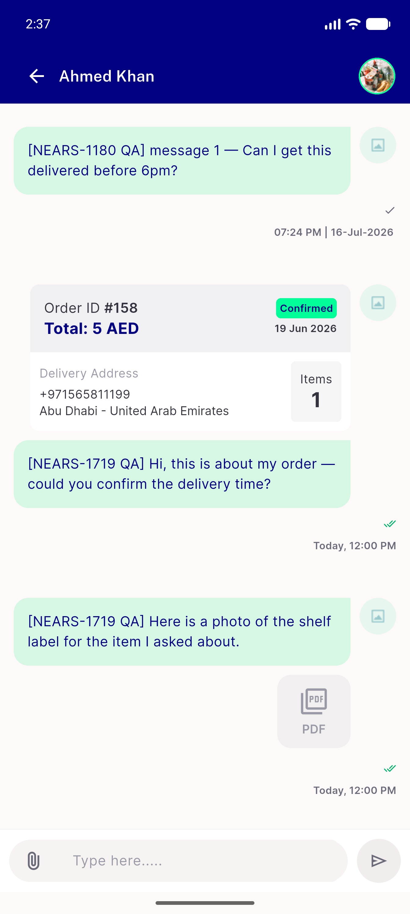
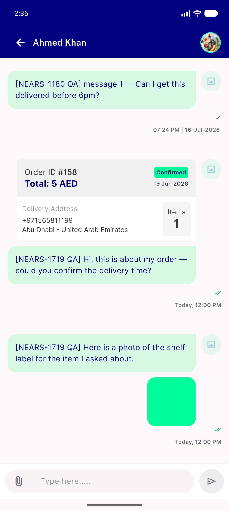
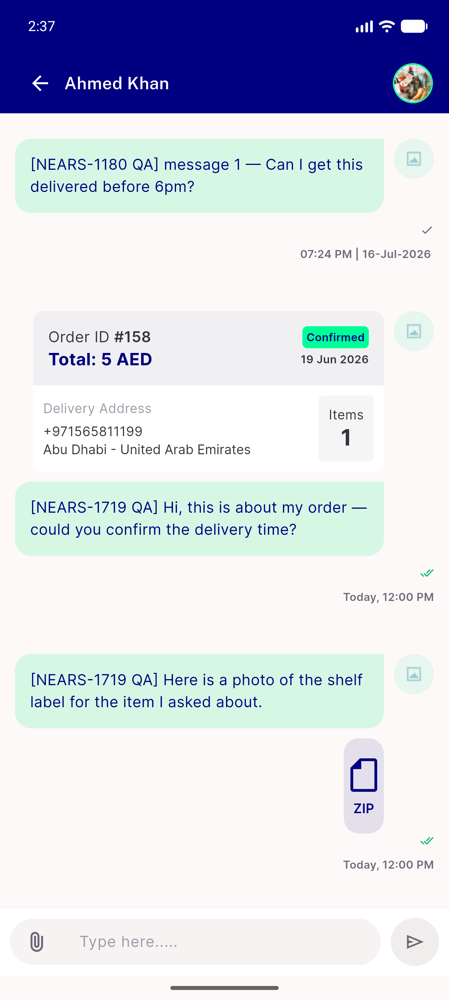
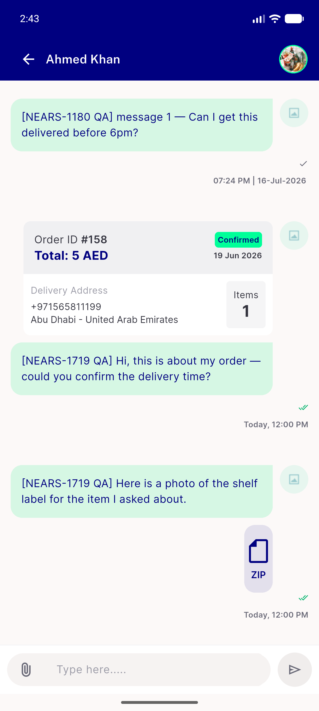
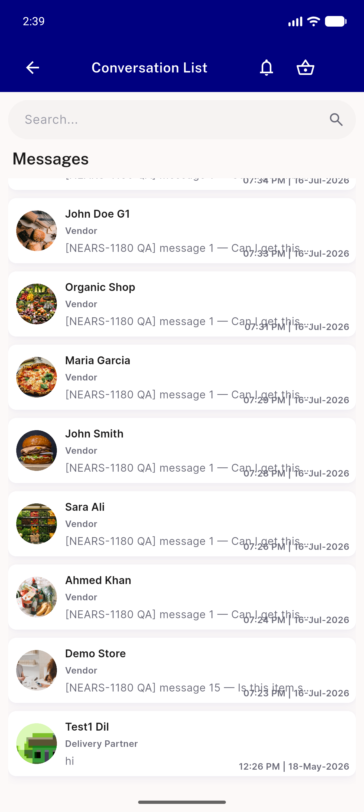
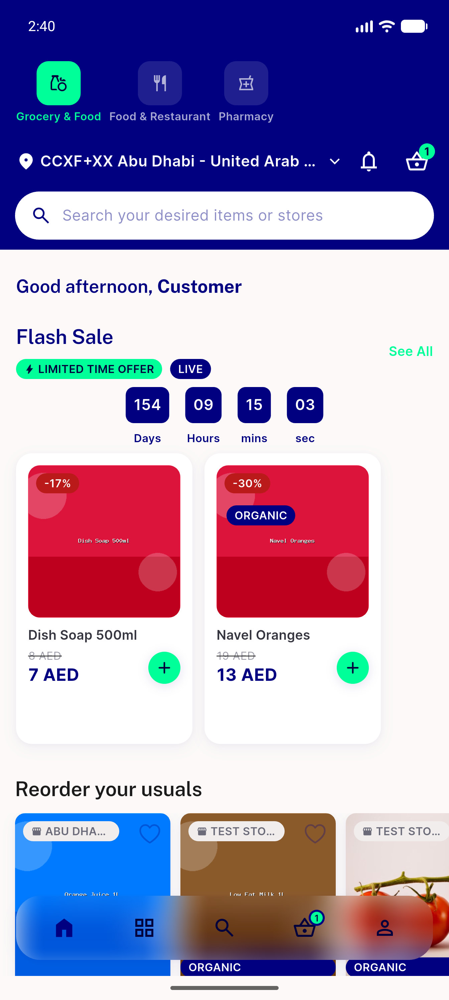

# QA Evidence — NEARS-1731

**PASS — video glyph 1.257:1 -> 4.781:1 measured from device pixels; image/pdf/other arms 0-pixel diff vs base**

**15 screenshot(s).** Click any thumbnail for full resolution.

<table>
<tr>
<td align="center" width="33%"> boot</td>
<td align="center" width="33%"> ac1 BEFORE base video tile</td>
<td align="center" width="33%"> ac1 before after</td>
</tr>
<tr>
<td align="center" width="33%"> ac1 video tile raw</td>
<td align="center" width="33%"> ac1 video tile zoom</td>
<td align="center" width="33%"> ac3 arm pdf</td>
</tr>
<tr>
<td align="center" width="33%"> ac3 arm webp</td>
<td align="center" width="33%"> ac3 arm zip</td>
<td align="center" width="33%"> base arm pdf</td>
</tr>
<tr>
<td align="center" width="33%"> base arm webp</td>
<td align="center" width="33%"> base arm zip</td>
<td align="center" width="33%"> reg conversation list</td>
</tr>
<tr>
<td align="center" width="33%"> reg home</td>
<td align="center" width="33%"> reg image preview</td>
<td align="center" width="33%"> reg preview stuck</td>
</tr>
</table>

### Other artifacts
- [`bug-guest-boot-401-error-snackbar.log`](bug-guest-boot-401-error-snackbar.log)
- [`progress.md`](progress.md)

---
*From `nears/docs/qa-evidence/NEARS-1731/` · public-repo scrub policy (no live secrets; verified clean).*
