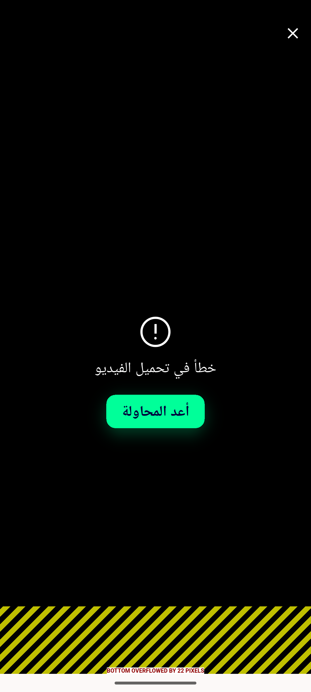

# QA Evidence — NEARS-1732

**PASS — chat video error state + retry verified live (emulator-5562)**

**4 screenshot(s).** Click any thumbnail for full resolution.

<table>
<tr>
<td align="center" width="33%"> ac1 ac2 video error state</td>
<td align="center" width="33%"> c3 01 en default retry hugs</td>
<td align="center" width="33%"> c3 02 ar fontscale2.5 clamped to 1.3 hugs</td>
</tr>
<tr>
<td align="center" width="33%"> c3 03 ar narrow320 clamped ellipsis</td>
</tr>
</table>

### Other artifacts
- [`ac-log-evidence.log`](ac-log-evidence.log)
- [`bug-lightbox-close-inert.log`](bug-lightbox-close-inert.log)

---
*From `nears/docs/qa-evidence/NEARS-1732/` · public-repo scrub policy (no live secrets; verified clean).*
