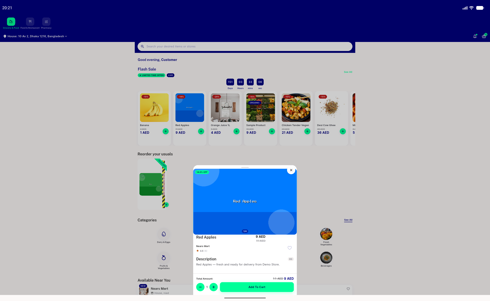
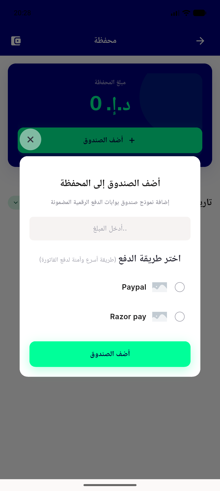
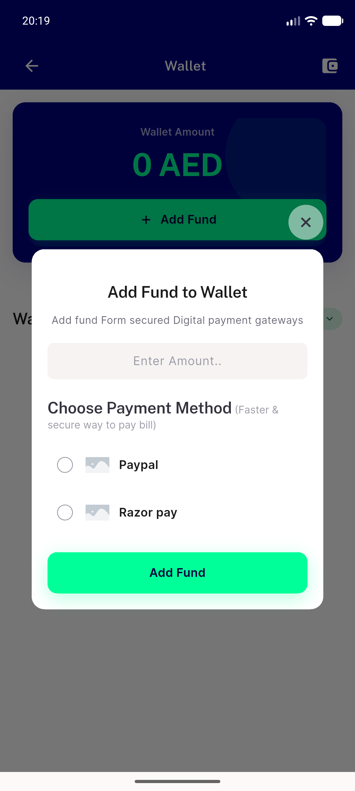
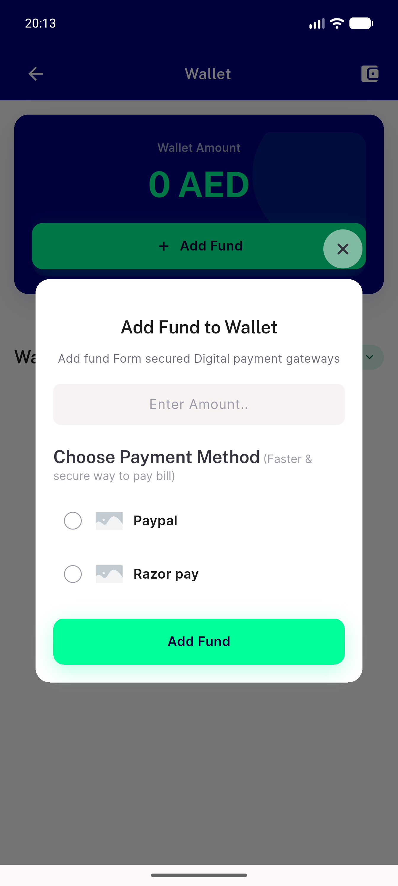
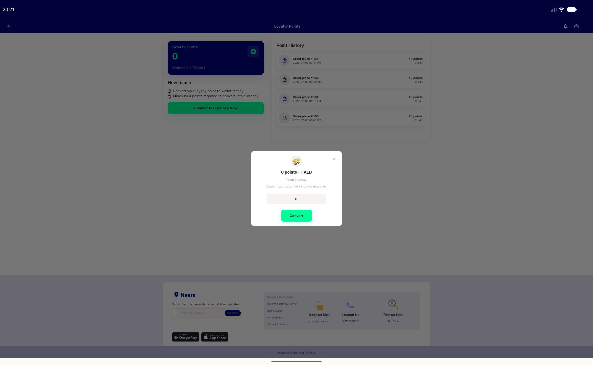

# QA Evidence — NEARS-1734

**PASS — AC1 pixel-identical at 3 live sites covering all 3 chrome profiles**

**7 screenshot(s).** Click any thumbnail for full resolution.

<table>
<tr>
<td align="center" width="33%"> site1 itemsheet POST</td>
<td align="center" width="33%"> site1 itemsheet PRE</td>
<td align="center" width="33%"> site10 addfund POST rtl arabic</td>
</tr>
<tr>
<td align="center" width="33%"> site10 addfund POST</td>
<td align="center" width="33%"> site10 addfund PRE</td>
<td align="center" width="33%"> site9 loyaltyconvert POST</td>
</tr>
<tr>
<td align="center" width="33%"> site9 loyaltyconvert PRE</td>
</tr>
</table>

### Other artifacts
- [`bug-renderflex-overflow-desktop-itemsheet.log`](bug-renderflex-overflow-desktop-itemsheet.log)
- [`pixel-diff-results.txt`](pixel-diff-results.txt)

---
*From `nears/docs/qa-evidence/NEARS-1734/` · public-repo scrub policy (no live secrets; verified clean).*
