# QA Evidence — NEARS-1735

**PASS — plus bug artifact for the transparent-background demo gap**

**19 screenshot(s).** Click any thumbnail for full resolution.

<table>
<tr>
<td align="center" width="33%"><a href="00-story.png">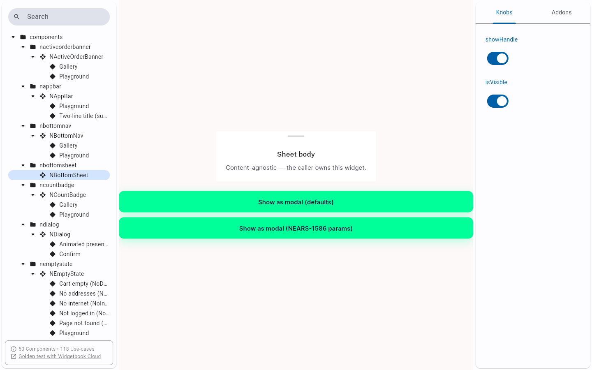</a> story</td>
<td align="center" width="33%"><a href="ac2-SIDE-BY-SIDE-radius-probe.png">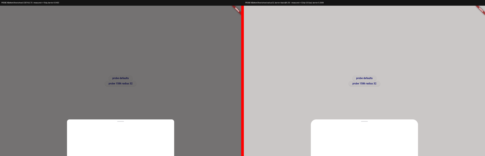</a> ac2 SIDE BY SIDE radius probe</td>
<td align="center" width="33%"><a href="ac2-SIDE-BY-SIDE-widgetbook.png">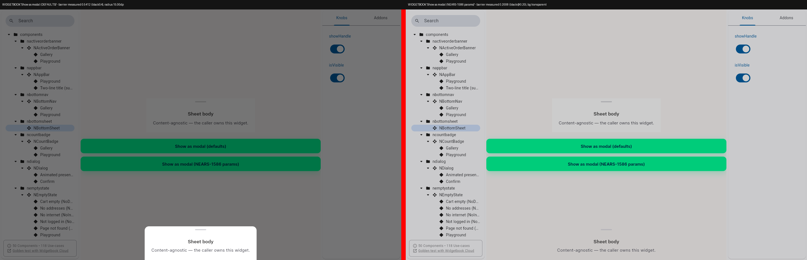</a> ac2 SIDE BY SIDE widgetbook</td>
</tr>
<tr>
<td align="center" width="33%"><a href="ac2-defaults.png">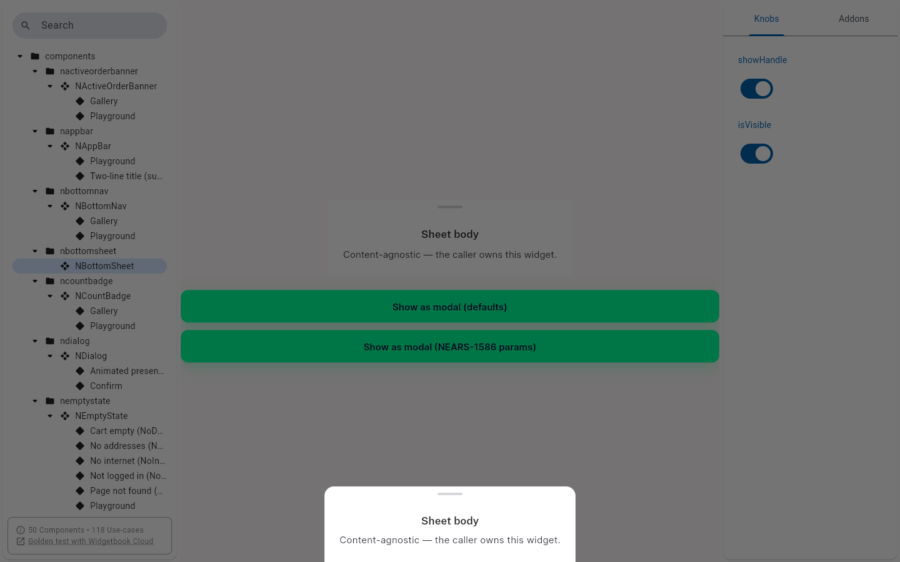</a> ac2 defaults</td>
<td align="center" width="33%"> ac2 nears1586</td>
<td align="center" width="33%"><a href="ac2-probe-defaults.png">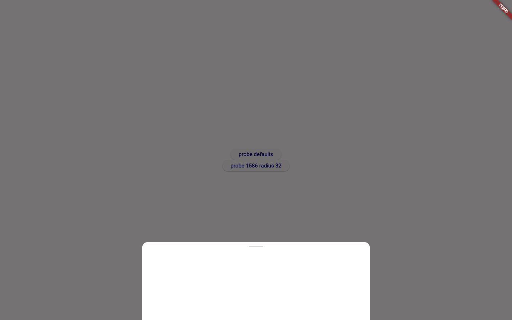</a> ac2 probe defaults</td>
</tr>
<tr>
<td align="center" width="33%"><a href="ac2-probe-radius32.png">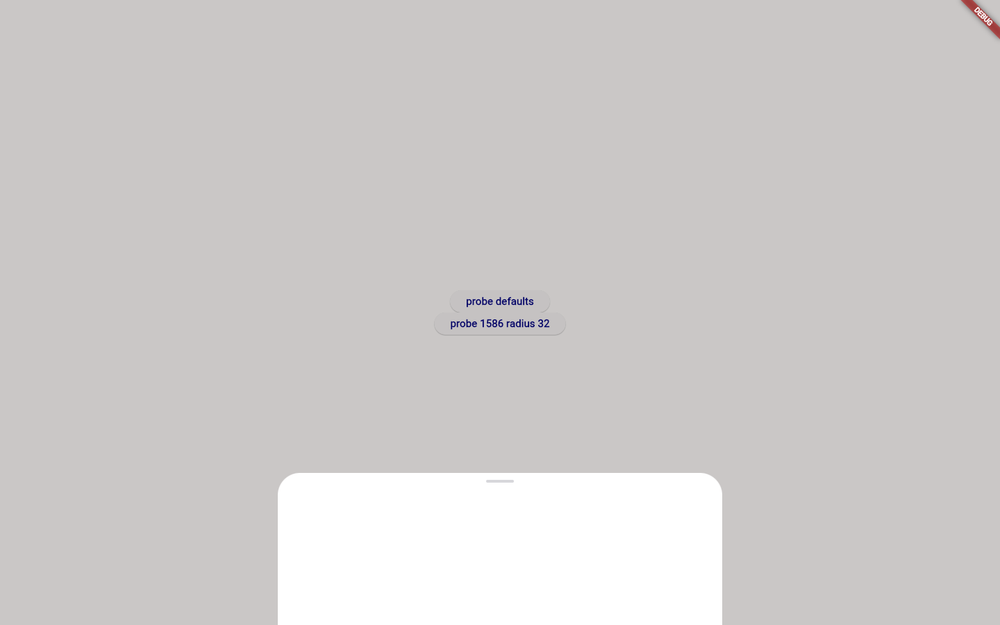</a> ac2 probe radius32</td>
<td align="center" width="33%"> after defaults</td>
<td align="center" width="33%"> after nears1586</td>
</tr>
<tr>
<td align="center" width="33%"><a href="bug-1586-demo-radius-not-paintable.png">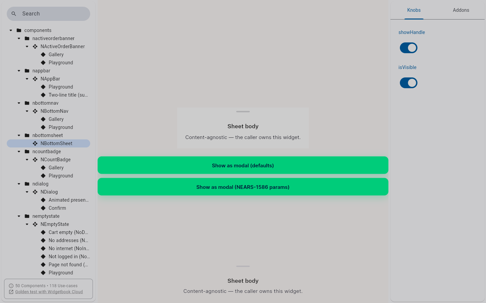</a> bug 1586 demo radius not paintable</td>
<td align="center" width="33%"><a href="ua-00-checkout-base.png">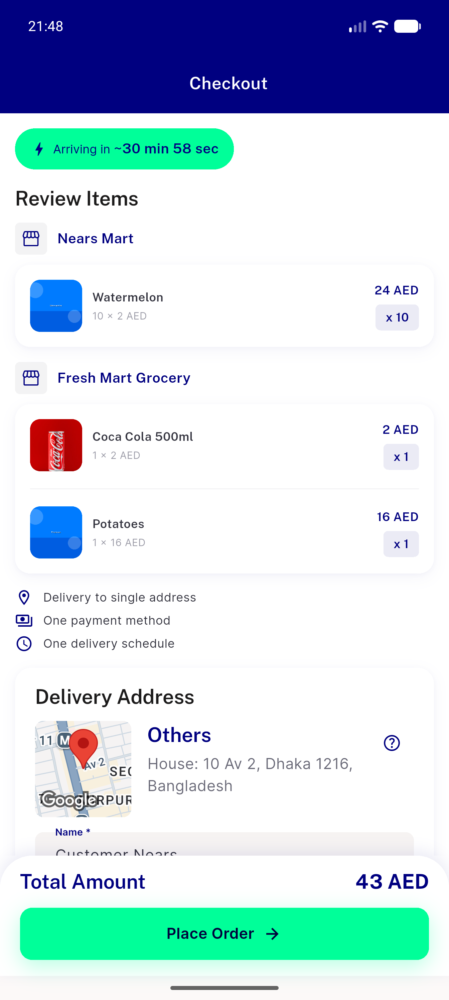</a> ua 00 checkout base</td>
<td align="center" width="33%"> ua 00 notif base</td>
</tr>
<tr>
<td align="center" width="33%"><a href="ua-00-orderdetails-base.png">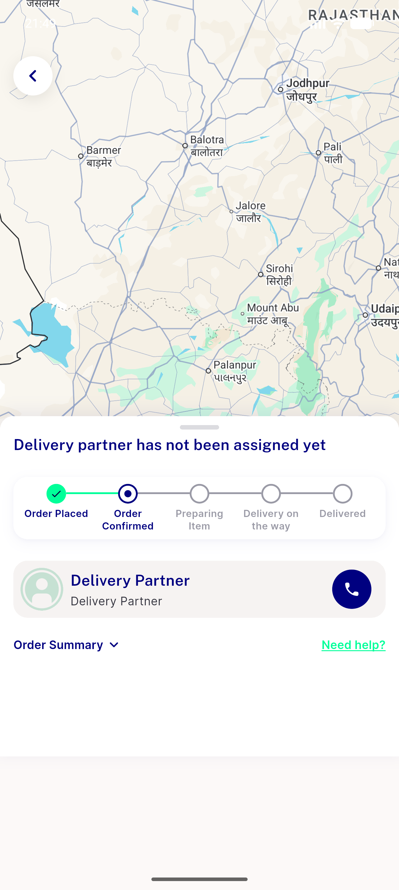</a> ua 00 orderdetails base</td>
<td align="center" width="33%"><a href="ua-00-viewall-base.png">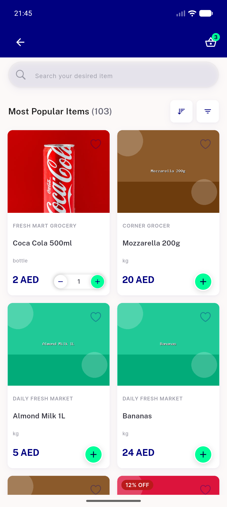</a> ua 00 viewall base</td>
<td align="center" width="33%"><a href="ua-checkout-address-sheet.png">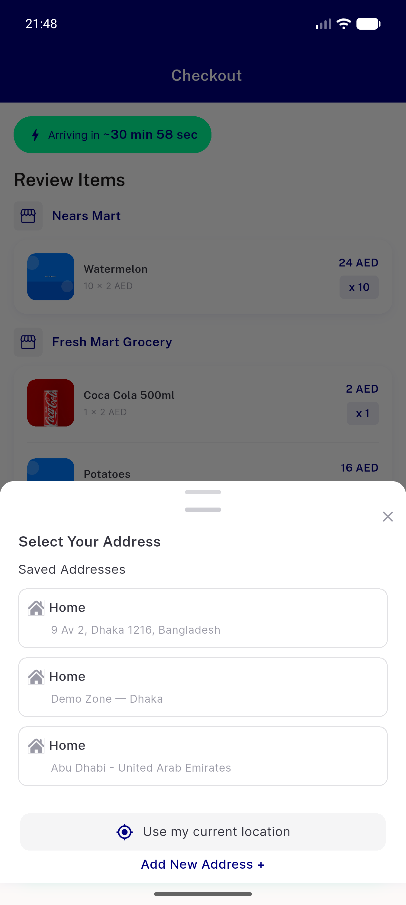</a> ua checkout address sheet</td>
</tr>
<tr>
<td align="center" width="33%"><a href="ua-filter-sheet.png">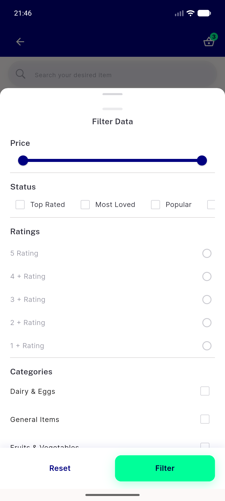</a> ua filter sheet</td>
<td align="center" width="33%"><a href="ua-notif-sheet.png">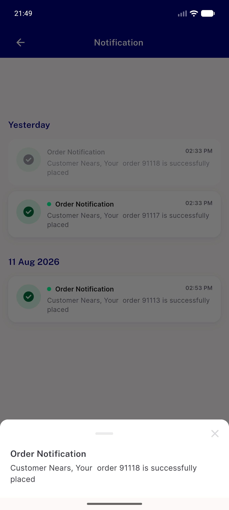</a> ua notif sheet</td>
<td align="center" width="33%"><a href="ua-order-help-sheet.png">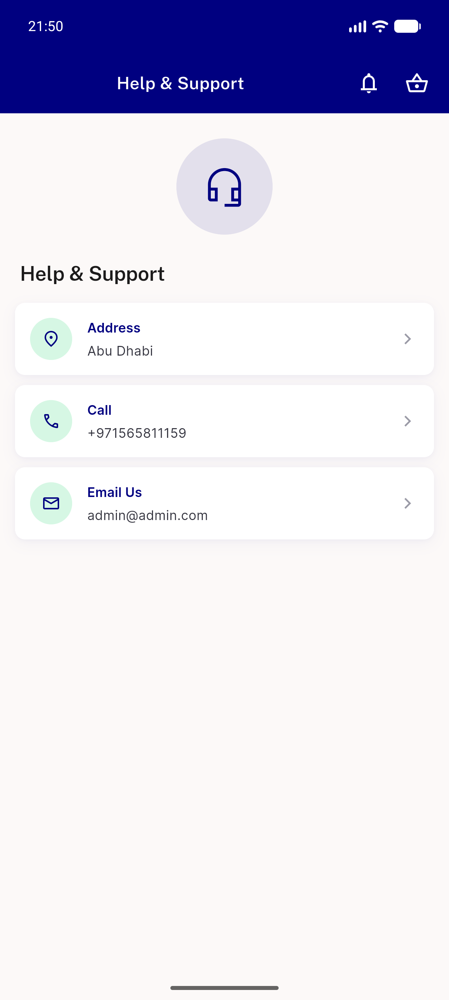</a> ua order help sheet</td>
</tr>
<tr>
<td align="center" width="33%"><a href="ua-sort-sheet.png">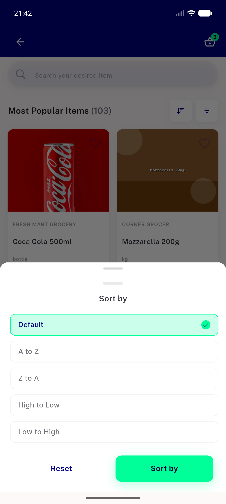</a> ua sort sheet</td>
</tr>
</table>

---
*From `nears/docs/qa-evidence/NEARS-1735/` · public-repo scrub policy (no live secrets; verified clean).*
