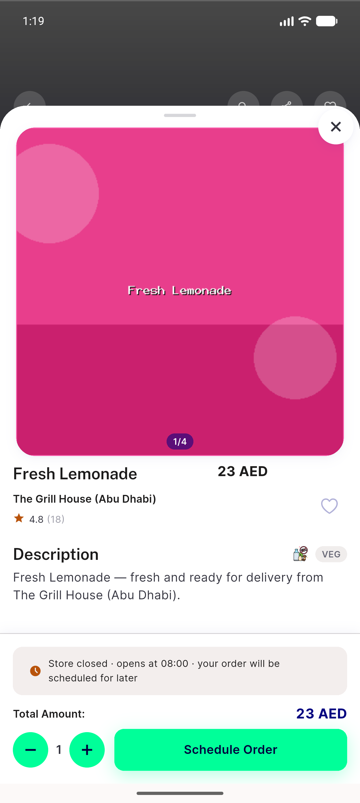
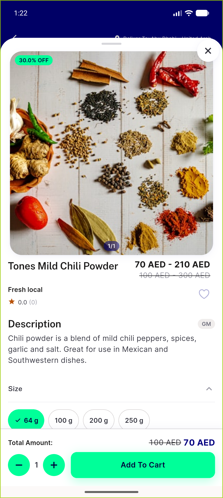
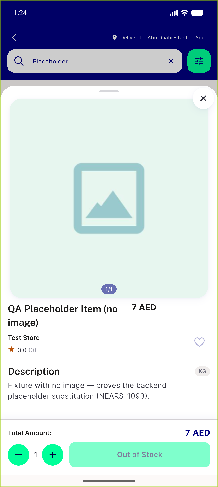
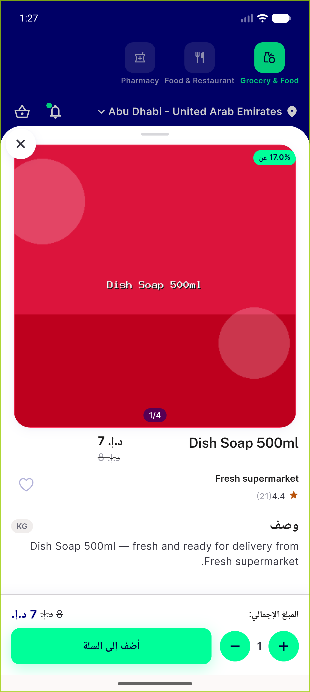
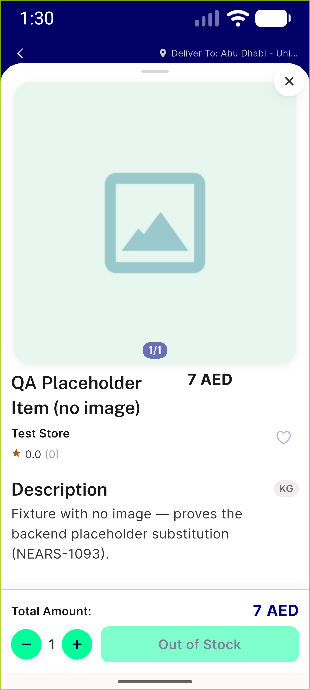

# QA Evidence — NEARS-1737

**PASS — item sheet title regression clean on Food+Grocery, LTR+RTL, no [WARN] emitted (APK md5 f28957dd5e9205bf4499bb71c61e70bc, emulator-5558)**

**5 screenshot(s).** Click any thumbnail for full resolution.

<table>
<tr>
<td align="center" width="33%"> food item sheet title</td>
<td align="center" width="33%"> grocery item sheet variations</td>
<td align="center" width="33%"> longest name 2line split</td>
</tr>
<tr>
<td align="center" width="33%"> rtl arabic item sheet</td>
<td align="center" width="33%"> ellipsis 2x fontscale</td>
</tr>
</table>

---
*From `nears/docs/qa-evidence/NEARS-1737/` · public-repo scrub policy (no live secrets; verified clean).*
