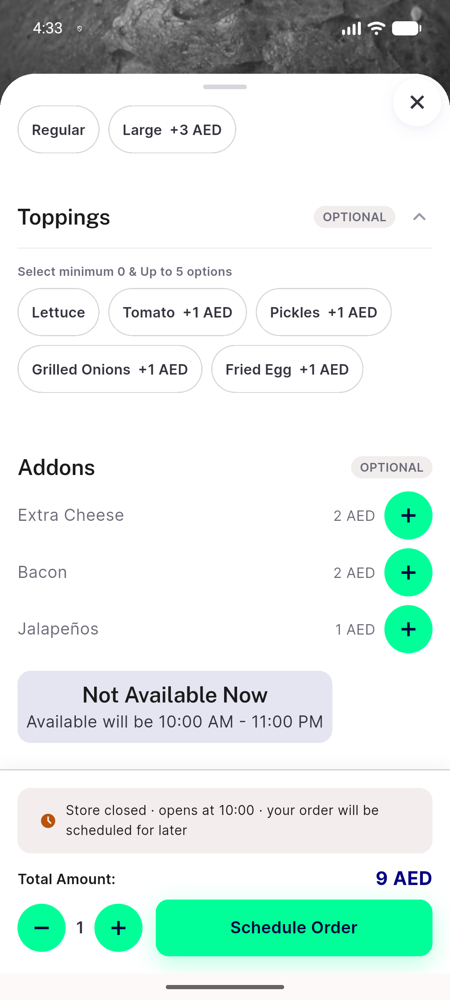
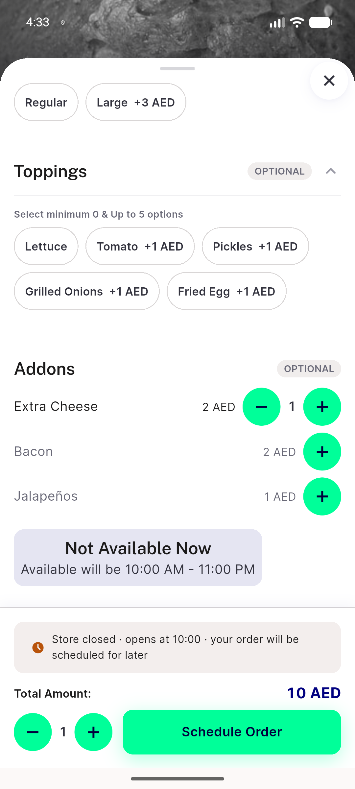
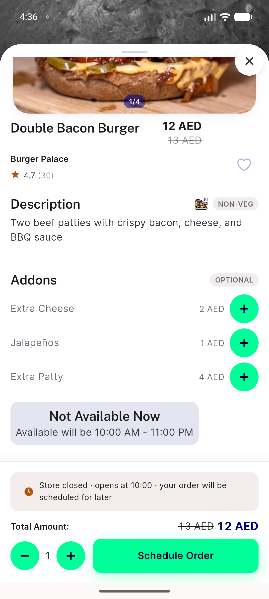
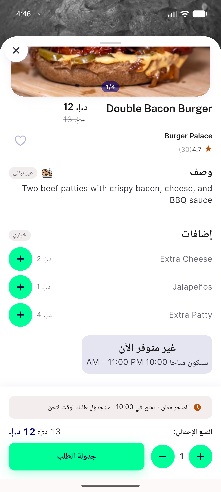
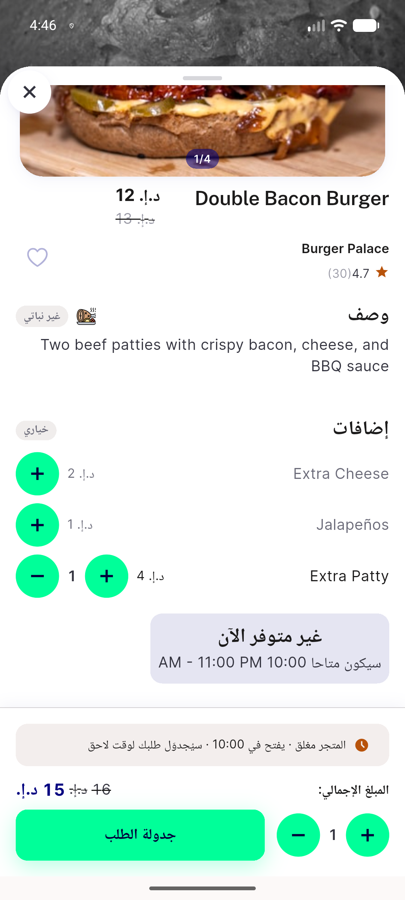

# QA Evidence — NEARS-1739

**PASS — add-on stepper circles measured at 44dp (115px @420dpi) collapsed + expanded, LTR + RTL, 411dp; behavior + main stepper unchanged; logs clean**

**6 screenshot(s).** Click any thumbnail for full resolution.

<table>
<tr>
<td align="center" width="33%"> ac1 addons collapsed</td>
<td align="center" width="33%"> ac2 addon expanded</td>
<td align="center" width="33%"> ac3 after removal collapsed</td>
</tr>
<tr>
<td align="center" width="33%"> ac4 item17 highest price 411dp</td>
<td align="center" width="33%"> ac6 arabic rtl collapsed 411dp</td>
<td align="center" width="33%"> ac6 arabic rtl expanded 411dp</td>
</tr>
</table>

---
*From `nears/docs/qa-evidence/NEARS-1739/` · public-repo scrub policy (no live secrets; verified clean).*
