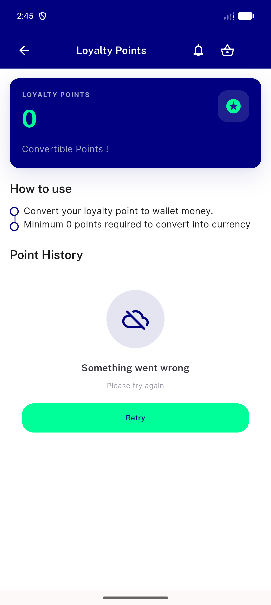
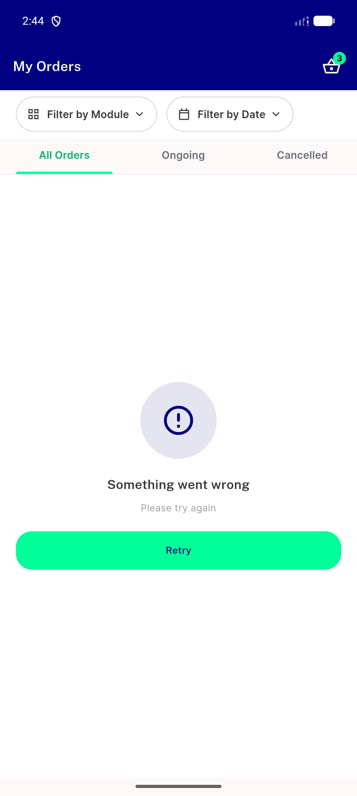
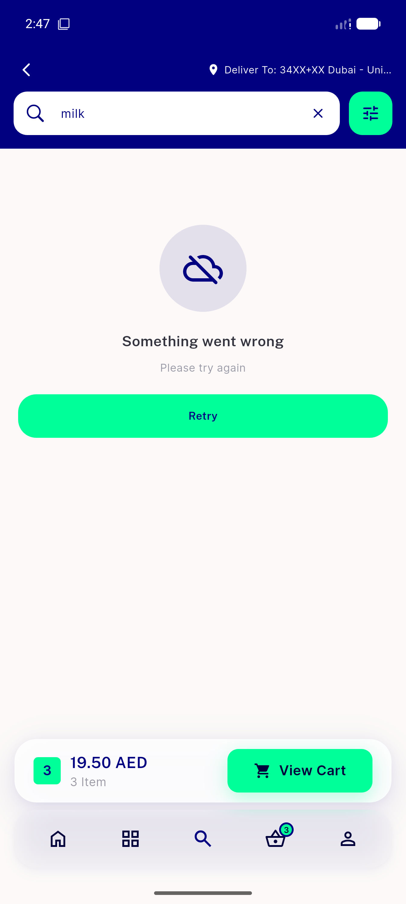
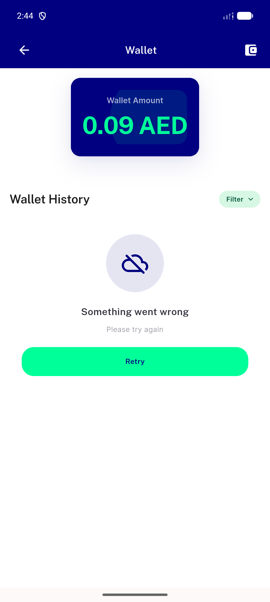

# QA Evidence — NEARS-1740

**PASS — DLS dir rename (widgets/dls -> widgets/legacy), NearsErrorRetry renders identically on 4 error-state screens; 0 grep hits, flutter analyze clean (2 pre-existing unrelated), flutter test 5321 passed**

**4 screenshot(s).** Click any thumbnail for full resolution.

<table>
<tr>
<td align="center" width="33%"> loyalty error retry</td>
<td align="center" width="33%"> my orders error retry</td>
<td align="center" width="33%"> search error retry</td>
</tr>
<tr>
<td align="center" width="33%"> wallet error retry</td>
</tr>
</table>

---
*From `nears/docs/qa-evidence/NEARS-1740/` · public-repo scrub policy (no live secrets; verified clean).*
