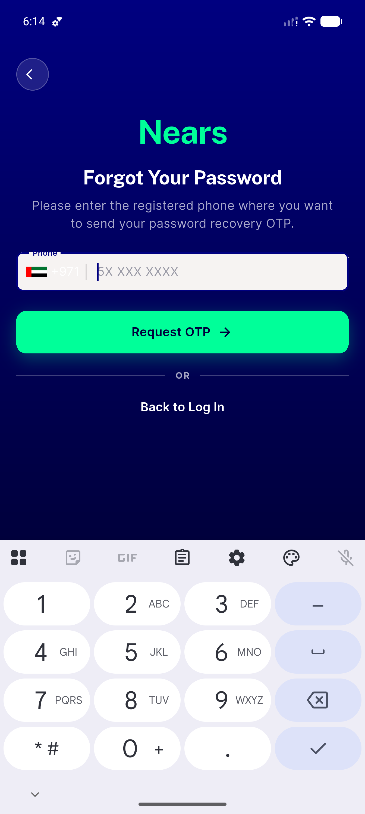
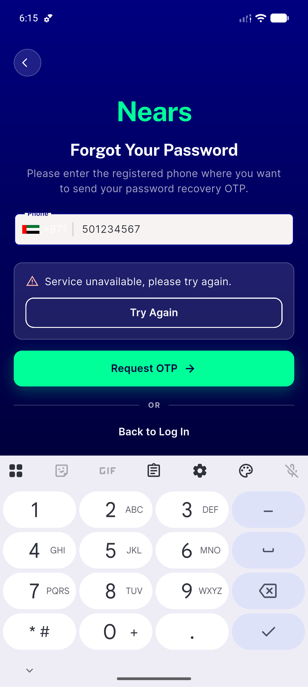
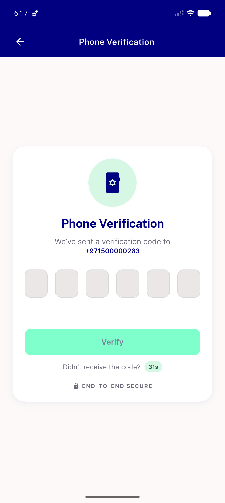
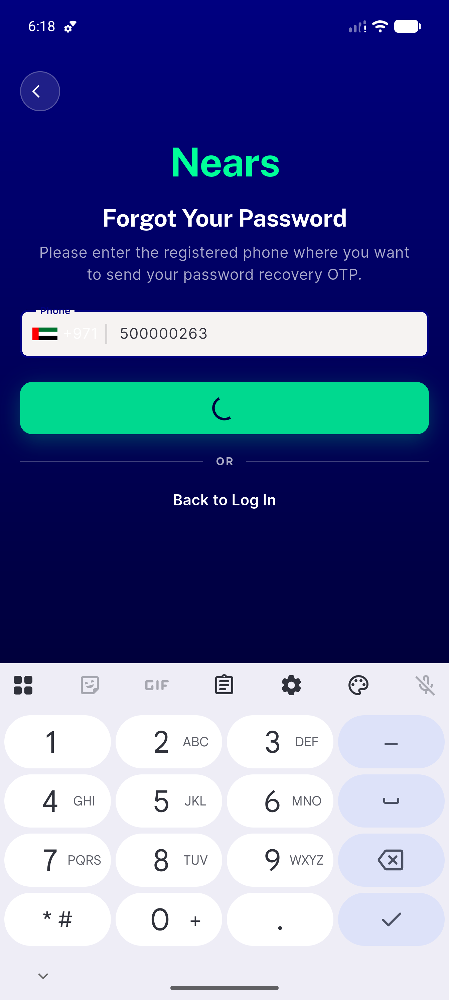
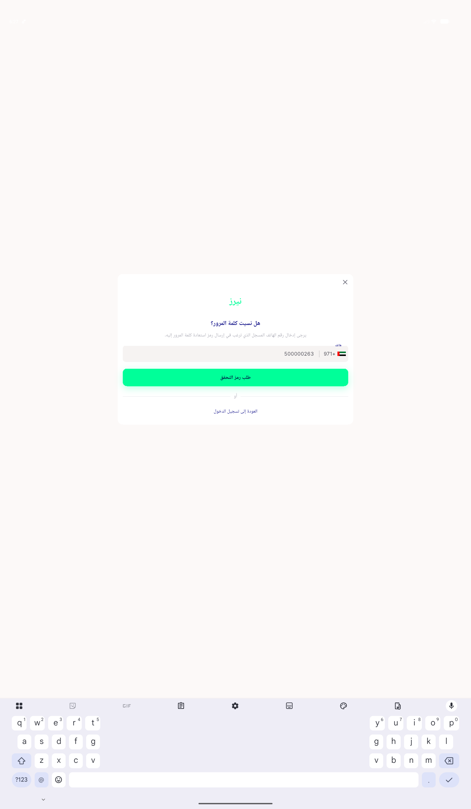
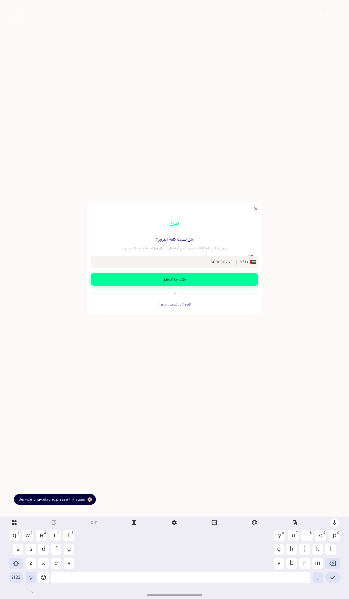
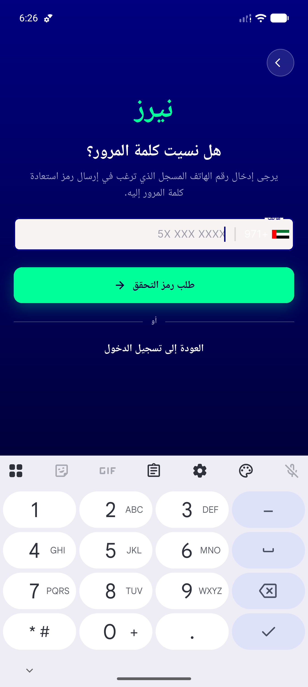
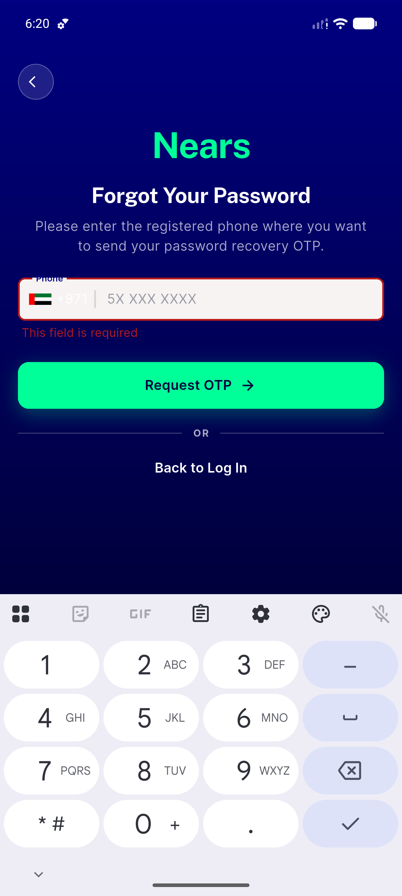
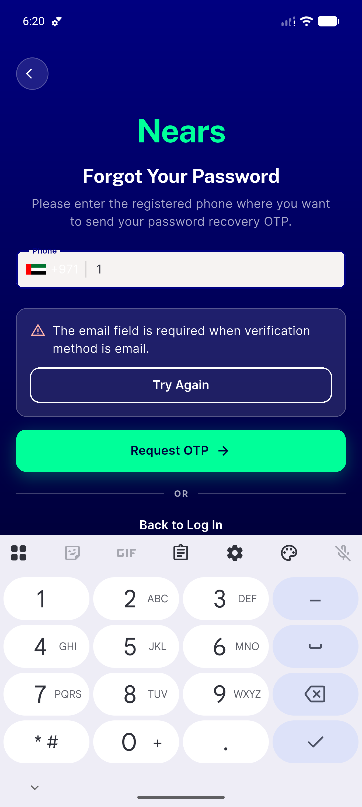
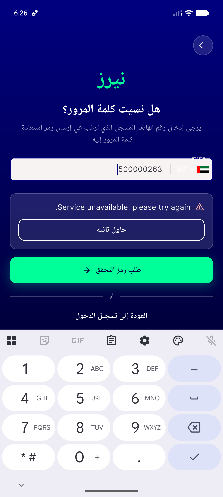

# QA Evidence — NEARS-1741

**PASS — freshness residuals named + rated (hot-reload path closed by log evidence)**

**14 screenshot(s).** Click any thumbnail for full resolution.

<table>
<tr>
<td align="center" width="33%"> ac1 01 forgot password clean</td>
<td align="center" width="33%"> ac1 02 error panel</td>
<td align="center" width="33%"> ac1 03 panel persists 9s</td>
</tr>
<tr>
<td align="center" width="33%"> ac1 04 recovered verification screen</td>
<td align="center" width="33%"> ac3 01 cta loading spinner</td>
<td align="center" width="33%"> ac4 01 desktop 1400dp ndivider or row</td>
</tr>
<tr>
<td align="center" width="33%"> ac4 02 desktop snackbar on failure</td>
<td align="center" width="33%"> ac5 01 rtl arabic clean</td>
<td align="center" width="33%"> ac5 02 rtl arabic error panel</td>
</tr>
<tr>
<td align="center" width="33%"> ac6 01 edit clears panel</td>
<td align="center" width="33%"> ac6 02 empty field inline error</td>
<td align="center" width="33%"> ac6 03 invalid phone toast</td>
</tr>
<tr>
<td align="center" width="33%"> bug invalid phone no toast</td>
<td align="center" width="33%"> bug rtl cta arrow not mirrored</td>
</tr>
</table>

### Other artifacts
- [`bug-invalid-phone-no-toast.log`](bug-invalid-phone-no-toast.log)
- [`bug-phone-picker-tap-target-22dp.log`](bug-phone-picker-tap-target-22dp.log)
- [`freshness-timeline.md`](freshness-timeline.md)
- [`progress.md`](progress.md)

---
*From `nears/docs/qa-evidence/NEARS-1741/` · public-repo scrub policy (no live secrets; verified clean).*
