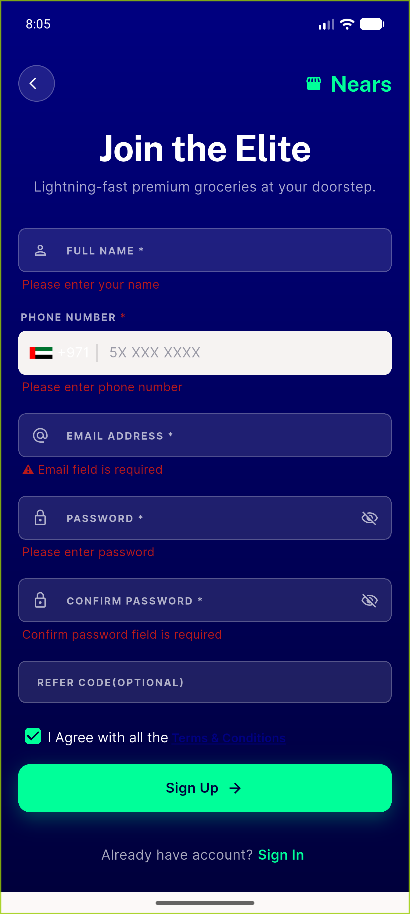
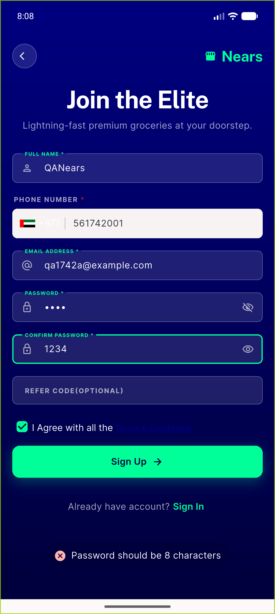
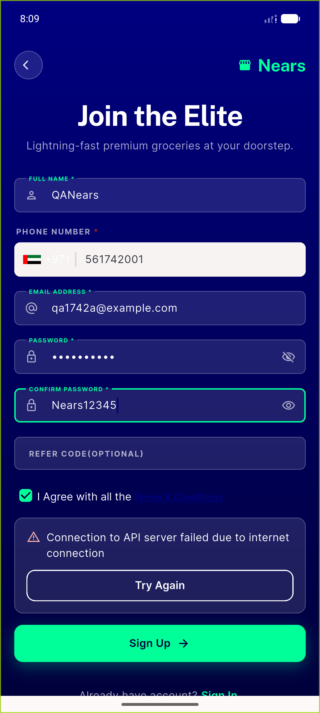
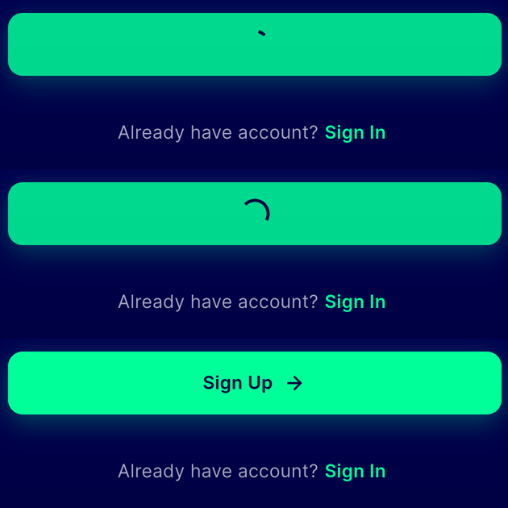
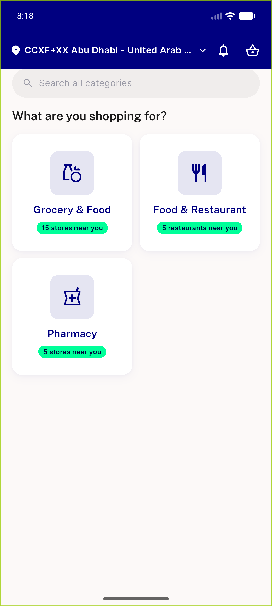
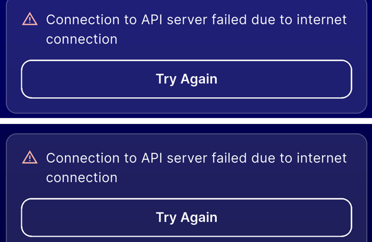
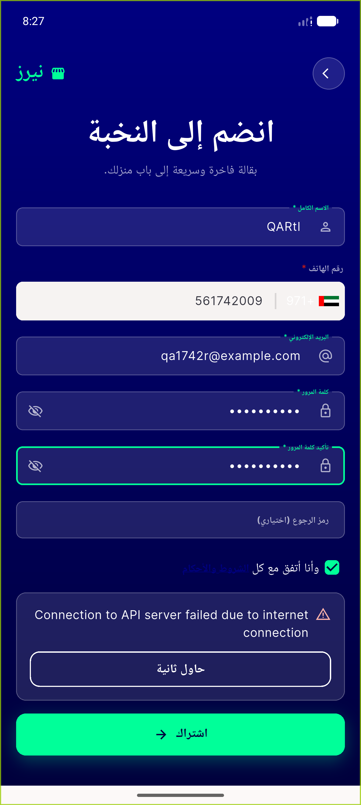
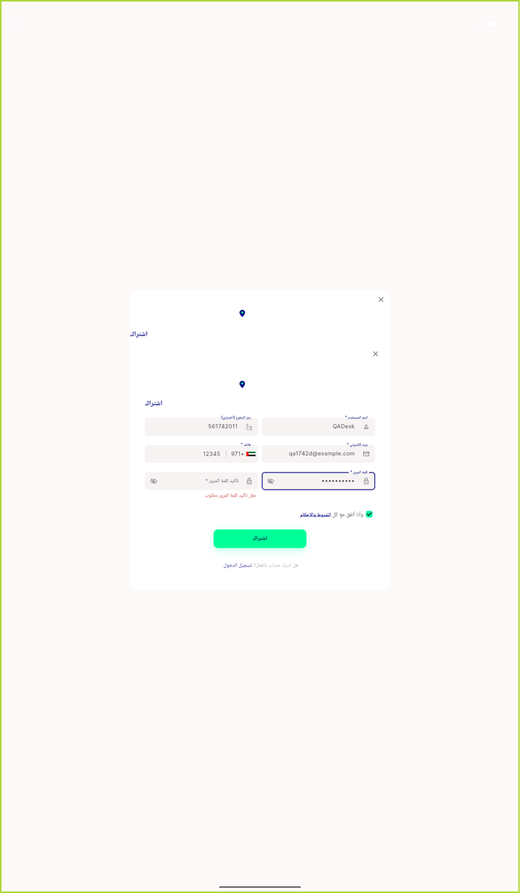

# QA Evidence — NEARS-1742

**PASS — NEARS-1742 signup submit states: 6/6 ACs met (AC5 struck), emulator-5558, worktree d5efc81e**

**8 screenshot(s).** Click any thumbnail for full resolution.

<table>
<tr>
<td align="center" width="33%"> negctl empty fields</td>
<td align="center" width="33%"> negctl short password</td>
<td align="center" width="33%"> fault panel</td>
</tr>
<tr>
<td align="center" width="33%"> ac3 inflight cta</td>
<td align="center" width="33%"> ac7 happy path landed</td>
<td align="center" width="33%"> panel parity 1741 vs 1742</td>
</tr>
<tr>
<td align="center" width="33%"> rtl fault panel</td>
<td align="center" width="33%"> ac4 desktop 1400dp</td>
</tr>
</table>

### Other artifacts
- [`bug-terms-checkbox-32dp.log`](bug-terms-checkbox-32dp.log)

---
*From `nears/docs/qa-evidence/NEARS-1742/` · public-repo scrub policy (no live secrets; verified clean).*
