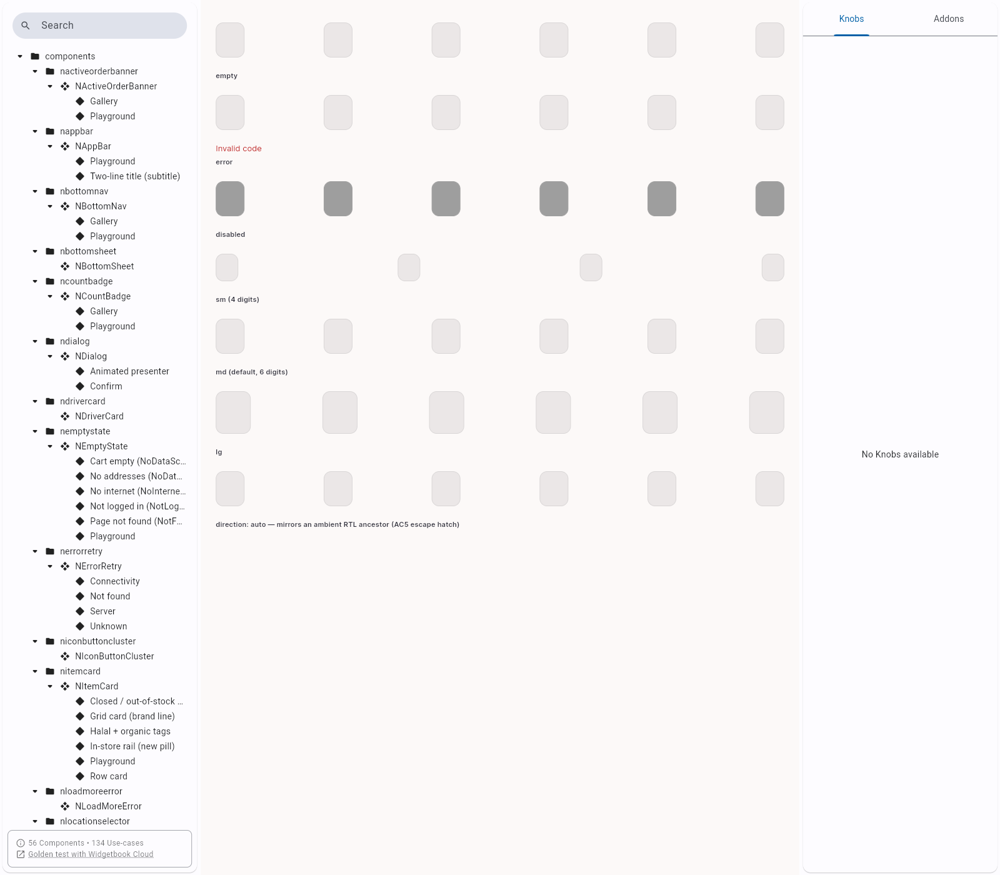
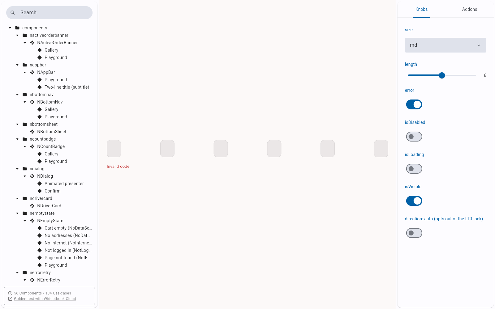
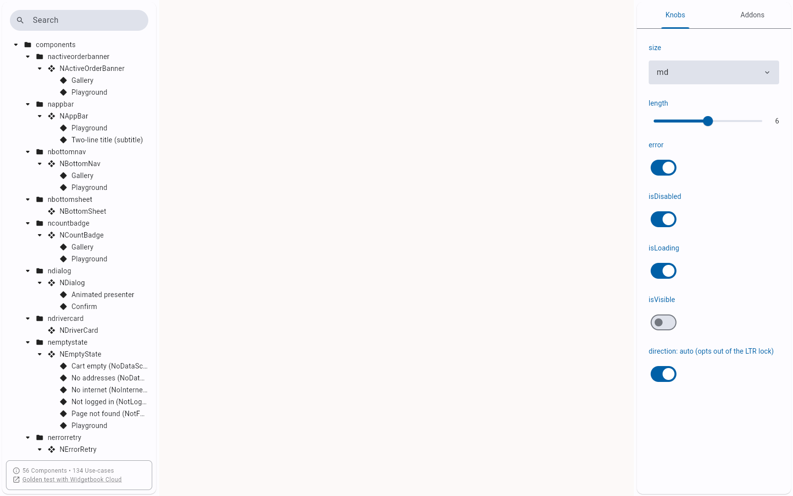

# QA Evidence — NEARS-1744

**PASS - NOtpInput DLS element, Widgetbook Playground+Gallery, light mode**

**3 screenshot(s).** Click any thumbnail for full resolution.

<table>
<tr>
<td align="center" width="33%"> ac4 ac5 gallery states</td>
<td align="center" width="33%"> ac4 playground error toggle</td>
<td align="center" width="33%"> knobs all toggled</td>
</tr>
</table>

---
*From `nears/docs/qa-evidence/NEARS-1744/` · public-repo scrub policy (no live secrets; verified clean).*
