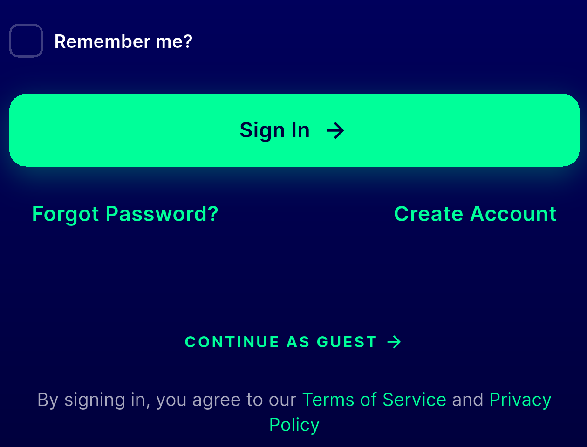
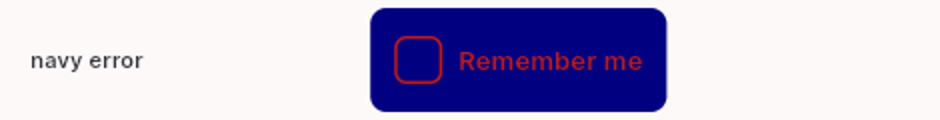
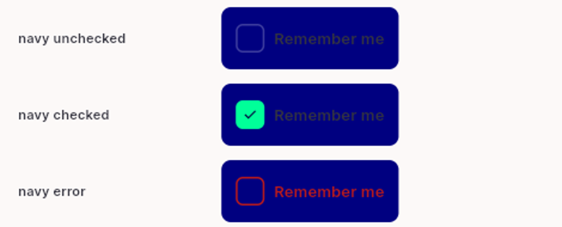
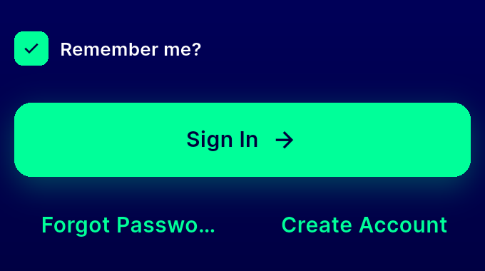
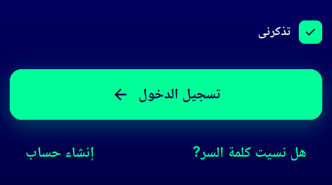
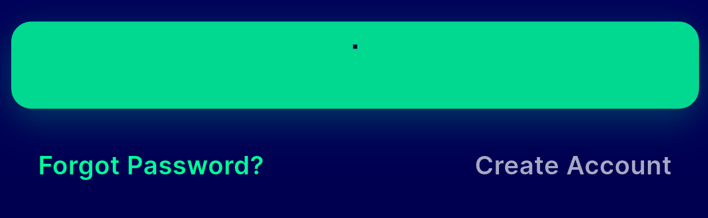
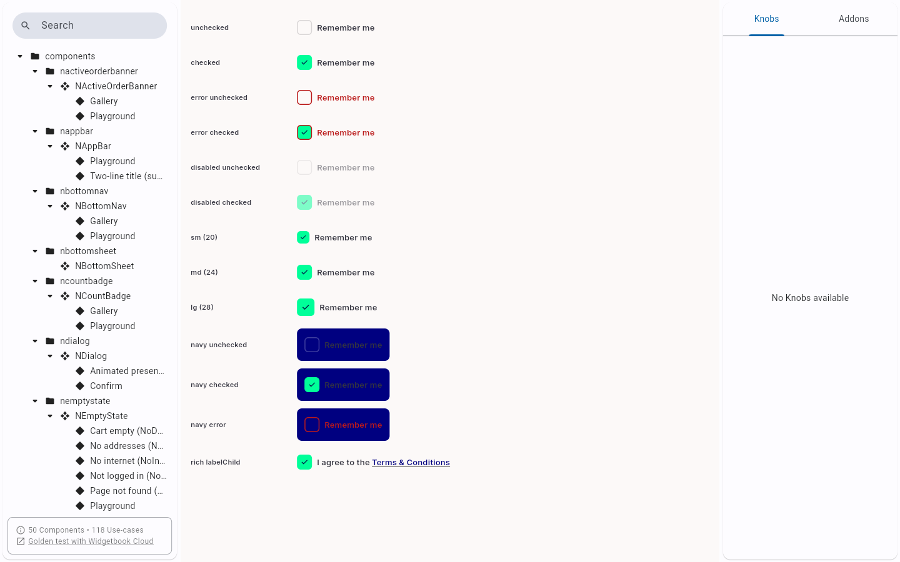

# QA Evidence — NEARS-1745

**FAIL — AC4 tertiary conversion truncates 'Forgot Password?' in EN at 360dp; 2 DLS contrast findings**

**10 screenshot(s).** Click any thumbnail for full resolution.

<table>
<tr>
<td align="center" width="33%"> ac4 ac5 ac6 converted controls en 448dp</td>
<td align="center" width="33%"> bug forgot password ellipsis 360dp en</td>
<td align="center" width="33%"> bug ncheckbox navy error contrast</td>
</tr>
<tr>
<td align="center" width="33%"> bug ncheckbox secondary label contrast</td>
<td align="center" width="33%"> q1 rtl mse ltr en 360dp</td>
<td align="center" width="33%"> q1 rtl mse rtl ar 360dp</td>
</tr>
<tr>
<td align="center" width="33%"> q12 create account disabled isloading</td>
<td align="center" width="33%"> q3 q5 q6 ncheckbox dls gallery</td>
<td align="center" width="33%"> q4 focus ring mint 012 navy</td>
</tr>
<tr>
<td align="center" width="33%"> q8a reset apply tertiary footer</td>
</tr>
</table>

### Other artifacts
- [`progress.md`](progress.md)

---
*From `nears/docs/qa-evidence/NEARS-1745/` · public-repo scrub policy (no live secrets; verified clean).*
