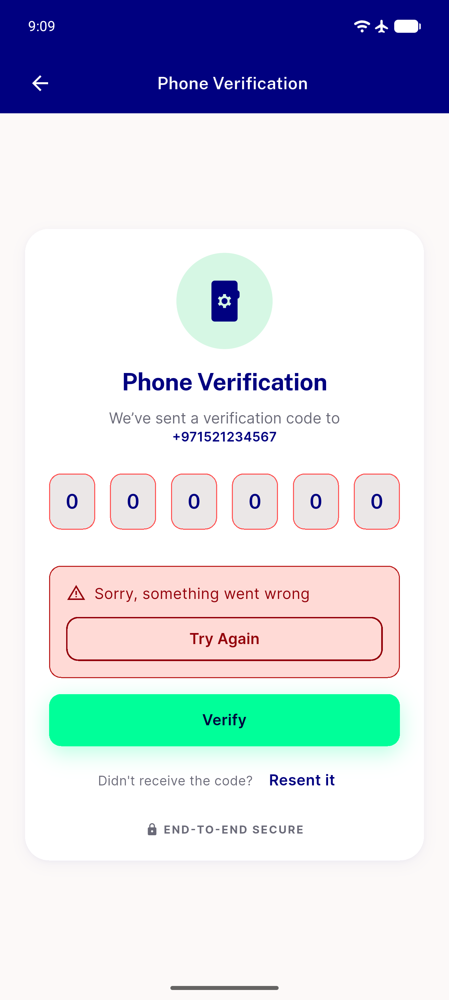
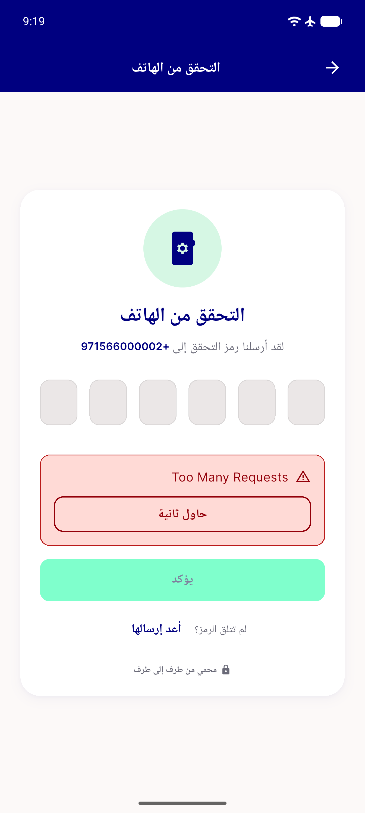
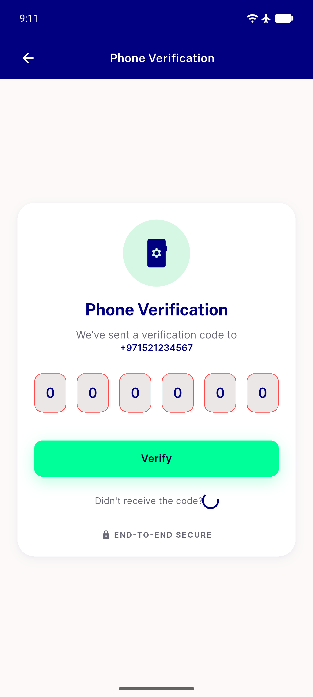
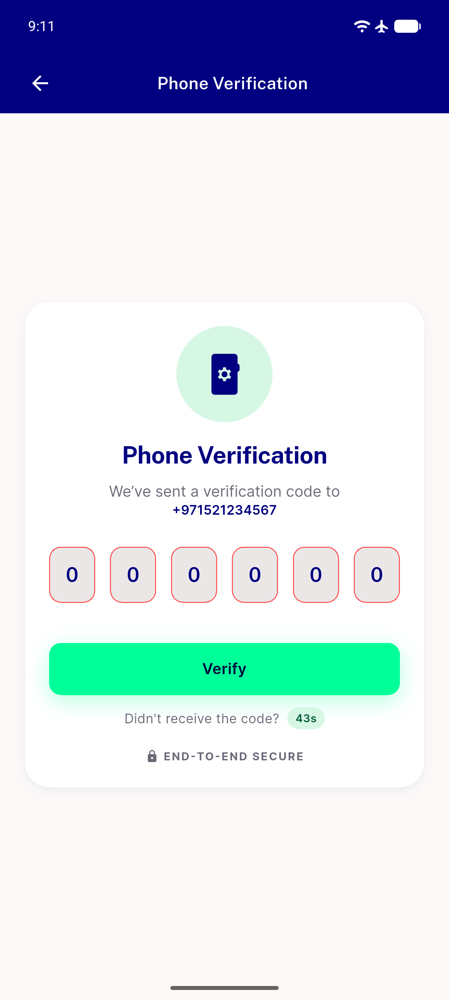
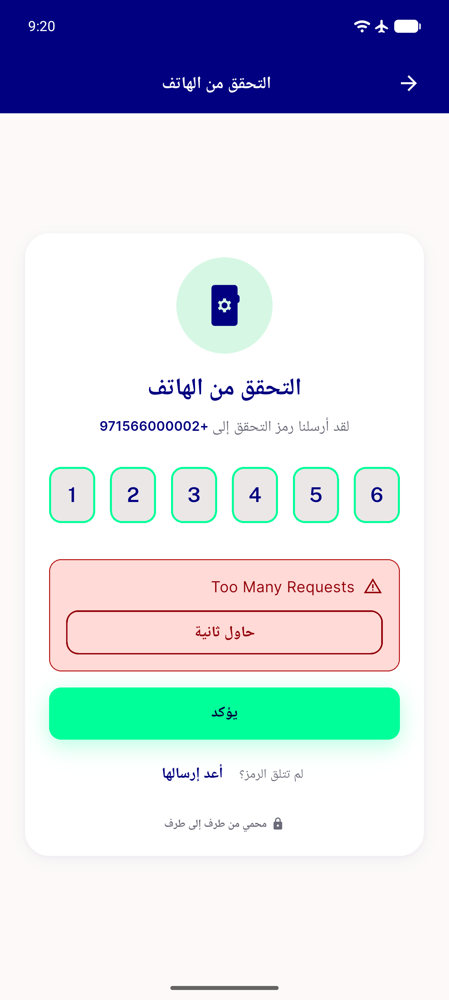
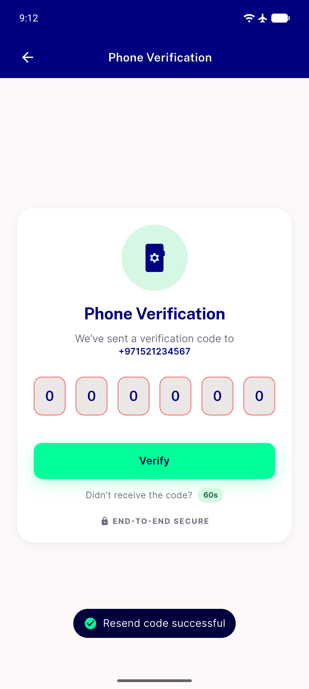

# QA Evidence — NEARS-1746

**PASS — verification_screen.dart reskin live-verified, 6/6 evidence shots**

**6 screenshot(s).** Click any thumbnail for full resolution.

<table>
<tr>
<td align="center" width="33%"> ac1 ac5 wrong otp panel shake redborder</td>
<td align="center" width="33%"> ac1 resend failure real 429 rtl</td>
<td align="center" width="33%"> ac2 ac3 resend loading verify independent</td>
</tr>
<tr>
<td align="center" width="33%"> ac3 resend cooldown pill</td>
<td align="center" width="33%"> ac6 rtl ltr digit entry</td>
<td align="center" width="33%"> ac7 resend success toast</td>
</tr>
</table>

---
*From `nears/docs/qa-evidence/NEARS-1746/` · public-repo scrub policy (no live secrets; verified clean).*
