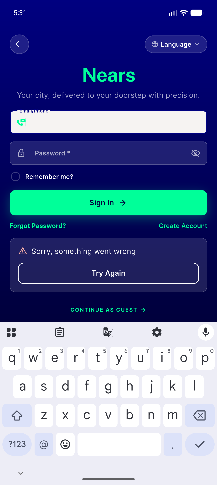
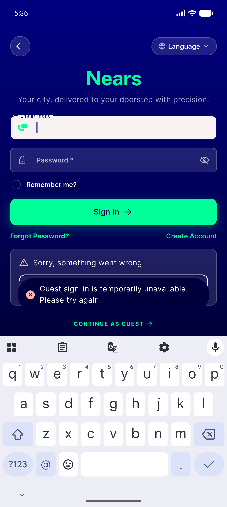
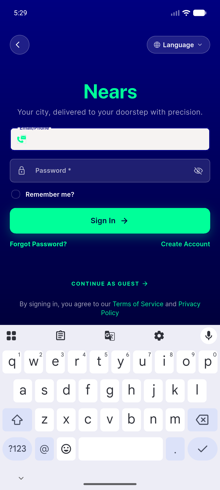
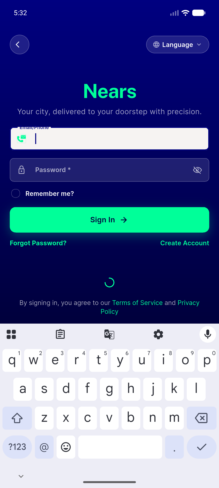
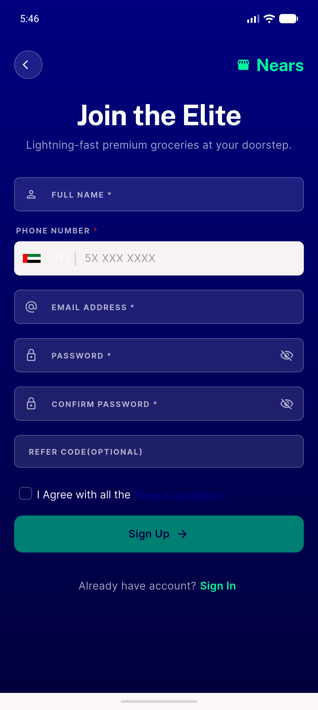
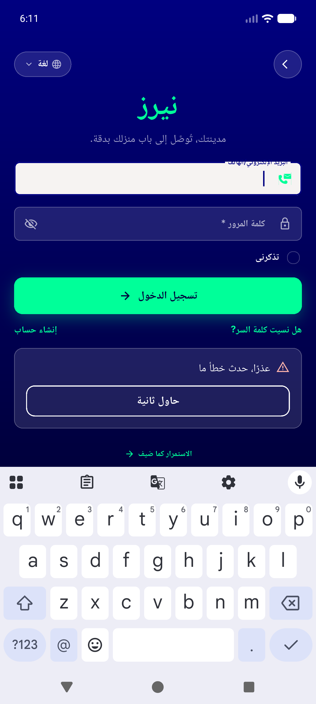
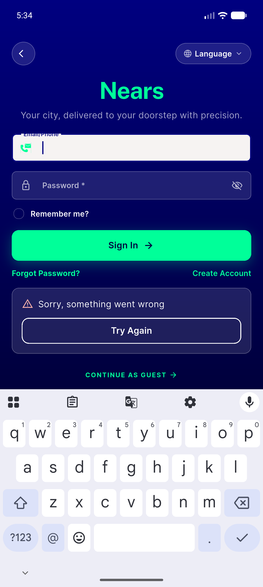
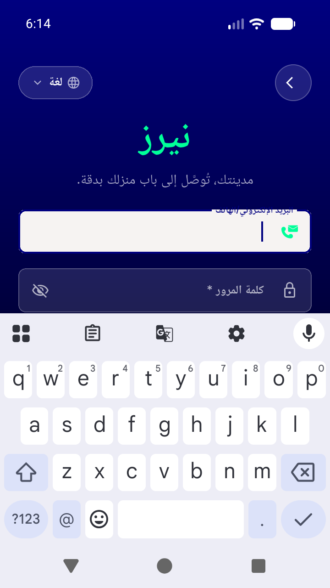
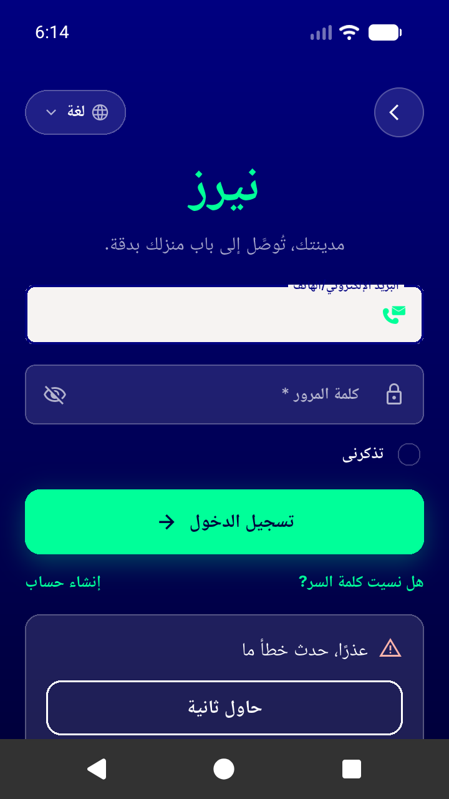

# QA Evidence — NEARS-1747

**PASS — NEARS-1747 sign-in error states, emulator-5556, worktree HEAD ecadee75 (live-isolate probe verified)**

**14 screenshot(s).** Click any thumbnail for full resolution.

<table>
<tr>
<td align="center" width="33%"> ac1 guest error panel en</td>
<td align="center" width="33%"> ac1 panel plus toast</td>
<td align="center" width="33%"> ac1 toast and panel overlap</td>
</tr>
<tr>
<td align="center" width="33%"> ac3 guest button idle</td>
<td align="center" width="33%"> ac3 guest button loading</td>
<td align="center" width="33%"> ac3 inflight retry</td>
</tr>
<tr>
<td align="center" width="33%"> ac4 nsnackbar back press en</td>
<td align="center" width="33%"> ac6 guest error panel ar rtl</td>
<td align="center" width="33%"> bug panel never shows server message</td>
</tr>
<tr>
<td align="center" width="33%"> bug small screen guest cta below fold</td>
<td align="center" width="33%"> bug toast covers try again</td>
<td align="center" width="33%"> small screen 360x640 ar</td>
</tr>
<tr>
<td align="center" width="33%"> small screen 360x640 panel keyboard ar</td>
<td align="center" width="33%"> small screen 360x640 panel no keyboard ar</td>
</tr>
</table>

### Other artifacts
- [`bug-double-fail-line.log`](bug-double-fail-line.log)
- [`bug-panel-never-shows-server-message.log`](bug-panel-never-shows-server-message.log)

---
*From `nears/docs/qa-evidence/NEARS-1747/` · public-repo scrub policy (no live secrets; verified clean).*
