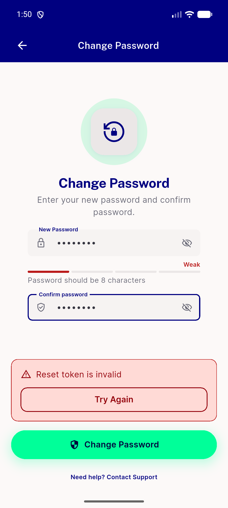
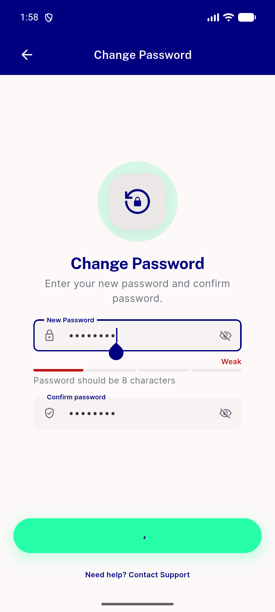
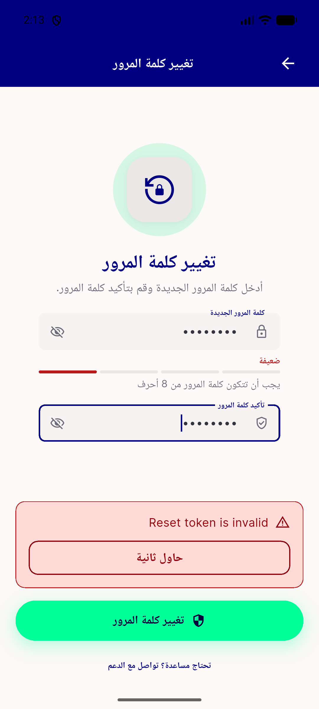
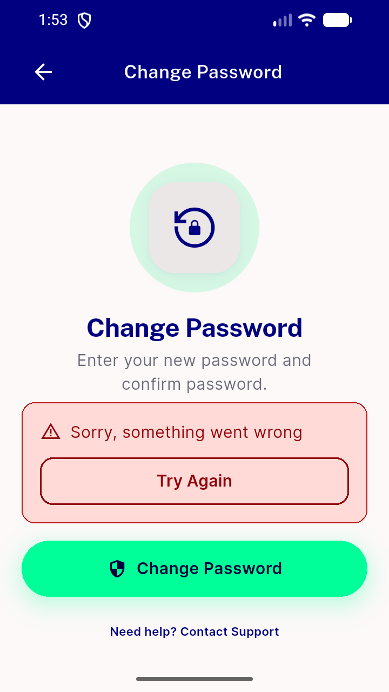
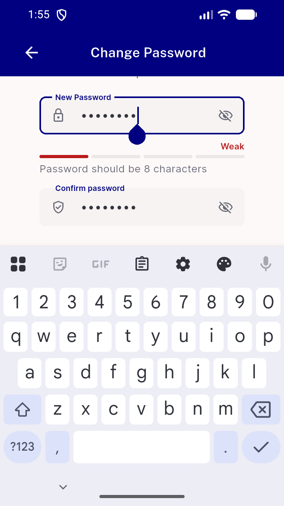

# QA Evidence — NEARS-1748

**FAIL-free live QA: 6 ACs met, AC4 deferred, reset-mount unreachable (firebase OTP)**

**6 screenshot(s).** Click any thumbnail for full resolution.

<table>
<tr>
<td align="center" width="33%"> ac1 error panel server message</td>
<td align="center" width="33%"> ac3 loading state</td>
<td align="center" width="33%"> ac6 rtl arabic error panel</td>
</tr>
<tr>
<td align="center" width="33%"> ac6 small screen 360x640 panel</td>
<td align="center" width="33%"> ac6 small screen keyboard raised</td>
<td align="center" width="33%"> bug keyboard occludes bottom bar</td>
</tr>
</table>

### Other artifacts
- [`bug-duplicate-fail-line.log`](bug-duplicate-fail-line.log)
- [`bug-strength-label-untranslated-ar.log`](bug-strength-label-untranslated-ar.log)

---
*From `nears/docs/qa-evidence/NEARS-1748/` · public-repo scrub policy (no live secrets; verified clean).*
