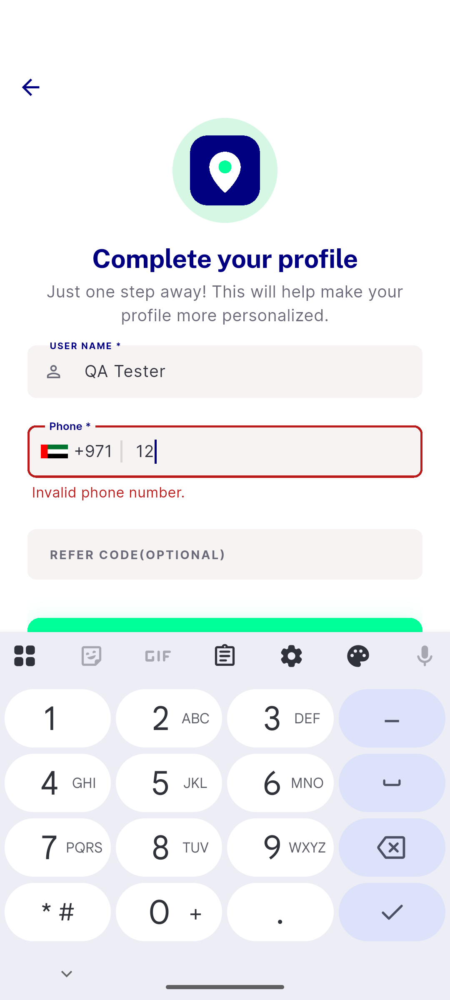
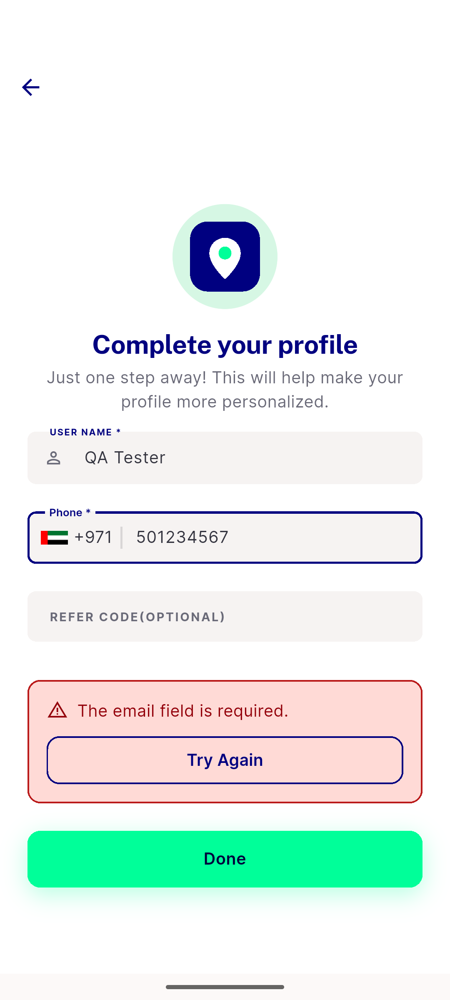
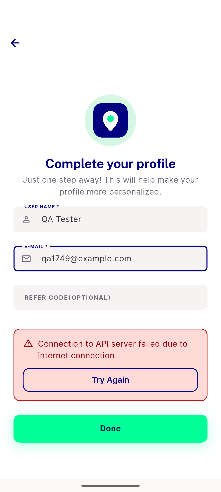
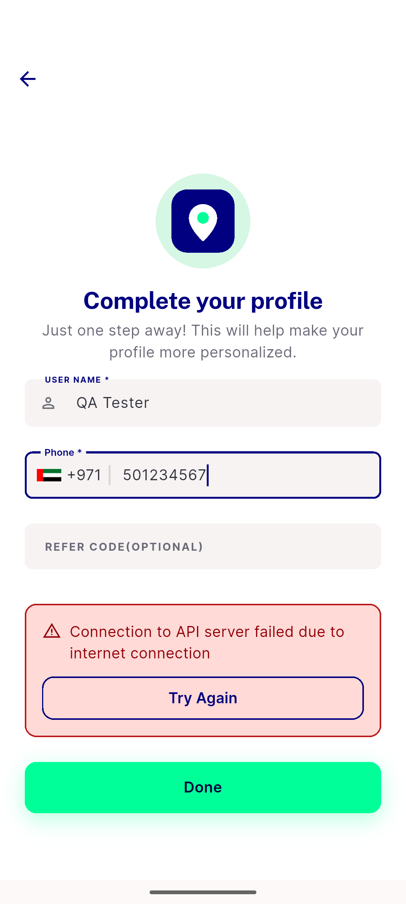
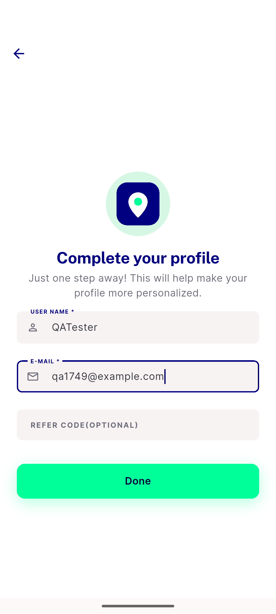

# QA Evidence — NEARS-1749

**FAIL — AC1 silent CTA on the non-social entry path; 5 other ACs demonstrated live on emulator-5562 @7889eddf**

**7 screenshot(s).** Click any thumbnail for full resolution.

<table>
<tr>
<td align="center" width="33%"> ac1 invalid phone inline error</td>
<td align="center" width="33%"> ac1 server failure panel backend message</td>
<td align="center" width="33%"> ac1 submit error panel light</td>
</tr>
<tr>
<td align="center" width="33%"> ac1 transport failure panel no global toast</td>
<td align="center" width="33%"> ac3 cta loading spinner and retry</td>
<td align="center" width="33%"> bug silent cta nonsocial empty phone</td>
</tr>
<tr>
<td align="center" width="33%"> nav coldroute configmodel null NOT A DEFECT</td>
</tr>
</table>

### Other artifacts
- [`bug-silent-cta-nonsocial-empty-phone.log`](bug-silent-cta-nonsocial-empty-phone.log)
- [`progress.md`](progress.md)

---
*From `nears/docs/qa-evidence/NEARS-1749/` · public-repo scrub policy (no live secrets; verified clean).*
