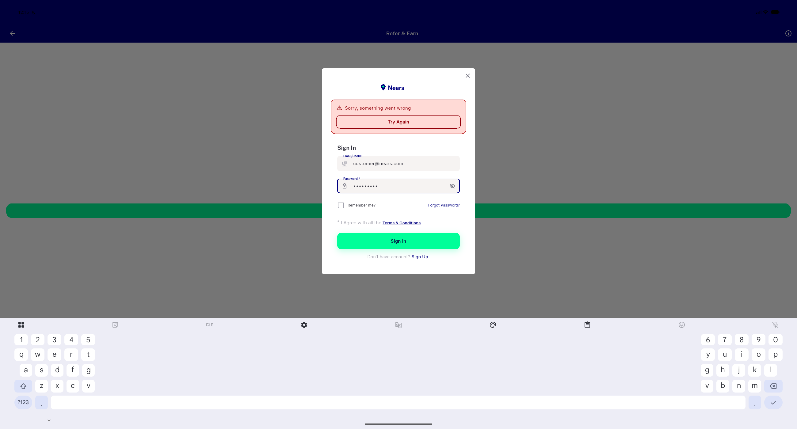
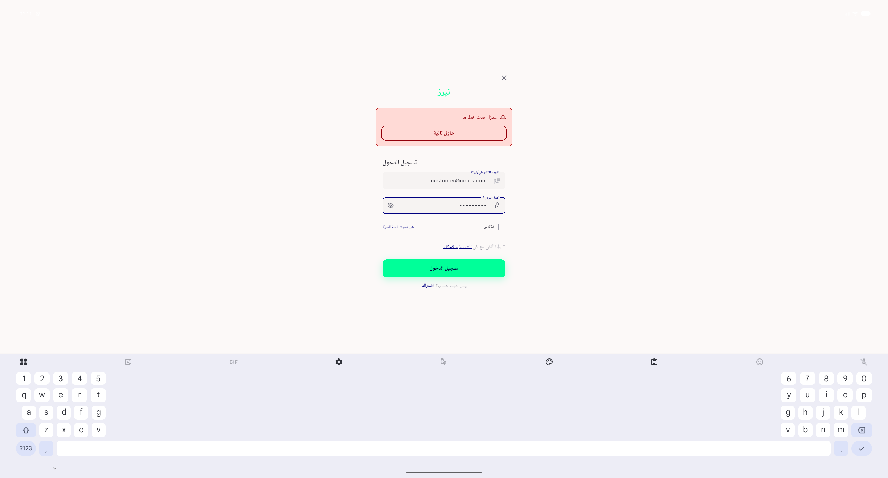
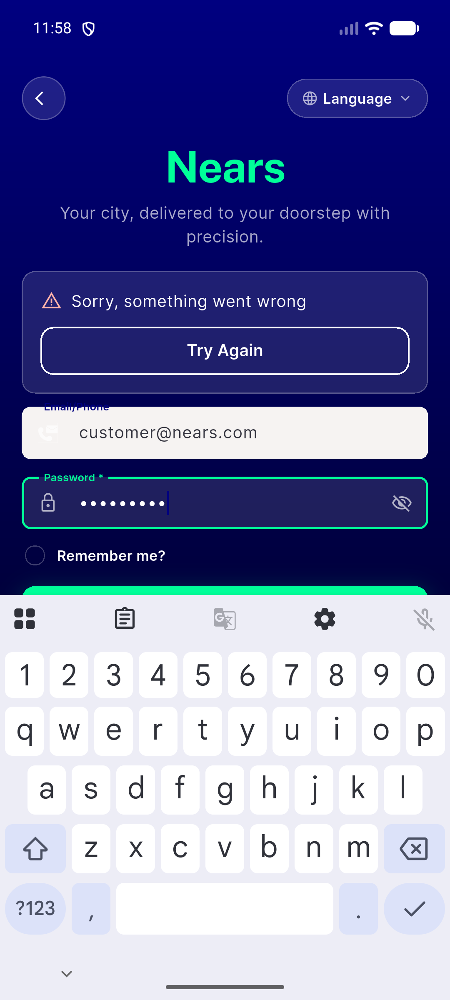
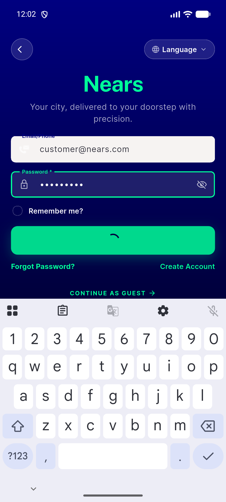
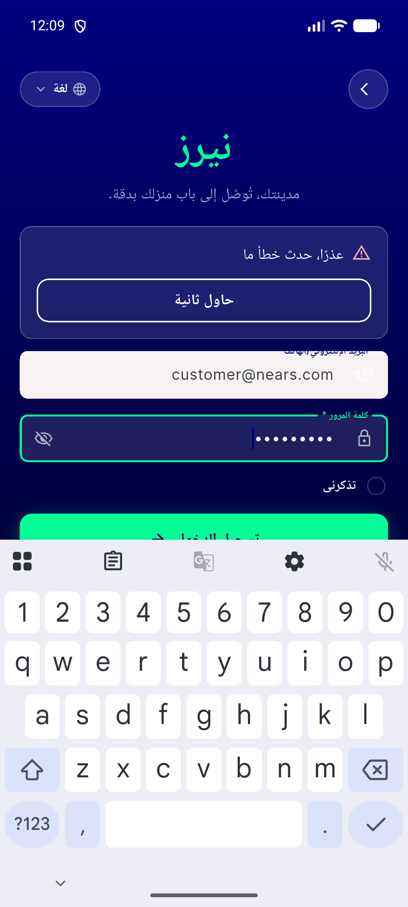
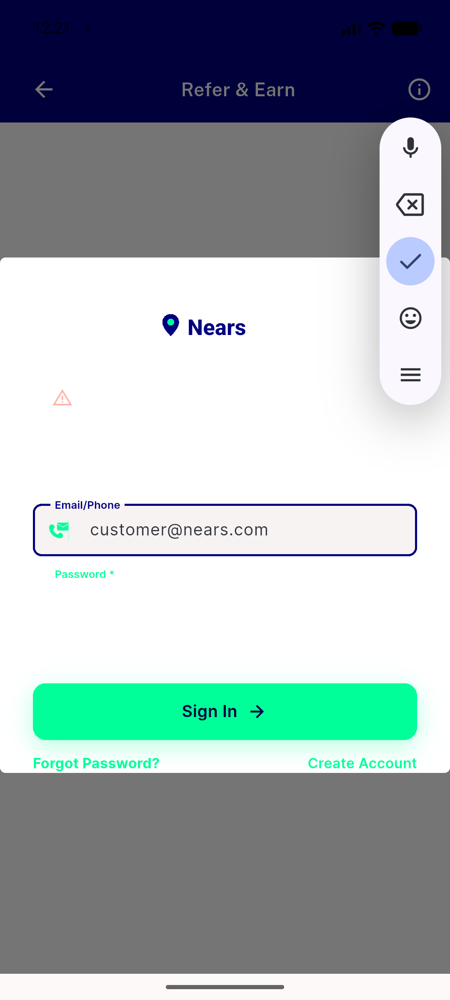
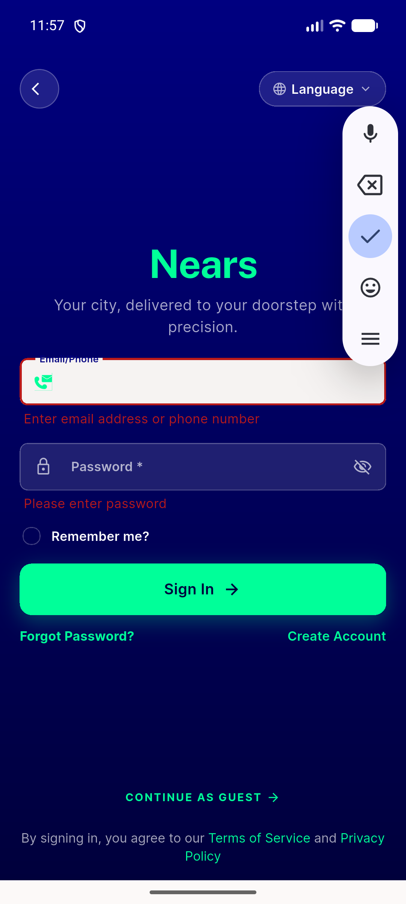
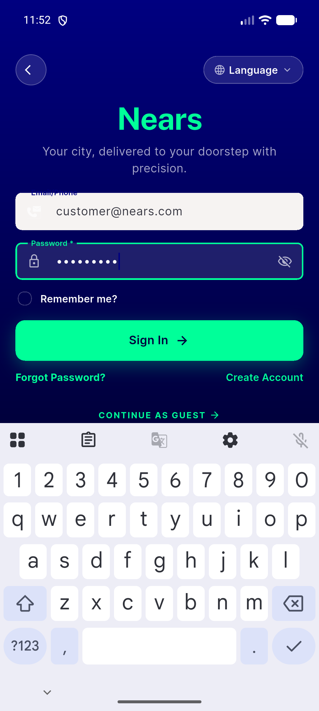

# QA Evidence — NEARS-1751

**PASS — persistent recovery panel verified live on the manual sign-in submit; pre-fix silent failure pinned on base 3bf46592**

**8 screenshot(s).** Click any thumbnail for full resolution.

<table>
<tr>
<td align="center" width="33%"> ac1 panel authdialog desktop</td>
<td align="center" width="33%"> ac1 panel desktop card pale</td>
<td align="center" width="33%"> ac1 panel mobile navy hero</td>
</tr>
<tr>
<td align="center" width="33%"> ac1 retry inflight panel cleared</td>
<td align="center" width="33%"> ac5 panel rtl arabic</td>
<td align="center" width="33%"> bug authdialog mobile white on white</td>
</tr>
<tr>
<td align="center" width="33%"> negative control empty fields</td>
<td align="center" width="33%"> prefix silent failure</td>
</tr>
</table>

### Other artifacts
- [`bug-dls-golden-renderflex-preexisting.log`](bug-dls-golden-renderflex-preexisting.log)
- [`prefix-silent-failure.log`](prefix-silent-failure.log)
- [`progress.md`](progress.md)

---
*From `nears/docs/qa-evidence/NEARS-1751/` · public-repo scrub policy (no live secrets; verified clean).*
