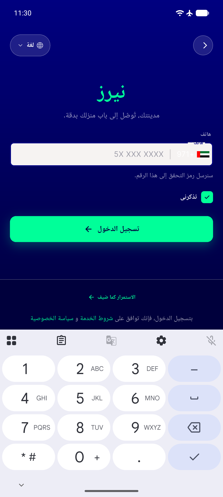
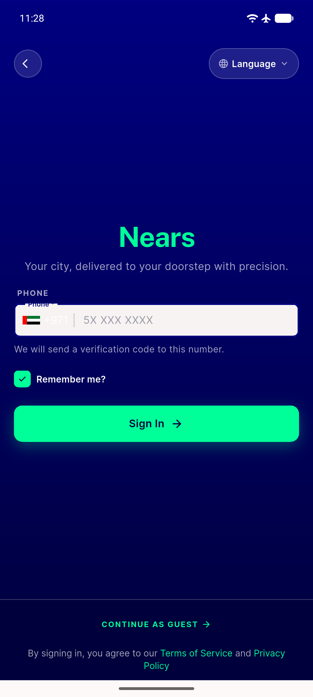
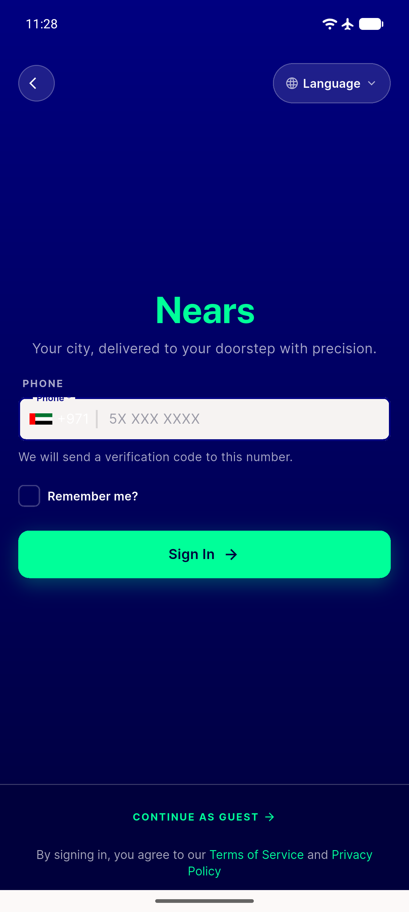
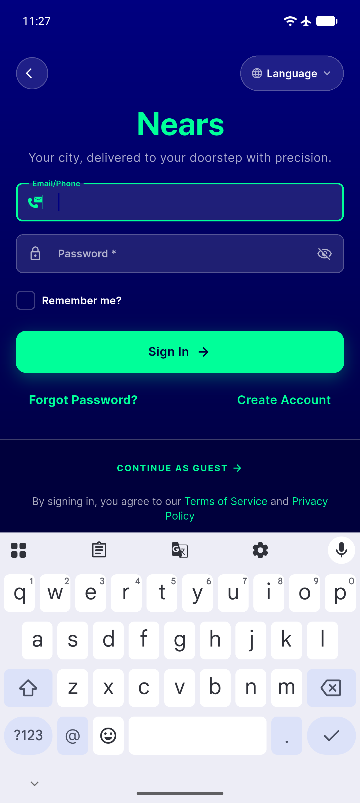

# QA Evidence — NEARS-1752

**PASS — otp_login_widget.dart NCheckbox reskin verified live, emulator-5558**

**4 screenshot(s).** Click any thumbnail for full resolution.

<table>
<tr>
<td align="center" width="33%"> ac rtl mirror</td>
<td align="center" width="33%"> ac toggle checked mint fill</td>
<td align="center" width="33%"> ac5 ncheckbox unchecked</td>
</tr>
<tr>
<td align="center" width="33%"> ac6 manual login baseline</td>
</tr>
</table>

### Other artifacts
- [`ac-a11y-dump-checked.xml`](ac-a11y-dump-checked.xml)
- [`ac-a11y-dump-rtl.xml`](ac-a11y-dump-rtl.xml)
- [`ac5-a11y-dump-unchecked.xml`](ac5-a11y-dump-unchecked.xml)

---
*From `nears/docs/qa-evidence/NEARS-1752/` · public-repo scrub policy (no live secrets; verified clean).*
