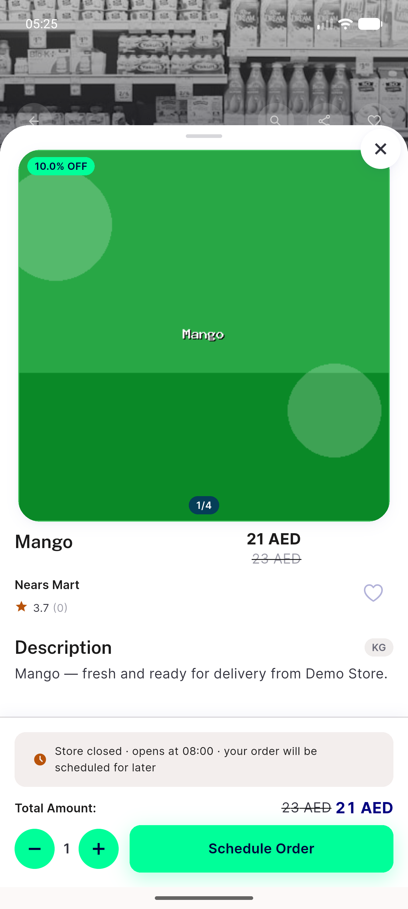

# QA Evidence — NEARS-1753

**Delta re-QA PASS at f95c5c79 — surface restored on a clean mount; AC1/AC3/AC6 held**

**21 screenshot(s).** Click any thumbnail for full resolution.

<table>
<tr>
<td align="center" width="33%"> bug sheet has no surface</td>
<td align="center" width="33%"> delta 01 clean mount surface</td>
<td align="center" width="33%"> delta 02 loading inflight surface</td>
</tr>
<tr>
<td align="center" width="33%"> delta 03 panel on real surface</td>
<td align="center" width="33%"> delta 04 rtl panel on surface</td>
<td align="center" width="33%"> fix 01 sheet mounted</td>
</tr>
<tr>
<td align="center" width="33%"> fix 02 loading yes inflight</td>
<td align="center" width="33%"> fix 03 loading no tap attempt</td>
<td align="center" width="33%"> fix 04 panel after failure</td>
</tr>
<tr>
<td align="center" width="33%"> fix 05 loading no inflight</td>
<td align="center" width="33%"> fix 06 panel errors array message</td>
<td align="center" width="33%"> fix 07 panel empty message fallback</td>
</tr>
<tr>
<td align="center" width="33%"> fix 08 success newuser setup</td>
<td align="center" width="33%"> fix 09 sheet clean geometry</td>
<td align="center" width="33%"> fix 10 success personalinfo nav</td>
</tr>
<tr>
<td align="center" width="33%"> fix 11 fontscale130 panel reachable</td>
<td align="center" width="33%"> fix 12 fontscale200 panel reachable</td>
<td align="center" width="33%"> fix 13 rtl arabic panel</td>
</tr>
<tr>
<td align="center" width="33%"> prefix 01 sheet mounted</td>
<td align="center" width="33%"> prefix 02 sheet vanished after failure</td>
<td align="center" width="33%"> reg 01 item sheet neighbour</td>
</tr>
</table>

### Other artifacts
- [`prefix-03-failure-log.txt`](prefix-03-failure-log.txt)
- [`progress.md`](progress.md)

---
*From `nears/docs/qa-evidence/NEARS-1753/` · public-repo scrub policy (no live secrets; verified clean).*
