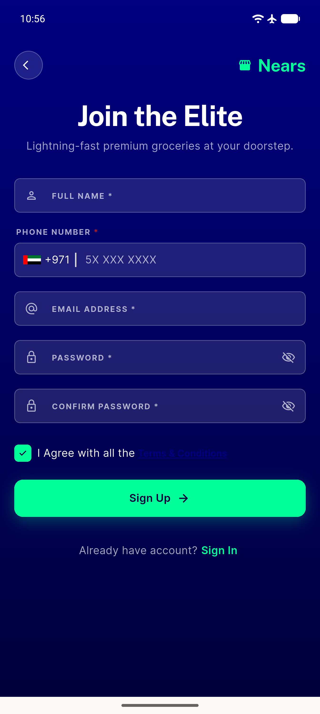
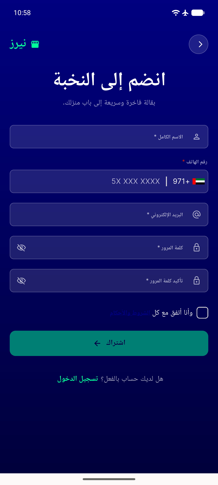

# QA Evidence — NEARS-1754

**fix-cycle 1 re-QA: PASS — terms-link gesture-arena fix + tap-target fix both verified live**

**4 screenshot(s).** Click any thumbnail for full resolution.

<table>
<tr>
<td align="center" width="33%"> ac3 rtl signup checkbox</td>
<td align="center" width="33%"> bug terms link tap target 22dp</td>
<td align="center" width="33%"> fix cycle1 ltr signup oneline verified</td>
</tr>
<tr>
<td align="center" width="33%"> fix cycle1 rtl signup oneline verified</td>
</tr>
</table>

### Other artifacts
- [`bug-terms-link-no-navigation.log`](bug-terms-link-no-navigation.log)
- [`fix-cycle1-ltr-repro.log`](fix-cycle1-ltr-repro.log)
- [`fix-cycle1-rtl-repro.log`](fix-cycle1-rtl-repro.log)

---
*From `nears/docs/qa-evidence/NEARS-1754/` · public-repo scrub policy (no live secrets; verified clean).*
