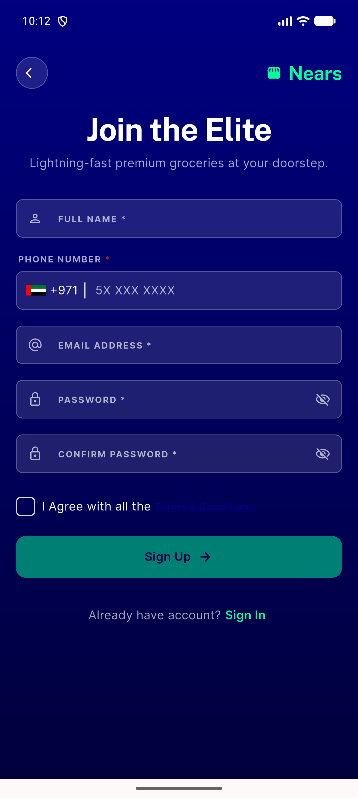

# QA Evidence — NEARS-1754

**FAIL — terms-link tap does not navigate on device (regression), tap target <44dp**

**2 screenshot(s).** Click any thumbnail for full resolution.

<table>
<tr>
<td align="center" width="33%"> ac3 rtl signup checkbox</td>
<td align="center" width="33%"> bug terms link tap target 22dp</td>
</tr>
</table>

### Other artifacts
- [`bug-terms-link-no-navigation.log`](bug-terms-link-no-navigation.log)

---
*From `nears/docs/qa-evidence/NEARS-1754/` · public-repo scrub policy (no live secrets; verified clean).*
