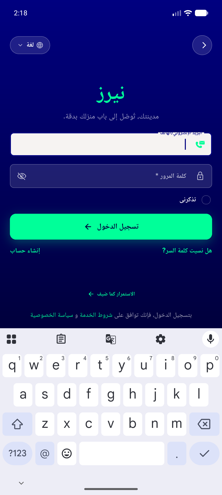
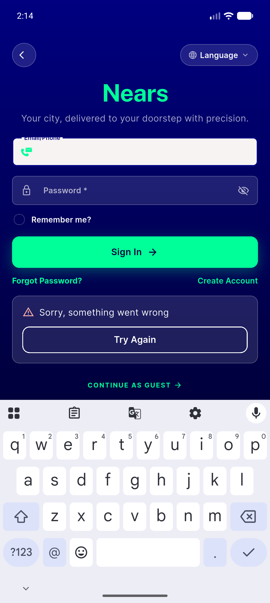
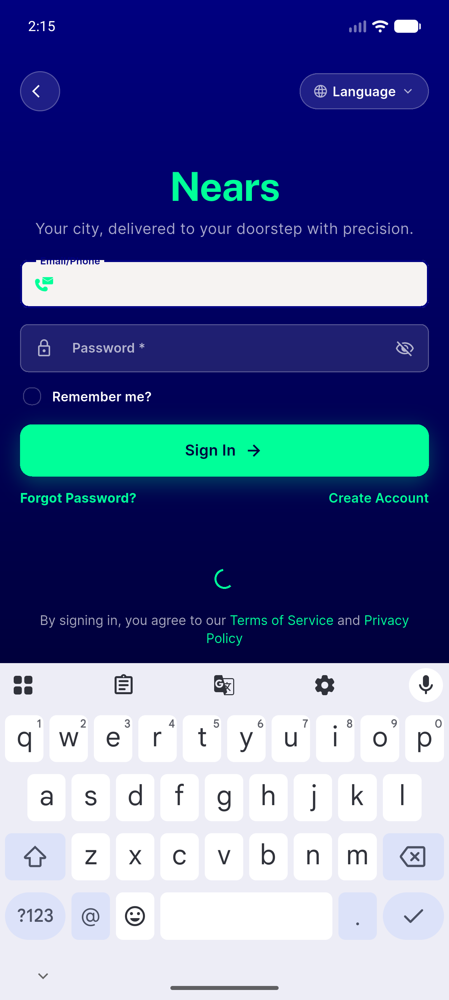
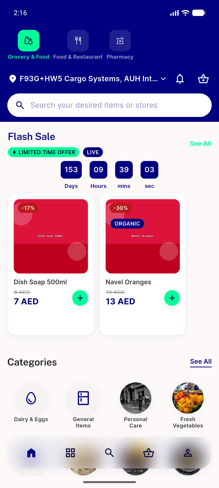
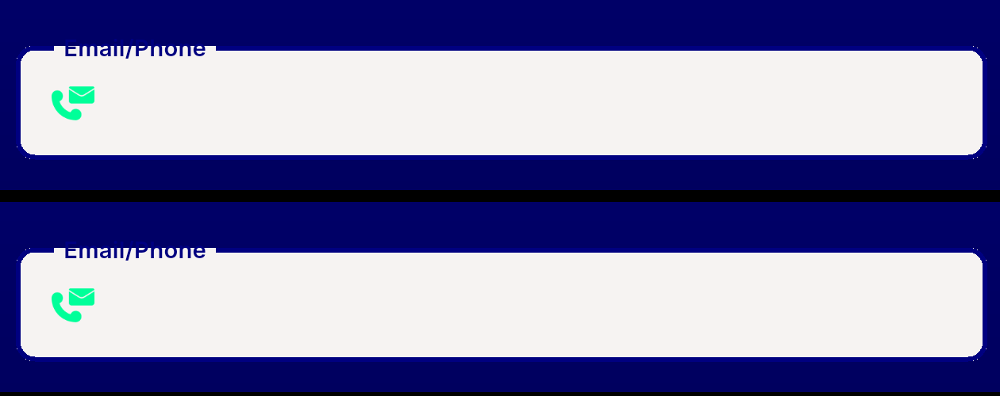

# QA Evidence — NEARS-1755

**PASS — NEARS-1755 guest-button dead-code deletion: guest login verified end-to-end live on emulator-5554**

**6 screenshot(s).** Click any thumbnail for full resolution.

<table>
<tr>
<td align="center" width="33%"> ac6 guest block rtl arabic</td>
<td align="center" width="33%"> ac6 guest failure panel</td>
<td align="center" width="33%"> ac6 guest inflight loading</td>
</tr>
<tr>
<td align="center" width="33%"> ac6 guest landed initial route</td>
<td align="center" width="33%"> ac6 signin screen baseline</td>
<td align="center" width="33%"> bug signin email label navy on navy</td>
</tr>
</table>

---
*From `nears/docs/qa-evidence/NEARS-1755/` · public-repo scrub policy (no live secrets; verified clean).*
