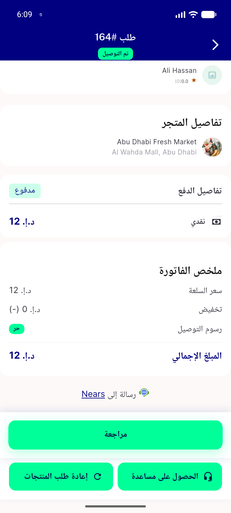
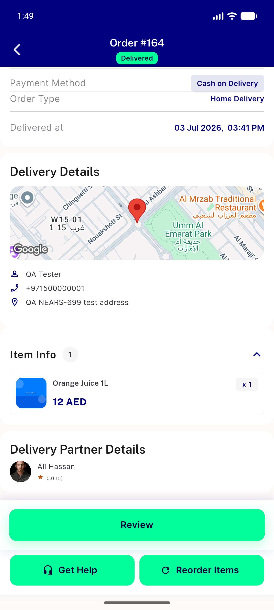
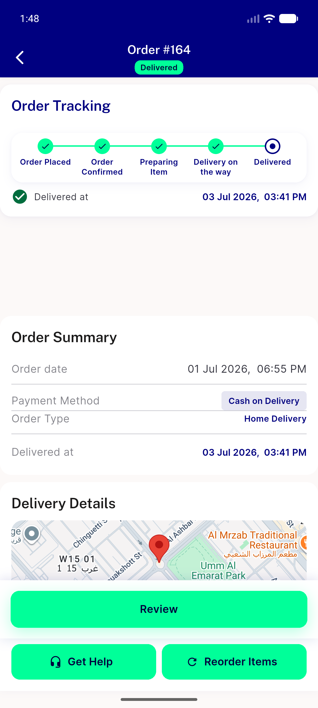

# QA Evidence — NEARS-1756

**AC1+AC2 PASS — delivery-man seed avatars render live from the fixed storage path**

**3 screenshot(s).** Click any thumbnail for full resolution.

<table>
<tr>
<td align="center" width="33%"> VACUOUS first attempt cached render DO NOT CITE</td>
<td align="center" width="33%"> ac2 PASS order164 ali hassan real portrait</td>
<td align="center" width="33%"> ac2 order164 top of screen</td>
</tr>
</table>

---
*From `nears/docs/qa-evidence/NEARS-1756/` · public-repo scrub policy (no live secrets; verified clean).*
