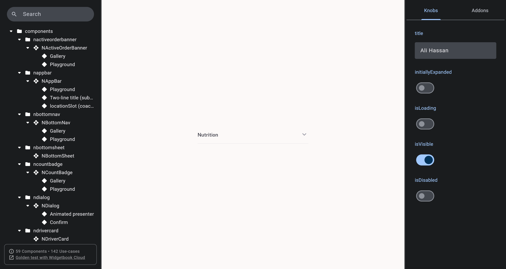
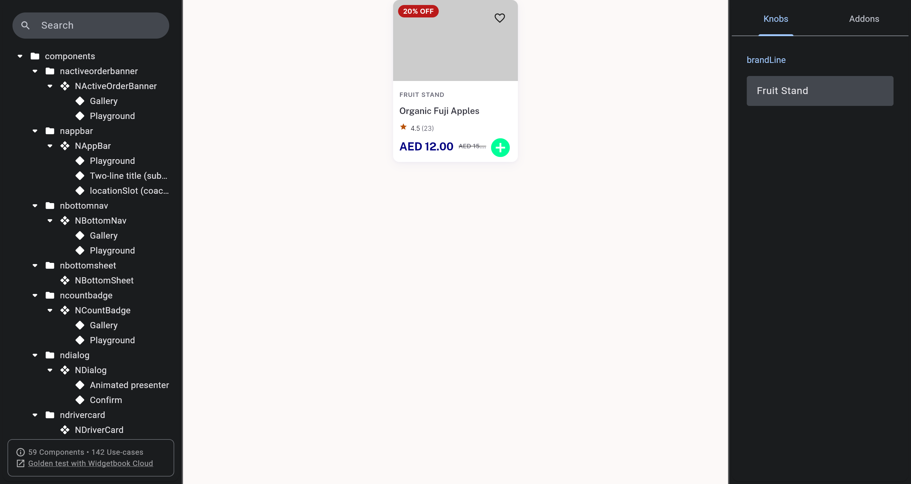
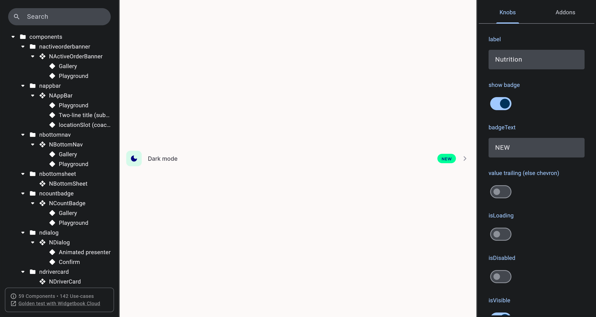

# QA Evidence — NEARS-1758

**PASS — light-mode WCAG contrast swap (disabledColor -> colorScheme.onSurfaceVariant), 4 call sites, cycle 0**

**3 screenshot(s).** Click any thumbnail for full resolution.

<table>
<tr>
<td align="center" width="33%"> n accordion chevron regression check</td>
<td align="center" width="33%"> n item card brandline strike light</td>
<td align="center" width="33%"> n settings tile chevron regression check</td>
</tr>
</table>

---
*From `nears/docs/qa-evidence/NEARS-1758/` · public-repo scrub policy (no live secrets; verified clean).*
