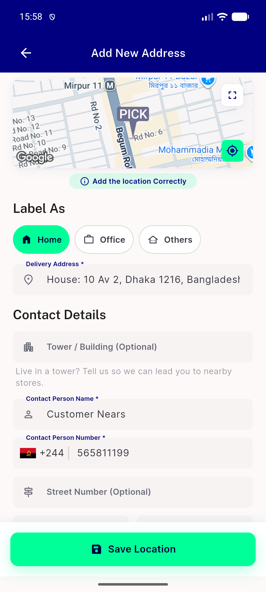
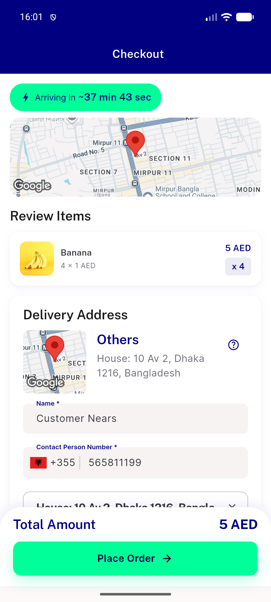
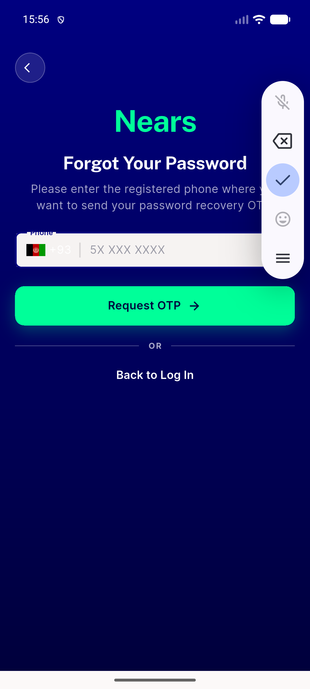
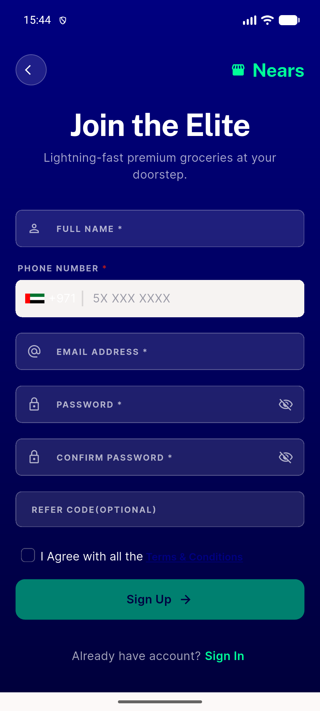
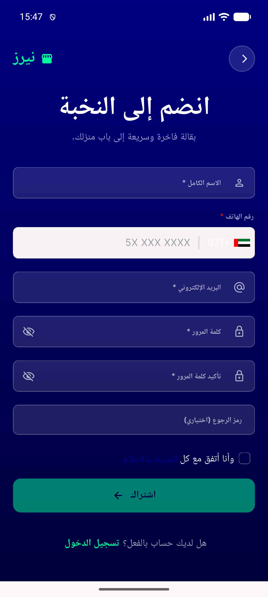
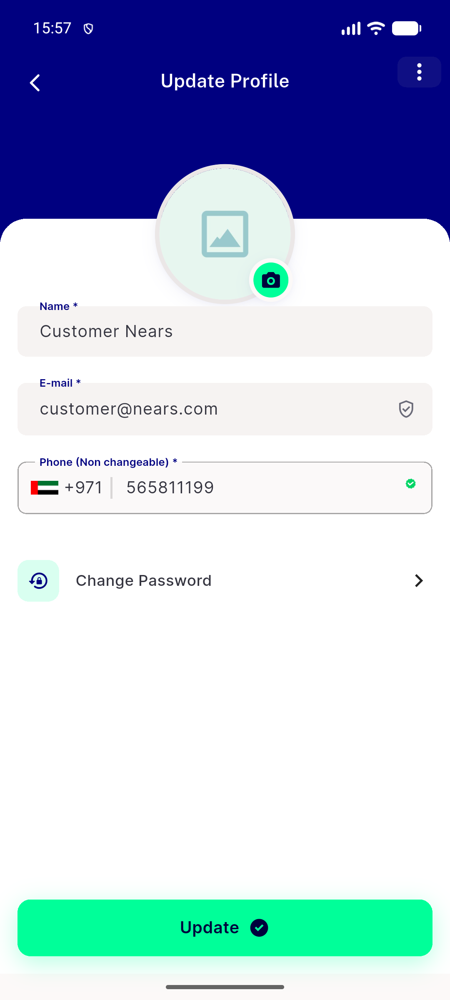

# QA Evidence — NEARS-1770

**PASS — dial-code picker tap target >=44dp LTR+RTL live-measured; 10/10 call sites confirmed same code path, 5 sampled live (auth/verification/checkout/profile/address); disabled-state refusal confirmed; no regressions**

**6 screenshot(s).** Click any thumbnail for full resolution.

<table>
<tr>
<td align="center" width="33%"> add address picker applied</td>
<td align="center" width="33%"> checkout delivery section picker applied</td>
<td align="center" width="33%"> forgetpass ltr picker applied</td>
</tr>
<tr>
<td align="center" width="33%"> signup ltr full</td>
<td align="center" width="33%"> signup rtl full</td>
<td align="center" width="33%"> update profile disabled phone</td>
</tr>
</table>

---
*From `nears/docs/qa-evidence/NEARS-1770/` · public-repo scrub policy (no live secrets; verified clean).*
