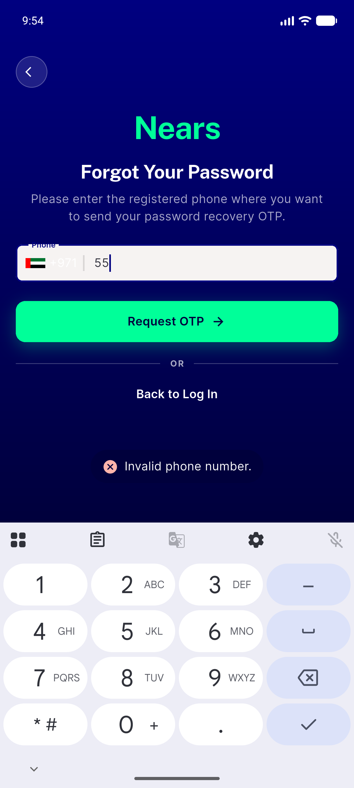
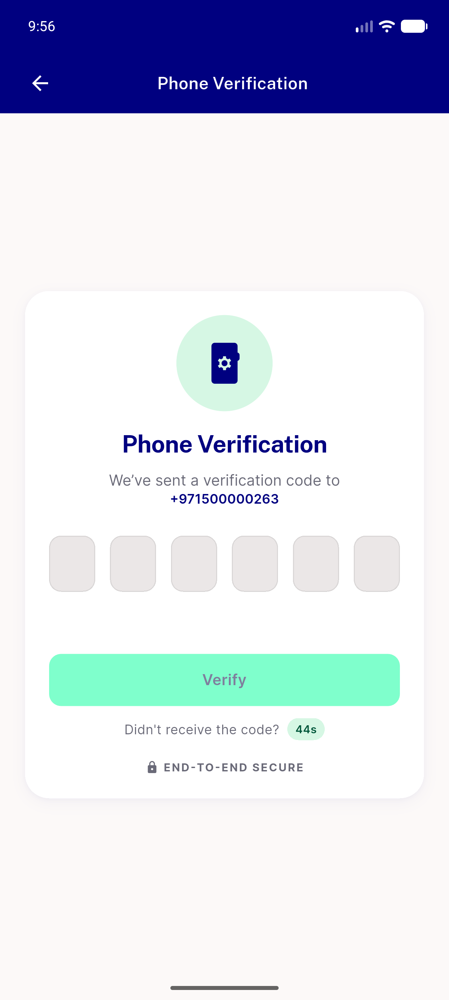

# QA Evidence — NEARS-1771

**PASS - forgot-password phone-validation guard rekeyed to isPhone (AC1-AC3 demonstrated live on emulator-5556)**

**2 screenshot(s).** Click any thumbnail for full resolution.

<table>
<tr>
<td align="center" width="33%"> ac1 invalid phone toast</td>
<td align="center" width="33%"> ac2 valid phone verification screen</td>
</tr>
</table>

---
*From `nears/docs/qa-evidence/NEARS-1771/` · public-repo scrub policy (no live secrets; verified clean).*
